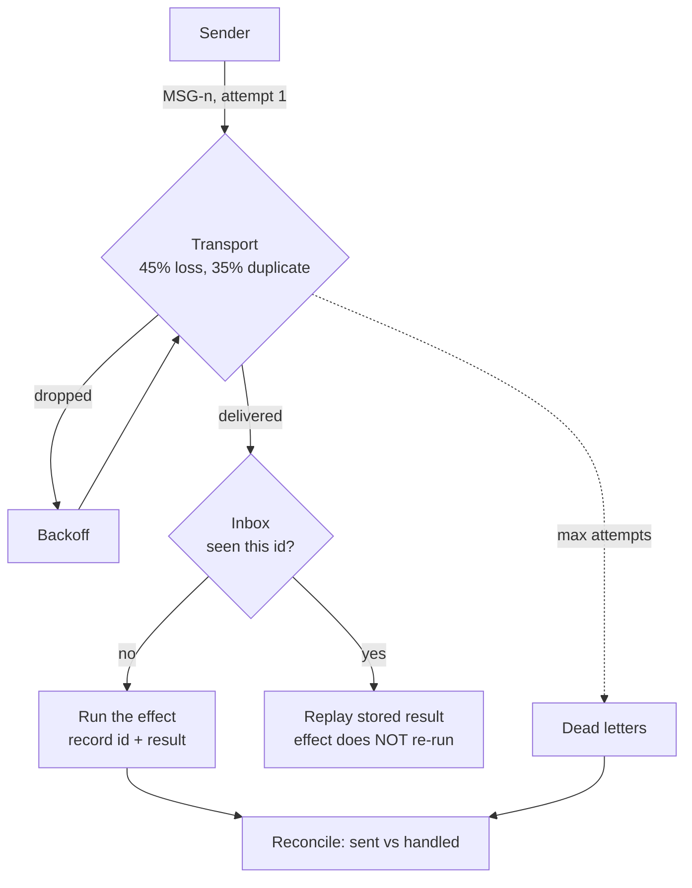

---
{
  "title": "Agent Communication Fault Tolerance",
  "summary": "Message ids, retry, receiver-side dedup, dead letters, and the reconciliation pass everyone skips.",
  "category": "Production controls",
  "projects": [
    { "flavor": "AgentFramework", "path": "AgentCommunicationFaultTolerance.AgentFramework" }
  ]
}
---

## What it is

Once agents talk over a network instead of a method call, every message has three outcomes rather
than two: arrived, lost, and **arrived but the acknowledgement was lost**. The third one is the
whole problem, and it has no clean solution — only a choice.

A sender that cannot tell "lost" from "acked-but-the-ack-was-lost" must either retry (and risk a
duplicate) or not retry (and risk a loss). There is no third option, which is why every mature
system converges on the same shape: **at-least-once delivery plus receiver-side dedup**.
Exactly-once delivery is not a transport you can buy; it is idempotent handling you have to write.

**IdempotentToolCalls** solves this for a tool the agent calls, where retry and effect are on the
same side of the wire. This solves it for a message the agent *sends*, where they are not.

## When to use it

- Anywhere agents communicate over a network: A2A, a message broker, HTTP between services.
- As the layer under **EventDrivenAgents** once the bus stops being in-process.
- When the receiving handler is expensive — a model call, a payment, a provisioning step — so a
  duplicate costs more than a wasted packet.

Skip it for in-process calls where the exception *is* the acknowledgement. And do not build it
twice: if you are on a broker with native dedup and DLQs, configure those and keep only the
reconciliation pass, which no broker does for you.

## How the demo works

`FlakyTransport` is seeded, so the run is reproducible: it loses 45% of attempts and duplicates
35% of deliveries. Four shipment notes go to an `Analyst` agent whose reply is the expensive
effect worth protecting.

Four mechanisms, in the order they engage:

- **Retry with backoff.** `SendAsync` loops up to `maxAttempts`, with exponential backoff
  (deliberately tiny here so the run stays watchable).
- **Receiver-side dedup.** `Inbox.Handle` keeps the "I have handled this id" record **with** the
  effect's result, in one synchronous method. A duplicate returns the stored result; the effect
  does not run again. The `Effect` delegate is synchronous on purpose — the check and the write
  must not be separable by an `await`, or two duplicates can both pass the check before either
  writes.
- **Dead-lettering.** A message that never gets through after `maxAttempts` goes to
  `DeadLetters`. It is not lost and it is not retried forever.
- **Reconciliation.** `Reconcile(sent, inbox)` compares what the sender believes it sent against
  what the receiver actually handled. This is the step people skip: retries and dead-letters make
  each *message's* fate correct, but only reconciliation makes the *conversation* correct — it is
  where you find out that agent B is missing the one message agent A believes it delivered.



## Key APIs

- `Inbox.Handle(message, effect)` → `(Result, Duplicate)` — dedup and effect in one place, which
  is the only arrangement where "check then write" cannot interleave.
- `ReliableChannel.SendAsync(message, effect)` → `Delivery(MessageId, Delivered, Duplicate,
  Attempts, Error)` — the full fate of one message, including how many attempts it took.
- `ReliableChannel.Reconcile(sent, inbox)` — the ids the sender sent that the receiver never
  handled.
- `new FlakyTransport(seed, lossRate, duplicateRate)` — seeded, because a fault-tolerance demo
  that behaves differently every run teaches nothing.

## What to watch in the output

Seed 11 is chosen so that all four mechanisms fire in one run:

- **MSG-1** — `[transport delivered MSG-1 twice] absorbed by the inbox; the effect did not run
  again`. Without that line dedup would be invisible: a duplicate correctly ignored looks exactly
  like a duplicate that never arrived, which is a poor way to demonstrate the guarantee the whole
  pattern exists to provide.
- **MSG-3** — `delivered on attempt 3`, with a single `[effect ran]` line. Dropped twice,
  analysed once.
- **MSG-4** — `dead-lettered after 4 attempts`. Not lost, not retried forever.
- **MSG-2, resent** — the third outcome, and the one that forces the whole design. A sender that
  never received the acknowledgement cannot tell "lost" from "arrived, ack lost", so it resends;
  the receiver replays the stored result and the analysis does not run again.

Then the summary:

```
sent: 4   handled by receiver: 3   effects actually run: 3   dead-lettered: 1   duplicates absorbed: 1
gap: MSG-4 never reached the receiver — requeue or escalate.
```

`effects actually run` equalling `handled by receiver` — never exceeding it, despite one absorbed
duplicate and one replayed resend — is the dedup guarantee. `sent` exceeding `handled` is the gap
reconciliation exists to find, and the run names the missing id so it can be requeued or escalated.

Change the seed and re-run. Different messages fail, the same invariants hold: effects never
exceed distinct messages handled, and nothing vanishes silently.

**IdempotentToolCalls** for the same problem inside a tool call,
**ExceptionHandlingAndRecovery** for retry and circuit-breaking against a dependency,
**EventDrivenAgents** for the bus this hardens.
