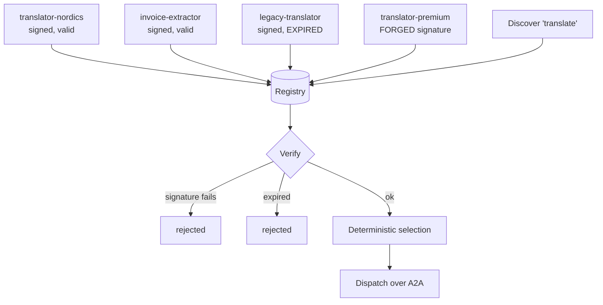

---
{
  "title": "Agent Registry & Discovery",
  "summary": "Find a peer by capability, verify its signed card, and only then send it work.",
  "category": "Orchestration",
  "projects": [
    { "flavor": "AgentFramework", "path": "AgentRegistry.AgentFramework" }
  ]
}
---

## What it is

**InterAgentCommunication.A2A** answers *how* two agents talk. It does not answer *which* agent,
or why you should believe its claim to be able to do the thing. This pattern is that missing
half: peers publish signed capability cards, a consumer discovers by capability, verifies, and
only then dispatches.

"Find an agent that can translate" is the easy part. Everything that decides whether this is a
feature or a hole happens between finding a card and sending it work — because an unverified
registry is a directory of whatever anyone published, and dispatching to it hands your task, and
whatever context rides along with it, to a name that *claimed* a capability.

So the order is fixed and none of it is optional: signature, then expiry, then capability, then
an endpoint. A card that fails any check is not "used with lower confidence". It is not used.

## When to use it

- Multi-team or multi-tenant estates where the set of available agents changes without your
  deployment changing.
- Anywhere agents are addressed by capability rather than by hard-coded URL.
- As the front door to A2A: discovery decides the peer, A2A carries the conversation.

Skip it when you have three agents you configured yourself — a registry adds a moving part and
a key to manage for a lookup a `Dictionary` already does. And note that discovery does not
replace authorisation: knowing which peer can do something is not the same as deciding it may do
it for *this* request, which is **ToolAuthorization** territory.

## How the demo works

Four cards go into the registry, and three of them are wrong in a different way:

- `translator-nordics` — properly signed, valid, two capabilities.
- `invoice-extractor` — properly signed, also claims `translate`.
- `legacy-translator` — properly signed and **expired yesterday**. Still in the directory, still
  claiming the capability.
- `translator-premium` — plausible name, `evil.example` endpoint, and a **signature from a key
  the registry has never seen**, published via `PublishRaw` so it reaches the directory intact.

`Discover("translate", now)` returns a `DiscoveryResult` per match — either a verified card or a
rejection reason. Rejections are *returned*, not filtered out, so the run can print which cards
were refused and why. A discovery that silently returns two of four results tells an operator
nothing about the two that vanished.

Selection among verified peers is deterministic — fewest capabilities first, then name — so two
runs over the same registry dispatch to the same peer. A discovery step that picks
nondeterministically is a class of bug you cannot reproduce.

The dispatch itself is a stand-in for the A2A call the endpoint would receive; the sample is
about what had to be true before that line runs. It closes by re-verifying a card whose endpoint
was swapped after publication — the endpoint is inside the signed canonical form, so redirecting
it breaks the signature.

## Key APIs

- `AgentCard.Canonical()` — the exact bytes that get signed, with field order fixed in code
  rather than by JSON property order, so a peer that reserialises the card still verifies.
  Capabilities are sorted before signing for the same reason.
- `HMACSHA256.HashData(key, canonicalBytes)` and `CryptographicOperations.FixedTimeEquals` for
  the comparison.
- `Registry.Discover(capability, now)` → `IReadOnlyList<DiscoveryResult>` — matches with their
  verdicts, rejections included.
- `Registry.Verify(card, now)` — usable on its own, which is what makes re-verification before a
  later dispatch a one-liner.

The `ponytail:` note on `Sign` is deliberate: HMAC with one shared registry key demonstrates
sign-and-verify without a PKI, and it has a real limit — anyone who can verify can also mint. A
production registry signs per-agent with asymmetric keys and publishes a JWKS, so a compromised
consumer cannot forge cards. That is a different mechanism, not a bigger key.

**And a second limit, which is about what verification proves rather than how strong it is.** A
verified card establishes that *the registry vouched for this name, capabilities and endpoint*. It
does not establish that whoever answers at that endpoint is the agent the card describes. Nothing
here binds the card to the connection: without TLS server-identity checking bound to the card's
endpoint — or a challenge the peer must sign with the key the card names — a network-level attacker
who can answer at that address inherits the trust the signature conferred. Discovery-time identity
and connection-time identity are separate problems, and this sample solves only the first.

## What to watch in the output

The discovery block is the whole pattern in five lines: two `ok` rows, one `rejected …
signature does not verify` (the forged premium translator), one `rejected … card expired`. Note
that the forged card was *found* — it matched the capability query — and stopped at verification.
Discovery and trust are separate steps, and this is what that separation looks like.

Then the dispatch line, and at the end the endpoint-swap check, which should print `signature
does not verify`. If it ever prints `accepted`, the endpoint has fallen out of the canonical
form and the whole scheme is decorative.

**InterAgentCommunication.A2A** is the transport this feeds; **ToolAuthorization** decides
whether a discovered peer may act on a given request; **MCP** is the same trust question asked
about a tool server instead of a peer agent.
