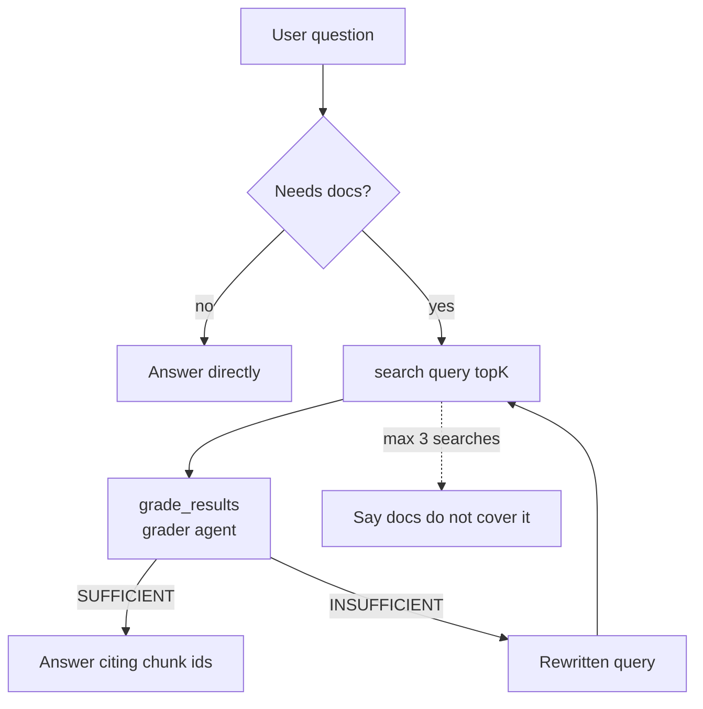

---
{
  "title": "Agentic RAG",
  "summary": "Retrieval becomes a tool the agent chooses, grades, and retries with a better query.",
  "category": "Knowledge & context",
  "projects": [ { "flavor": "AgentFramework", "path": "AgenticRAG.AgentFramework" } ]
}
---

## What it is

Classic RAG retrieves once, on every question, whether or not retrieval helps — and it trusts
whatever comes back. Agentic RAG hands the agent the steering wheel: retrieval is a *tool* it
may or may not call, the retrieved chunks are *graded* before they are used, and a poor grade
triggers a rewritten query and another search.

Three differences from plain **RAG**: retrieval is optional, results are judged, and the loop
can run again. This is the Self-RAG / CRAG family of designs.

## When to use it

- Some questions need no documents at all, and a forced retrieval only adds noise and cost.
- Your corpus contains near-misses — right vocabulary, wrong product — that rank high on
  similarity but do not answer the question.
- The user's phrasing rarely matches the document's phrasing, so a rewrite pays for itself.

Skip it when a single similarity search is reliably good enough. Every extra grading and
re-retrieval round is another model call and more latency; plain RAG is cheaper and simpler.

## How the demo works

The sample indexes ten documentation chunks for a fictional *Helioform Nimbus 9* smart
thermostat, including two deliberate traps about the legacy *Nimbus 8* and its AA batteries.
The `AgenticRag` agent gets two tools: `search(query, topK)` and `grade_results(question)`.
Grading is delegated to a second `ChatClientAgent` named `grader` that returns a structured
`GradeReport(Sufficient, RelevantChunkIds, RewrittenQuery)` via `RunAsync<GradeReport>`.

Three questions take three different paths: *"What is 15% of 240?"* needs no retrieval,
*"How do I pair the Nimbus 9 with the mobile app?"* is a direct hit, and *"Does the Nimbus 9
have a battery backup for power outages?"* pulls the Nimbus 8 chunks to the top — so the
grader must reject them and suggest wording like *reserve cell* that matches the real chunk.

The instructions cap the loop at three searches per question, so a bad corpus fails honestly
instead of spinning.

## Key APIs

- `AIFunctionFactory.Create(Search, "search", ...)` — retrieval exposed as a callable tool.
- `AIFunctionFactory.Create(GradeResults, "grade_results", ...)` — the grader, also a tool.
- `grader.RunAsync<GradeReport>(prompt)` — structured output for the grading verdict.
- `IEmbeddingGenerator` + `TensorPrimitives.CosineSimilarity` — the same in-memory ranking as
  **RAG**, deliberately kept instead of a vector-store connector.
- `ChatClientAgent(client, name, instructions, tools: [...])` — the loop lives in the
  instructions, not in C# control flow.

## What to watch in the output

Every question is separated by a `======` rule. The tools log themselves: `  [tool]
search("...", topK: 3)` followed by `         -> n9-pair (score 0.87)` lines, then `  [tool]
grade_results("...")` and a verdict line reading `-> SUFFICIENT, relevant: [...]` or
`-> INSUFFICIENT, relevant: [...], suggested query: "..."`. The arithmetic question should
print no `[tool]` lines at all, and the battery question is where you can watch the grader
discard the `n8-*` chunks. Compare with **RAG** for the always-retrieve baseline, and
**ToolUse** for the underlying function-calling loop.
