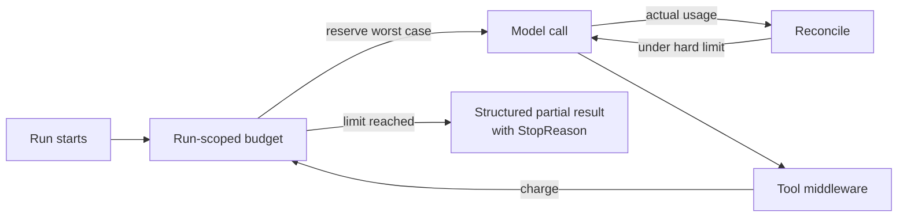

---
{
  "title": "Bounded Execution",
  "summary": "Enforce one run's hard limits on iterations, calls, output tokens, and elapsed time — with input tokens as a conservative pre-dispatch estimate.",
  "category": "Production controls",
  "projects": [ { "flavor": "AgentFramework", "path": "BoundedExecution.AgentFramework" } ]
}
---

## What it is

An agent loop can keep calling models and tools long after its useful work is done. Bounded
execution gives each run a finite envelope and stops at a host-enforced boundary. This is not a
circuit breaker: a breaker remembers whether a dependency is unhealthy across calls; an execution
budget limits one run even when every dependency is healthy.

The budget is run-scoped and covers iterations, model calls, tool calls, input/output tokens,
elapsed time, and estimated cost. Retries and evaluator calls count because they pass through the
same interceptors.

## When to use it

- Autonomous or recursive workflows whose number of turns is not known in advance.
- Tools that can repeatedly return "possibly relevant" results.
- Multi-tenant systems that need a firm per-run resource ceiling.

Use **Resource-Aware Optimization** when the goal is choosing a cheaper model or degrading after
spend. Use both when a run must route economically *and* have a hard upper bound.

## How the demo works

`ExecutionBudgetState` atomically reserves a conservative maximum before every model call. Two
concurrent calls therefore cannot both observe the same remaining budget. The provider's own
output cap is clamped to the remaining budget, so the full worst case is reserved before dispatch.
Actual usage is reconciled afterward and unused reservation is released. Function middleware
charges every tool invocation, while a linked cancellation token bounds a call that is still in
flight for only the time remaining in the run.

The token prices come from `BOUNDED_EXECUTION_INPUT_COST_PER_MILLION` and
`BOUNDED_EXECUTION_OUTPUT_COST_PER_MILLION`, with demo defaults. Prices are configuration, not
provider facts embedded in the budget component.

## How hard is each limit

| Limit | Enforcement |
|---|---|
| Model calls | Hard - checked before dispatch |
| Iterations | Hard - one agent invocation, checked before the run starts |
| Tool calls (total and per tool) | Hard - checked before invocation |
| Elapsed time | Hard - linked cancellation over the remaining duration |
| Output tokens | Hard - the provider's own `MaxOutputTokens` is capped to the remaining budget and the full cap is reserved |
| Input tokens | Conservative - the request is estimated at ~4 chars/token before dispatch; a mis-estimate is caught on reconcile, after the call |
| Estimated cost | Follows the two token limits: hard on output, conservative on input |

Usage a provider does not report is charged at the reservation, never at zero.

## Key APIs

- `ExecutionBudgetState.RecordIteration()` — counts one orchestration-loop turn, separately from model calls.
- `ExecutionBudgetState.ReserveModelCall(...)` — atomically reserves calls, tokens, and cost.
- `ExecutionBudgetState.Reconcile(...)` — replaces the reservation with actual response usage; charges
  the reservation itself when the provider omits usage.
- `DelegatingChatClient.GetResponseAsync(...)` — the boundary around every model attempt.
- Agent Framework function middleware — charges each tool call, including repeated calls.
- `CancellationTokenSource.CreateLinkedTokenSource(...)` — preserves caller cancellation while
  enforcing total elapsed time.

## What to watch in the output

The final block always prints `Result status`, `Stop reason`, calls, tokens, elapsed time, cost, and
whether the soft threshold was crossed. A hard stop is explicitly `Partial`; prompt wording alone
is never treated as a budget control.
