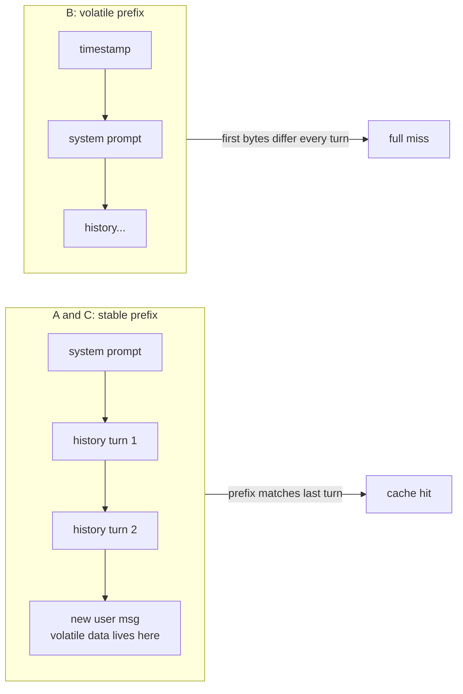

---
{
  "title": "Cache-Aware Context",
  "summary": "Keep the prompt a stable prefix plus append-only history, and the provider's cache pays for most of your input tokens.",
  "category": "Knowledge & state",
  "projects": [ { "flavor": "AgentFramework", "path": "CacheAwareContext.AgentFramework" } ]
}
---

## What it is

Providers cache prompt **prefixes**: if the first N tokens of a request byte-match a
recent request, those tokens are served from cache — typically at a large discount and
lower latency. An agent whose message list is *stable prefix + append-only history*
gets this almost for free, because each turn's request literally extends the previous
one. But the cache matches from the top, so a single volatile byte early in the prompt
— a timestamp, a request id, a reshuffled tool list — invalidates everything after it,
every turn.

This is not response caching (**SemanticCaching** covers that — same answer served
twice). Here every call still runs; the layout only decides how much of the *input* is
re-priced.

## When to use it

Always — it is free. Concretely, audit for it when:

- Multi-turn agents re-send a large system prompt or tool schema every call.
- Anything volatile (time, user location, run ids) sits near the top of the prompt.
- History gets rewritten between turns — note that compaction and summarization
  invalidate the cache at the mutation point, so compact at boundaries, not every turn.

The mechanics: caching needs a prefix of at least ~1024 tokens, hits grow in 128-token
steps, entries live for minutes, and hits are best-effort — expect the occasional
unexplained miss.

## How the demo works

The same four-question support conversation runs three times over a ~1300-token system
prompt (shop policy plus a 30-product catalog). Layout **A** is the well-behaved
baseline: fixed system prompt, append-only history. Layout **B** injects a per-turn
timestamp at the **top** of the system prompt. Layout **C** carries the same timestamp,
moved into the latest user message — the fix. After each call the demo prints
`UsageDetails.InputTokenCount` next to `CachedInputTokenCount`.

A per-run session id sits at the top of every prompt — constant within the run, unique
across runs — because provider caches outlive the process and a rerun of a
deterministic demo would otherwise hit the previous run's cache.

## Key APIs

- `UsageDetails.CachedInputTokenCount` — the cached-token count, first-class in
  Microsoft.Extensions.AI.
- Plain `IChatClient.GetResponseAsync` over a hand-built `List<ChatMessage>` — the
  pattern is about message-list layout, so the demo keeps the list visible instead of
  hiding it behind an agent abstraction.

## What to watch in the output

Layout A: turn 1 pays full price, then `served from cache` climbs — 1280, 1408, 1536 —
as each turn extends the previous prefix (note the 128-token steps). Layout B: the same
conversation, cache column flat at **0**; four timestamp characters at the top of the
prompt cost every cached token, every turn. Layout C: the identical timestamp is still
in the prompt, just at the end — and the cache column matches A. If every column reads
0, your deployment or model does not support prompt caching. **SemanticCaching** caches
responses instead; **ContextCompaction** is the pattern whose history mutations this
one says to schedule carefully.
