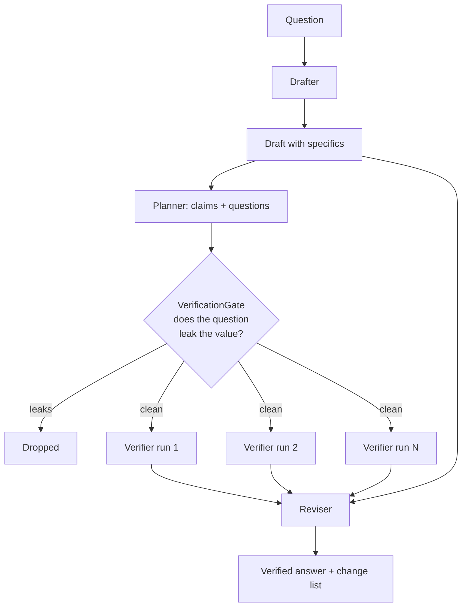

---
{
  "title": "Chain of Verification",
  "summary": "Draft, plan the checks, answer each one with the draft out of sight, then revise against what came back.",
  "category": "Reasoning & generation",
  "projects": [
    { "flavor": "AgentFramework", "path": "ChainOfVerification.AgentFramework" }
  ]
}
---

## What it is

Answer first, then check the answer — but check it somewhere the answer cannot be seen.

That last clause is the whole pattern. Asking a model to review its own output in the same
context gets you the same output with more confidence: the draft is right there, every token of
it conditioning the review, and "are you sure?" is a question the model answers by re-reading
what it just wrote. Chain of Verification breaks that loop structurally. The draft is decomposed
into individual claims; each claim becomes a narrow question; each question is answered by a
fresh call that has never seen the draft. Only then are the two put side by side.

The difference from **SelfCorrectionLoop** is what does the checking. There, an evaluator agent
judges the whole output against criteria — a better critic, but still a critic reading the thing it
is critiquing. Here the checker is not judging anything; it is answering "in what year was Cologne
founded?" with no idea that a draft exists, let alone what it claimed.

Be precise about what that buys, because it is easy to oversell and most write-ups of CoVe do.
This is **independent context, not independent evidence**. The checker is the same deployment, same
weights, same training data: a misconception the draft has, the check can have too — and on
questions like Roman founding dates that is not a remote possibility, it is the likely failure. So
this is a **blind cross-check**, and its two outcomes are worth very different amounts:

- **Disagreement is strong evidence.** Two passes over the same knowledge reaching different
  answers means at least one is unreliable, which is exactly what you wanted to find out.
- **Agreement is weak evidence.** It rules out anchoring on the draft. It does not rule out a
  shared misconception, and treating it as confirmation is how a wrong answer acquires a
  verification badge.

Genuine independence needs a different source — retrieval, a tool, a second model. **AgenticRAG**
is where that lives.

## When to use it

- Factual output with many small, separately checkable specifics — dates, names, figures,
  citations. The more independent claims, the more this pays.
- Anywhere a confident wrong detail is worse than a hedge: briefing notes, summaries of source
  material, anything a person will quote onward.
- When you can afford the calls. This is 1 draft + 1 planning + N verification + 1 revision.
  For a four-city question that is around eight calls for one answer.

Skip it when the claims are not separable (an opinion, a piece of code, a plan — you cannot
verify "the third paragraph" independently of the second), and skip it when the model's own
uncertainty is already the signal you need, where **ConfidenceReporting** costs one call instead
of eight.

## How the demo works

The question — four European cities founded as Roman settlements, with Roman names and founding
years — is chosen because it invites exactly the failure this pattern catches: plausible,
specific, confidently wrong dates.

Four stages, of which only the third is unusual:

1. **Draft.** One agent, told never to hedge, produces the answer with all its specifics.
2. **Plan.** A planner splits the draft into claims. Each claim carries a `value` — the part
   that could be wrong — and a question that checks it. The prompt is explicit: ask *"In what
   year was X founded?"*, never *"Was X founded in 38 BC?"*.
3. **Verify, in isolation.** A separate `Verifier` agent answers each question in its own
   stateless run — no session, no draft, no siblings. The questions run concurrently because
   they are genuinely independent; that independence is the point, and the parallelism is a
   free consequence of it.
4. **Revise, into three outcomes.** The reviser sees the draft and the cross-checks together, and
   is explicitly told that a cross-check is *not an authority*. Each disagreement resolves as:
   check confident and disagrees → correct the draft; check uncertain and disagrees → mark the
   claim **contested**, stating both values without picking one; check agrees → leave it alone and
   do **not** upgrade the wording, because agreement between a model and itself is weak evidence.
   The verifier is asked to prefix its answers `CONFIDENT:` or `UNCERTAIN:` so that split is
   available to act on.

Between 2 and 3 sits the host's contribution, `VerificationGate`. Models drift toward leading
questions — it is the natural way to phrase a check — and a question containing the drafted
value re-anchors the verifier on the very number under suspicion, turning an independent
measurement back into a request for agreement. The gate tokenises the claim's value and the
question and rejects the question if every token of the value appears in it. Token-level, not
substring: `38 BC` must be caught inside `AD 38 BC-era`, while a question that merely mentions
*BC* is fine.

## Key APIs

- `new ChatClientAgent(client, name:, instructions:)` — four agents, one per stage. Statelessness
  is doing real work here: the `Verifier` cannot leak the draft into a verification run because
  no session ever connects them.
- `agent.RunAsync<VerificationPlan>(...)` — structured output for the claim/question extraction.
- `Task.WhenAll(checks.Select(...))` over the verifier — independent questions, so concurrent
  runs, with `agent.RunAsync(question, options:)` per check.
- `VerificationGate.Validate(claim, question)` — the host's screen. Returns reasons, not a bool,
  so a dropped question prints why it was dropped.

**Coverage is reported, not implied.** The planner is capped at eight claims and the gate drops
leading questions, so some of the draft's specifics may never be checked at all. The run prints
`claims extracted / cross-checked / never checked` and labels the result *partially* cross-checked
when anything was missed — calling an output "verified" when three of its eleven claims were never
looked at is the quiet overclaim this pattern invites.

## What to watch in the output

`=== Draft ===` first, with its confident dates. Then the gate: any line starting `[gate] claim N
question rejected` is the planner having written a leading question, which is common enough that
seeing zero of them across a run is the surprising outcome. `=== N verification questions passed
the gate ===` lists each question next to what the draft claimed, which is the clearest view of
what is about to be tested.

The section worth reading closely is `=== Blind cross-checks ===`. Compare each to the
`draft says:` value above it, and note the `CONFIDENT:`/`UNCERTAIN:` prefix — that is what decides
whether a disagreement becomes a correction or a contested claim.

Then `=== Cross-checked answer ===`, whose `Changes:` list is the deliverable: corrections and
contested claims, listed separately. An empty change list means the draft and the check agreed,
which — per above — is the weaker of the two possible results, not a clean bill of health.

Finally `=== Coverage ===`. If it says `never checked: 2`, two of the draft's specifics carry the
draft's confidence and nothing more, and the run says so rather than letting the header imply
otherwise.

**SelfCorrectionLoop** is the same instinct with a judging evaluator rather than a blind re-ask;
**Voting** and **SelfConsistency** sample the same question many times instead of decomposing it —
and share this pattern's ceiling, since correlated errors survive any number of samples from one
model. **AgenticRAG** is the escape from that ceiling: evidence from outside the weights.
