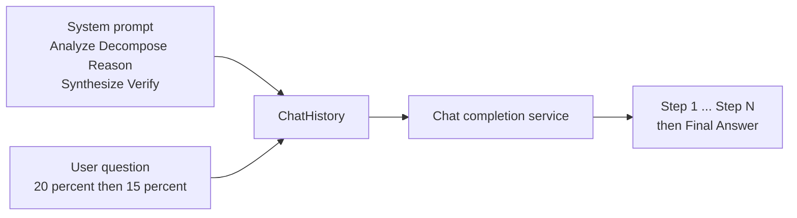

---
{
  "title": "Chain of Thought",
  "summary": "Ask the model to show its work step by step before committing to a final answer.",
  "category": "Reasoning & generation",
  "projects": [ { "flavor": "SemanticKernel", "path": "ChainofThoughts" } ]
}
---

## What it is

A model that answers immediately answers from pattern-matching. Chain of Thought forces it to
spend tokens on intermediate steps first — analyse, decompose, solve each piece, synthesise,
verify — and only then state a conclusion. The reasoning is not a side effect; it is context
the model then conditions its own answer on.

There is no orchestration here. It is a **single call with a structured system prompt** — the
cheapest reasoning pattern in the repo, and the base that Self-Consistency, Tree of Thoughts
and ReAct all extend.

## When to use it

- Multi-step arithmetic, logic puzzles, or anything with a tempting-but-wrong shortcut answer.
- Decisions you have to audit later: the printed steps are the audit trail.
- Prompts where the model keeps being confidently wrong on the first token.

Skip it for lookups, formatting, classification, or extraction — the extra tokens cost latency
and money and buy nothing. Skip it too on reasoning models that already think internally; you
end up paying for two chains of thought. And remember the printed reasoning is a *plausible*
explanation, not a guaranteed one — it can be fluent and still wrong.

## How the demo works

The sample builds a `ChatHistory`, adds a system message laying out the five fixed stages, and
asks a discount trap question: *"A store offers 20% off, then an additional 15% off the sale
price. Is this the same as a single 35% discount? Explain with a $100 item."* The answer is no —
successive discounts compound to 32%, not 35% — and the step-by-step format is what pushes the
model to actually compute $100 to $80 to $68 instead of adding the percentages.

One `GetChatMessageContentAsync` call, no tools, no loop. The whole pattern lives in the system
message.

## Key APIs

- `Settings.Kernel` — the shared kernel from the `Shared` project.
- `kernel.GetRequiredService<IChatCompletionService>()` — the raw chat service, no agent wrapper.
- `new ChatHistory()` with `AddSystemMessage(...)` / `AddUserMessage(...)`.
- `chatService.GetChatMessageContentAsync(history)` — a single completion.

## What to watch in the output

The demo prints one block prefixed `CoT Agent:`. Inside it, look for the `Step N:` headers the
system prompt demands, and the closing `Final Answer:` line — if either is missing, the model
skipped the scaffold and you are back to a plain completion. **Self-Consistency** runs this same
idea five times and votes on the answers; **Reasoning and Acting** keeps the step-by-step framing
but lets the model call tools between steps.
