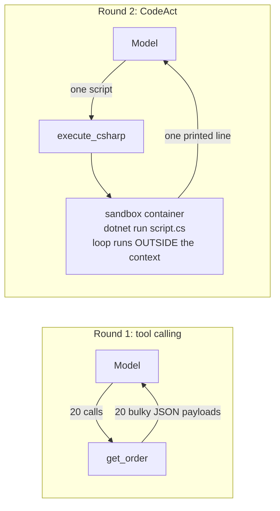

---
{
  "title": "CodeAct",
  "summary": "One code-execution tool instead of many bound tools — intermediate results stay inside the script.",
  "category": "Orchestration",
  "risk": "Executes model-written C# in a locked-down local container (no network, read-only, non-root, resource limits); fails closed without Docker/Podman. Host execution requires an explicit double opt-in.",
  "projects": [ { "flavor": "AgentFramework", "path": "CodeAct.AgentFramework" } ]
}
---

## What it is

Classic tool calling pays a hidden tax: every tool result round-trips through the model's
context, so a task that needs twenty lookups puts twenty bulky payloads into the prompt —
and the model re-reads all of them on every subsequent call. CodeAct inverts the action
space: the agent gets a **single tool that executes code** plus a small API it can script
against. Loops, filtering, and aggregation run inside the script; only what the script
*prints* ever reaches the model.

This is the architecture behind "the agent writes bash/Python instead of making tool
calls" — here the script language is C# itself, executed as a .NET 10 file-based app.

## When to use it

- Tasks that chain or fan out over many actions (batch lookups, filter-then-aggregate),
  where per-call tool results would flood the context.
- Action APIs that compose well in code — the model is often better at writing a loop
  than at orchestrating twenty sequential tool calls.
- You want deterministic post-processing (sums, sorting, joins) done exactly, not by
  a model reading JSON blobs.

Skip it for one-shot actions — a single `get_weather` call needs no script. And treat the
executor as what it is, **arbitrary code execution**: model-generated code is untrusted
code. This sample runs it in a locked-down local container and **fails closed** when no
container runtime is available — see the security section below.

## How the demo works

The same question — *which of orders A-100…A-119 are delayed, and what is their total
value?* — is answered twice.

Round 1 binds a classic `get_order` tool; the model calls it 20 times and every bulky
JSON payload lands in the context. Round 2 binds only `execute_csharp`. The agent writes
top-level C# statements calling `GetOrder(id)` in a loop; the host appends the action-API
source (the same deterministic fake data), writes `script.cs` into a disposable per-run
directory, runs it as `dotnet run script.cs` **inside the sandbox container**, and feeds
back stdout — a single line like `A-101,A-105,…|2107.5`.

A `CallCounter` (delegating `IChatClient`) counts model round-trips, and both rounds
print their `AgentResponse.Usage` token totals for a side-by-side comparison.

## Security: sandbox by default

This pattern executes model-generated code, which must be treated as hostile. The rule
this repo applies to every pattern that executes generated code, shell commands, or
dynamically selected tools:

> **The model proposes. A constrained host validates and executes. Untrusted execution
> never inherits the application's authority.**

`Execution/CodeRunnerFactory` selects the runner and **never silently falls back to host
execution**: with Docker (or Podman via `CodeExecutionOptions.ContainerRuntime`) present
you get `ContainerCodeRunner`; without it the sample throws before the first model call.
Running model code on the host requires a deliberate double opt-in — the
`--allow-unsafe-host-execution` flag (or
`AGENTIC_PATTERNS_ALLOW_UNSAFE_HOST_EXECUTION=true` for Pattern Explorer's Docker image) AND
`AGENTIC_PATTERNS_ACKNOWLEDGE_UNSAFE_CODE_EXECUTION=I_UNDERSTAND_THIS_RUNS_UNTRUSTED_CODE_ON_MY_HOST` —
so nobody lands in unsafe mode just because Docker happened to be stopped.

### How the container is set up

The image (`CodeAct.AgentFramework/Sandbox/Dockerfile`, built automatically on first run)
is deliberately boring — the pinned .NET SDK plus a NuGet cache pre-warmed at build time,
the only moment network access is legitimate. The security boundary is applied at
`docker run` time, on the **least-privilege principle: allow nothing by default, then
grant back only what compiling and running a BCL-only script strictly needs — never
anything preemptively or "just in case"**:

| Flag | Denies / grants |
|---|---|
| `--network none` | No network at all, not even DNS — exfiltration and call-outs fail |
| `--read-only` | Immutable container filesystem |
| `--cap-drop ALL` | No Linux capabilities |
| `--security-opt no-new-privileges=true` | setuid binaries cannot escalate |
| `--user 65532:65532` | Non-root, with no matching user on the host |
| `--pids-limit / --memory / --cpus` + host timeout | Fork bombs and spin loops die early |
| `--tmpfs /tmp:rw,exec,…,size=512m` | The one writable path, bounded — granted back because build artifacts must be written and the compiled script must execute |
| `--mount …,readonly` of the per-run directory | The only host path visible: a disposable directory holding `script.cs`, read-only |
| Four `--env` values (`HOME`, `DOTNET_CLI_HOME`, …) | The complete environment; nothing from the host's environment is forwarded |

The host also writes a `NuGet.config` with an **empty package-source list** next to the
script, and strips `#:` directives from the model's code, so the model cannot add package
feeds or references even if a boundary ever regressed — restore resolves only from the
offline cache baked into the image. Each run gets a uniquely named container so a timeout
can kill *that* container, output retention is bounded (a script printing forever cannot
grow host memory), and cleanup (`docker rm -f`, directory delete) runs in `finally`.

### Included sandbox ≠ production-ready sandbox

The container demonstrates the required isolation boundary and reduces accidental risk,
but it is **not a production-grade sandbox for adversarial or multi-tenant workloads** —
container escapes exist. A production implementation should execute code in a dedicated
disposable worker, VM, microVM, or hardened sandbox service with no ambient credentials,
denied network by default, strict resource limits, constrained filesystem access, and
audited inputs and outputs. Never execute model-generated code inside the application
process or on the application host.

## Key APIs

- `new ChatClientAgent(client, instructions, tools: [AIFunctionFactory.Create(ExecuteCSharp, ...)])` —
  the whole action space is one function.
- `IGeneratedCodeRunner` / `ContainerCodeRunner` / `CodeRunnerFactory` — the fail-closed
  execution boundary; `ContainerCodeRunner.BuildRunArguments` is the entire security
  posture as one pure, unit-tested function.
- .NET 10 file-based apps — `dotnet run script.cs` compiles and runs a single file; the
  host appends local functions and record declarations after the model's top-level
  statements, so the API is callable without any project scaffolding.
- `AgentResponse.Usage.InputTokenCount` / `OutputTokenCount` — the evidence.

## What to watch in the output

Round 1 answers correctly but reports thousands of input tokens — the 20 order payloads.
Round 2 prints the agent's actual script (each line prefixed `|`), then its one-line
output, then the same correct answer at a fraction of the input tokens with the same
number of model calls. The instructions pin down the exact `Status` values — an early
version of this demo let the model guess `"Delayed"` instead of `"delayed"` and it
confidently reported zero delayed orders, a good reminder that a scripting API needs
real documentation. **ToolUse** shows the classic baseline; **HostedTools** is the
provider-hosted cousin (a server-side code interpreter); **ContextOffloading** attacks
the same bloat from the other side, evicting payloads that already happened.
