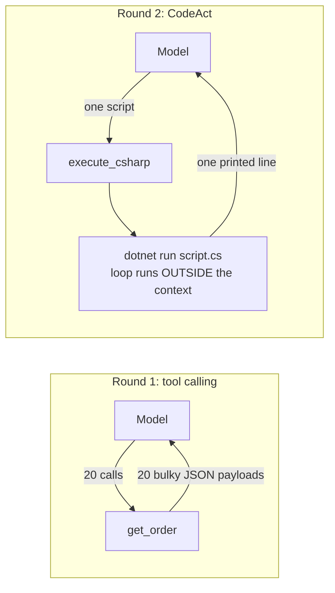

---
{
  "title": "CodeAct",
  "summary": "One code-execution tool instead of many bound tools — intermediate results stay inside the script.",
  "category": "Fundamentals",
  "risk": "Runs model-written C# directly on this machine — no sandbox, network or filesystem limits.",
  "projects": [ { "flavor": "AgentFramework", "path": "CodeAct.AgentFramework" } ]
}
---

## What it is

Classic tool calling pays a hidden tax: every tool result round-trips through the model's
context, so a task that needs twenty lookups puts twenty bulky payloads into the prompt —
and the model re-reads all of them on every subsequent call. CodeAct inverts the action
space: the agent gets a **single tool that executes code** plus a small API it can script
against. Loops, filtering, and aggregation run inside the script; only what the script
*prints* ever reaches the model.

This is the architecture behind "the agent writes bash/Python instead of making tool
calls" — here the script language is C# itself, executed as a .NET 10 file-based app.

## When to use it

- Tasks that chain or fan out over many actions (batch lookups, filter-then-aggregate),
  where per-call tool results would flood the context.
- Action APIs that compose well in code — the model is often better at writing a loop
  than at orchestrating twenty sequential tool calls.
- You want deterministic post-processing (sums, sorting, joins) done exactly, not by
  a model reading JSON blobs.

Skip it for one-shot actions — a single `get_weather` call needs no script. And treat the
executor as what it is, **arbitrary code execution**: a real deployment runs it sandboxed
(container, no network, resource and time limits). The demo runs it directly for clarity.

## How the demo works

The same question — *which of orders A-100…A-119 are delayed, and what is their total
value?* — is answered twice.

Round 1 binds a classic `get_order` tool; the model calls it 20 times and every bulky
JSON payload lands in the context. Round 2 binds only `execute_csharp`. The agent writes
top-level C# statements calling `GetOrder(id)` in a loop; the host appends the action-API
source (the same deterministic fake data), writes `script.cs`, runs `dotnet run script.cs`,
and feeds back stdout — a single line like `A-101,A-105,…|2107.5`.

A `CallCounter` (delegating `IChatClient`) counts model round-trips, and both rounds
print their `AgentResponse.Usage` token totals for a side-by-side comparison.

## Key APIs

- `new ChatClientAgent(client, instructions, tools: [AIFunctionFactory.Create(ExecuteCSharp, ...)])` —
  the whole action space is one function.
- .NET 10 file-based apps — `dotnet run script.cs` compiles and runs a single file; the
  host appends local functions and record declarations after the model's top-level
  statements, so the API is callable without any project scaffolding.
- `AgentResponse.Usage.InputTokenCount` / `OutputTokenCount` — the evidence.

## What to watch in the output

Round 1 answers correctly but reports thousands of input tokens — the 20 order payloads.
Round 2 prints the agent's actual script (each line prefixed `|`), then its one-line
output, then the same correct answer at a fraction of the input tokens with the same
number of model calls. The instructions pin down the exact `Status` values — an early
version of this demo let the model guess `"Delayed"` instead of `"delayed"` and it
confidently reported zero delayed orders, a good reminder that a scripting API needs
real documentation. **ToolUse** shows the classic baseline; **HostedTools** is the
provider-hosted cousin (a server-side code interpreter); **ContextOffloading** attacks
the same bloat from the other side, evicting payloads that already happened.
