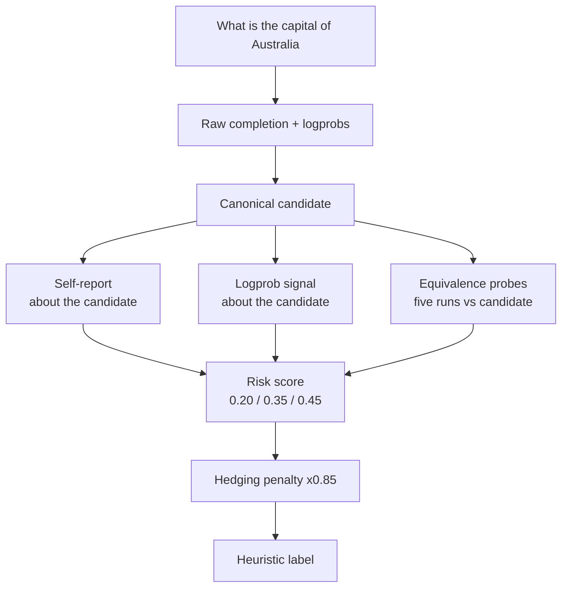

---
{
  "title": "Uncertainty Signals (Confidence Reporting)",
  "summary": "Score one canonical candidate with self-report, logprob and consistency signals — an uncalibrated heuristic, not a confidence measurement.",
  "category": "Production controls",
  "projects": [
    { "flavor": "AgentFramework", "path": "ConfidenceReporting.AgentFramework" },
    { "flavor": "SemanticKernel", "path": "ConfidenceReporting.SemanticKernel" }
  ]
}
---

## What it is

Models answer wrong questions with the same fluent tone as right ones. This pattern attaches a
number to the answer so downstream code can decide whether to show it, hedge it, or escalate it.
Asking the model *"how sure are you?"* is the weakest form — it is a vibe, not a measurement —
so the samples combine three independent signals, all scored against **one canonical candidate
answer**:

- **Self-reported** confidence, via structured output, about that candidate.
- **Logprobs** — the model's own token probabilities for that candidate's exact text.
- **Consistency sampling** — ask N times at high temperature and measure agreement, via an
  equivalence check, with that candidate.

These are uncertainty *signals*, not a confidence *measurement*. Every signal now scores the same
canonical candidate, which removes the worst defect - three signals describing three different
answers - but the combination is still a hand-tuned heuristic. Before it gates an automated
decision, fit it on labelled examples and report Brier score, expected calibration error,
accuracy per confidence bucket, and selective accuracy as the system abstains.

## Information-theoretic view

The three signals sit at different points on the proxy spectrum (see
`docs/coordination-physics.md`). Self-reported confidence is the softest proxy there is — a
number the system being measured chooses to emit about itself, which is verification theater
the moment anything optimizes against it. Logprobs and consistency sampling are probe-based:
measured from the model's behavior rather than asked of it, which makes them the
mechanical-gate version of the same question. The sample's weighting already encodes this
ranking — 0.20 for self-report against 0.35 and 0.45 for the probes — so the design is the
theory made executable: trust what you measured over what you were told. That ranking is still
a hand-picked weighting, not a fitted one — see the calibration caveat above.

## When to use it

- As a routing signal — answer directly, show the uncertainty, escalate, or abstain — never as a
  probability shown to an end user.
- You want a cheap heuristic to prioritize human review, not replace it.
- The UI can meaningfully show "approximate" versus "verified".

Skip it when the work is creative or open-ended — there is no ground truth to be confident
about. Also note the cost: consistency sampling multiplies your token bill by the sample count.

## How the demo works

Both samples ask a single question — *"What is the capital of Australia?"* — and run four stages
in order:

1. Generate **one canonical candidate** from a raw completion with logprobs enabled — the only
   call whose logprobs describe the exact text that gets displayed.
2. Normalise that completion's per-token log probabilities with `(avgLogprob + 3.0) / 3.0`.
3. Ask the self-report agent to score *that candidate* (not to answer fresh) and reason about it.
4. Sample the question five more times at `Temperature = 0.9` and, for each sample, run an
   equivalence probe at `Temperature = 0` asking whether it asserts the same thing as the
   candidate — a semantic check, not keyword overlap. A malformed judgement counts as
   *disagreement*, never agreement.

Hedging words like `might`, `possibly` and `not sure` are scanned for in the candidate text.

`UncertaintySignals.RiskScore` weights the three at 0.20 self-report, 0.35 logprobs and 0.45
consistency, then multiplies by 0.85 if hedging was detected. `UncertaintySignals.Label` buckets
the result into *answer directly*, *answer with the uncertainty shown*, *escalate to a second
check*, or *abstain; route to a human*.

## Key APIs

| Agent Framework | Semantic Kernel |
|---|---|
| `agent.RunAsync<SelfReportedResponse>(...)` scoring the candidate | `AzureOpenAIPromptExecutionSettings { ResponseFormat = typeof(SelfReportedResponse) }` |
| Raw `AzureOpenAIClient(...).GetChatClient(...)` for the candidate + logprobs | `OpenAIPromptExecutionSettings { Logprobs = true, TopLogprobs = 1 }` |
| `ChatCompletionOptions.IncludeLogProbabilities` | `response.InnerContent as ChatCompletion` |
| `chatClient.GetResponseAsync(..., ResponseFormat = ChatResponseFormat.Json)` for the equivalence probe | `AzureOpenAIPromptExecutionSettings { ResponseFormat = typeof(EquivalenceResponse) }` |

> Neither `IChatClient` nor `IChatCompletionService` surfaces logprobs directly. Agent Framework
> reaches for the raw OpenAI client; Semantic Kernel casts `InnerContent`. Both fall back to a
> flat `0.5` when logprobs are unavailable.

## What to watch in the output

After the question, the answer line is followed by the self-reported confidence, the
token-probability signal, agreement across five runs, and whether hedging language was detected
— each labelled with what it actually measures. Then a `Heuristic uncertainty score` line with
its routing label, and an explicit disclaimer that the number is not a probability of
correctness. Canberra is well known, so expect a high consistency score and a high combined
number — swap in an obscure question to watch the three signals disagree.
**SelfConsistency** is the sampling half of this pattern used on its own, and
**EvaluationAndMonitoring** tracks the cost of running it five times per question.
