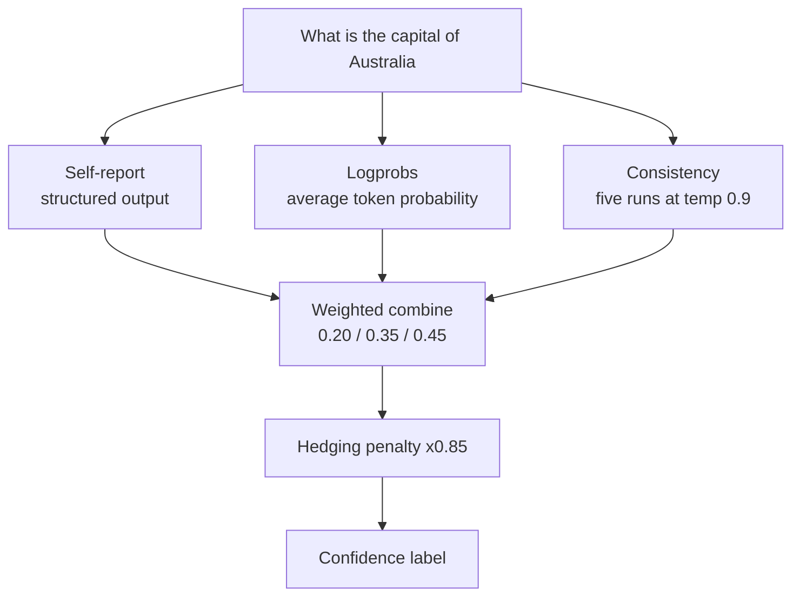

---
{
  "title": "Confidence Reporting",
  "summary": "Blend self-reported, logprob and consistency signals into one trustworthy confidence score.",
  "category": "Production controls",
  "projects": [
    { "flavor": "AgentFramework", "path": "ConfidenceReporting.AgentFramework" },
    { "flavor": "SemanticKernel", "path": "ConfidenceReporting.SemanticKernel" }
  ]
}
---

## What it is

Models answer wrong questions with the same fluent tone as right ones. Confidence reporting
attaches a number to the answer so downstream code can decide whether to show it, hedge it, or
escalate it. Asking the model *"how sure are you?"* is the weakest form — it is a vibe, not a
measurement — so the samples combine three independent signals:

- **Self-reported** confidence, via structured output.
- **Logprobs** — the model's own token probabilities, the most objective signal available.
- **Consistency sampling** — ask N times at high temperature and measure agreement.

## When to use it

- The answer feeds an automated decision and a wrong one is expensive.
- You want a human-review threshold rather than reviewing everything.
- The UI can meaningfully show "approximate" versus "verified".

Skip it when the work is creative or open-ended — there is no ground truth to be confident
about. Also note the cost: consistency sampling multiplies your token bill by the sample count.

## How the demo works

Both samples ask a single question — *"What is the capital of Australia?"* — and run all three
techniques over it. `SelfReportedResponse` is the structured shape (`answer`, `confidence`,
`reasoning`); the answer text is also scanned for hedging words like `might`, `possibly` and
`not sure`. Logprob confidence averages the per-token log probabilities and normalises with
`(avgLogprob + 3.0) / 3.0`. Consistency runs the question five times at `Temperature = 0.9`,
picks the majority answer, and scores agreement by fuzzy keyword match.

`CombineConfidence` weights the three at 0.20 self-report, 0.35 logprobs and 0.45 consistency,
then multiplies by 0.85 if hedging was detected. `GetConfidenceLabel` buckets the result into
High, Medium, Low, or *Very low confidence — consider human review*.

## Key APIs

| Agent Framework | Semantic Kernel |
|---|---|
| `agent.RunAsync<SelfReportedResponse>(q)` | `AzureOpenAIPromptExecutionSettings { ResponseFormat = typeof(SelfReportedResponse) }` |
| Raw `AzureOpenAIClient(...).GetChatClient(...)` for logprobs | `OpenAIPromptExecutionSettings { Logprobs = true, TopLogprobs = 1 }` |
| `ChatCompletionOptions.IncludeLogProbabilities` | `response.InnerContent as ChatCompletion` |
| `chatClient.GetResponseAsync(..., new ChatOptions { Temperature = 0.9f })` | `IChatCompletionService.GetChatMessageContentAsync` |

> Neither `IChatClient` nor `IChatCompletionService` surfaces logprobs directly. Agent Framework
> reaches for the raw OpenAI client; Semantic Kernel casts `InnerContent`. Both fall back to a
> flat `0.5` when logprobs are unavailable.

## What to watch in the output

After the question, a `=== Confidence Results ===` block prints `Self-reported confidence`,
`Logprob confidence`, `Consistency score`, and `Hedging language`, then the `► Combined
confidence` line with its label. Canberra is well known, so expect a high consistency score and
a high combined number — swap in an obscure question to watch the three signals disagree.
**SelfConsistency** is the sampling half of this pattern used on its own, and
**EvaluationAndMonitoring** tracks the cost of running it five times per question.
