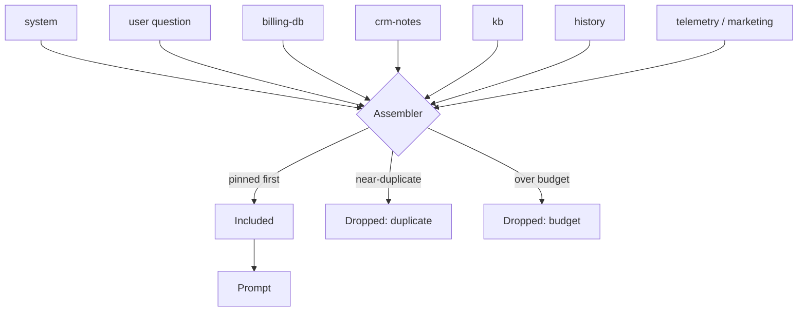

---
{
  "title": "Context Assembly",
  "summary": "Build the context window on purpose: pin what must survive, collapse duplicates, rank the rest, and drop with reasons.",
  "category": "Knowledge & state",
  "projects": [
    { "flavor": "AgentFramework", "path": "ContextAssembly.AgentFramework" }
  ]
}
---

## What it is

The default in most agents is accretion. History grows, retrieval results are concatenated, tool
output is pasted in, and the context is whatever that adds up to. It fails twice: it blows the
window on long runs, and long before that it buries the three lines that mattered under forty that
did not.

Assembly treats the window as a budgeted allocation with an explicit order of business:

1. **Pinned items go in first and are never evicted.** The system prompt and the actual user
   request are not candidates competing on a relevance score — a context that dropped the question
   to fit more retrieval is worse than useless.
2. **Near-duplicates collapse.** Three sources saying the same thing spend three times the tokens
   for one fact.
3. **The rest compete on relevance**, and what does not fit is **dropped with a reason**, so a
   thin answer can be traced to the eviction that caused it.

This sits *underneath* **RAG** rather than beside it. Retrieval answers "what documents match" —
that is one source among several, and none of them knows about the others or about the budget
they are all spending from. Someone has to rank across sources and say no. That someone is the
host, before the call.

## When to use it

- Any agent drawing on more than one source: history, memory, retrieval, profile, tool output.
- Long-running or multi-turn agents where the window is a real constraint rather than a
  theoretical one.
- When you need to explain why the agent did not know something — the drop list is that answer.

Skip it when there is one source and it fits; ranking a single retrieval result against itself is
ceremony. **ContextCompaction** is the right tool when the problem is a long *history* rather than
many *sources*, and **CacheAwareContext** when the layout matters for cache hits rather than for
fit.

## How the demo works

A billing question arrives with twelve candidates from eight sources, each carrying its own
relevance score. The scores come from each source's own retriever; arbitrating **across** sources
is what no single source can do, and is exactly the assembler's job.

`ContextAssembler.Assemble` orders by pinned, then relevance, then source name — that last tiebreak
is not decorative. A context that varies between runs over identical inputs is a bug you cannot
reproduce.

Then, per candidate: a near-duplicate check, a budget check, or inclusion. Both checks are skipped
for pinned items, which is the mechanical form of rule 1.

The duplicate check is word-overlap, not embeddings — this is a de-duplicator, not a retriever,
and the case it must catch is the same fact arriving from two systems in slightly different words.
The demo plants exactly that: `billing-db` and `crm-notes` both report the seat count change,
one of them phrased differently, and one of them is pure waste.

The budget is 120 tokens, estimated at `chars/4` — deliberately tight, so several genuinely
relevant items get dropped and the trade-off is visible rather than theoretical.

## Key APIs

- `ContextAssembler.Assemble(candidates, tokenBudget)` → `AssembledContext(Included, Dropped,
  Tokens, Budget)` — the drops come back with reasons rather than being filtered away.
- `Candidate(Source, Text, Relevance, Pinned)` — provenance travels with the text, so the
  assembled prompt can label each block `[source]` and the model can say where something came from.
- `ContextAssembler.EstimateTokens(text)` — `chars/4`, with a `ponytail:` note pointing at the
  provider tokenizer for when a 10% error would matter.

## What to watch in the output

The header — `N/120 tokens, 7 of 12 candidates` — then the included list with each item's source
and score. Check that both pinned items are there: the system prompt is 62 characters of pure
overhead by relevance-ranking logic, and dropping it would be catastrophic and quiet.

The drop list is the more interesting half. `near-duplicate of an item already included` is the
`crm-notes` copy of the seat-count fact. `would exceed the 120-token budget (N used)` items are
ordered by relevance, so the last thing dropped is the most relevant thing that did not fit — the
single number that tells you whether to raise the budget.

The answer is then produced from the assembled context only, with instructions to name any missing
fact rather than guess. If it says a fact is missing, cross-reference the drop list: that is the
feedback loop this pattern exists to close.

**MultiSourceContextFusion** resolves sources that *contradict* each other, which must happen
before assembly; **ContextCompaction** shrinks history rather than selecting across sources;
**ContextOffloading** moves bulk out of the window entirely.
