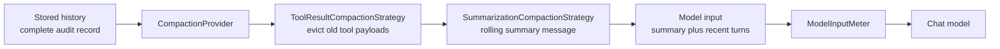

---
{
  "title": "Context Compaction",
  "summary": "Keep the full transcript, but shrink what gets sent to the model on every turn.",
  "category": "Knowledge & state",
  "projects": [ { "flavor": "AgentFramework", "path": "ContextCompaction.AgentFramework" } ]
}
---

## What it is

A long conversation eventually outgrows the context window, and old tool payloads are usually
the worst offenders — a single order lookup can be larger than every user message combined.
Context compaction separates two things that are easy to confuse: the **stored history**, which
stays complete as an audit record, and the **model input**, which is rewritten before each call.

Agent Framework ships this as a compaction pipeline. Strategies fire on triggers, oldest
content is condensed first, and the most recent turns are always preserved verbatim.

## When to use it

- Long-running sessions: support threads, agents that call bulky tools repeatedly.
- You must keep the real transcript for audit or replay, so you cannot simply drop messages.
- Cost tracks token count and most of those tokens are stale.

Skip it for short conversations — you pay a summarization model call for nothing. And be aware
of the trade-off: compaction is lossy by design, so anything the summarizer omits is gone from
the model's view even though it still sits in the stored history.

## How the demo works

An `OrderAgent` handles an eight-turn support conversation with two tools, `GetOrderStatus`
(which deliberately returns a bulky JSON blob) and `GetShippingOptions`. A
`PipelineCompactionStrategy` chains two strategies: `ToolResultCompactionStrategy` evicts old
tool outputs once messages exceed 8, keeping the last 2 groups intact, and
`SummarizationCompactionStrategy` folds everything but the last 3 groups into a rolling summary
once messages exceed 10. The pipeline is attached as an `AIContextProvider` via
`CompactionProvider`, while the untouched transcript lives in an `InMemoryChatHistoryProvider`.

The first message — *"Hi, my name is Priya, customer id C-1042."* — is the fact that must
survive; a final recall question checks whether it did.

`ModelInputMeter` is a small `DelegatingChatClient` that records exactly what each agent call
sent, which is how the demo can print both numbers side by side.

## Key APIs

- `PipelineCompactionStrategy([...])` — chains strategies, cheapest and bulkiest wins first.
- `ToolResultCompactionStrategy(trigger, minimumPreservedGroups)` — replaces old tool results
  with a one-line stub.
- `SummarizationCompactionStrategy(chatClient, trigger, minimumPreservedGroups)` — folds older
  turns into a rolling summary.
- `CompactionTriggers.MessagesExceed(n)` — when a strategy fires.
- `new CompactionProvider(strategy)` passed as `AIContextProviders` on `ChatClientAgentOptions`.
- `InMemoryChatHistoryProvider` + `session.TryGetInMemoryChatHistory(out var history)` — the
  full record, untouched by compaction.

## What to watch in the output

After every turn the demo prints `  [stored history: N messages | sent to model: M]`. Watch the
two numbers diverge once compaction trips around turn three — stored keeps climbing, sent to
model stays flat. Then `---- Recall across the compaction boundary ----` asks for the name and
customer id; a correct answer proves the summary carried the fact forward. Finally `---- What
the model actually received on that last call ----` dumps one line per message with role and a
90-character preview, where you can spot the `[Summary]` message and the stubbed tool results.
**MemoryManagement** takes the other route, rewriting the stored history itself with a
`SummarizingChatReducer`; **ToolUse** explains the tool calls whose payloads are being evicted
here.
