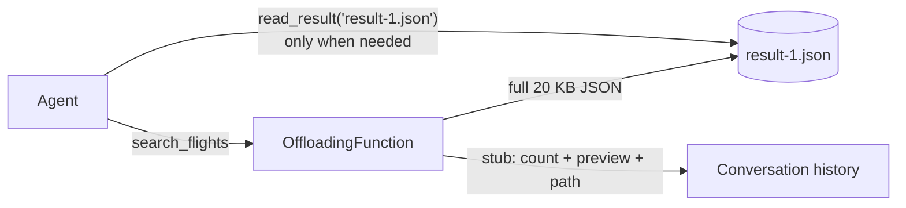

---
{
  "title": "Context Offloading",
  "summary": "Bulky tool results go to files; the context keeps a stub — and the agent can always read the data back.",
  "category": "Knowledge & state",
  "projects": [ { "flavor": "AgentFramework", "path": "ContextOffloading.AgentFramework" } ]
}
---

## What it is

Compaction is lossy: whatever the summarizer drops is gone from the model's view.
Offloading takes the other deal — bulky tool results are written to the filesystem the
moment they arrive, and the conversation keeps only a short stub: item count, a preview,
and the file path. The crucial property is that offloaded context is **recoverable**:
the agent holds a `read_result` tool, so when a later question needs a detail beyond the
preview, it loads the full data back for exactly that one call.

This is the Manus-style recipe: offload first because it is free and reversible, and
only reach for lossy summarization once offloading stops paying.

## When to use it

- Tools that return large payloads (search results, API responses, logs) that are
  consumed once, then referenced only occasionally.
- Long sessions where the same result must stay *reachable* for many turns without
  being *resident* in every request.
- You want a cheap first line of defense before lossy compaction.

Skip it when results are small — a stub plus a file is overhead, which is why the
wrapper only offloads above a size threshold. And mind the failure mode: if the preview
is too thin, the agent re-reads files constantly and you have paid twice.

## How the demo works

A travel agent has `search_flights`, which returns ~40 flights of indented JSON
(~20 KB). The function is wrapped in an `OffloadingFunction` — a `DelegatingAIFunction`
that lets small results through untouched, but writes anything over 600 chars to
`result-N.json` and returns the stub instead. The stub, not the payload, is what lands
in the session history and every later model call.

Three turns: the search (offloaded on arrival), a coarse question answerable near the
stub, then *"Which flight under $900 has wifi and the shortest duration?"* — a needle
question the preview cannot answer, so the agent calls `read_result` and recovers the
full data.

## Key APIs

- `DelegatingAIFunction` — wrap any `AIFunction`; override `InvokeCoreAsync` to
  post-process results without touching the tool itself.
- `AIFunctionFactory.Create(...)` for `read_result`, path-restricted to the offload
  directory.
- `InMemoryChatHistoryProvider` + `session.TryGetInMemoryChatHistory(...)` — used to
  measure what actually stayed in context.

## What to watch in the output

The `[search_flights: 20,xxx chars -> result-1.json, ~5xx char stub kept in context]`
line shows the swap happening. On the final question the agent reads the file back and
names the objectively correct flight (the dataset is deterministic — SK100 is the unique
shortest wifi-equipped option under $900). The closing line is the point: in-context
history of ~2K chars versus ~20 KB on disk, fully recoverable. **ContextCompaction**
is the lossy sibling that rewrites what the model sees; **SelfNote** adds distilled
notes rather than evicting payloads; **RalphLoop** pushes the same file-first idea to
its extreme, keeping *all* state outside the context.
