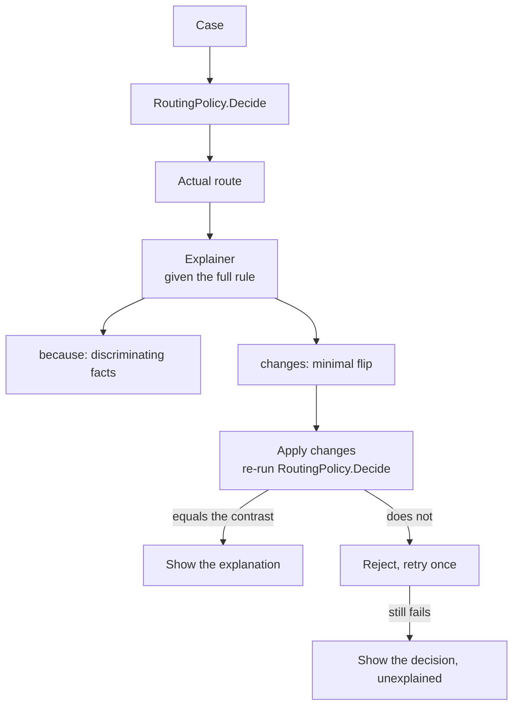

---
{
  "title": "Contrastive Explanation",
  "summary": "Why A rather than B — with the minimal flip condition re-run against the rule before it is shown.",
  "category": "Production controls",
  "projects": [
    { "flavor": "AgentFramework", "path": "ContrastiveExplanation.AgentFramework" }
  ]
}
---

## What it is

Not *"why did you choose A"* — *"why A rather than B, and what would have had to be different for
B?"*

The first question invites a justification, and a model will always produce one: fluent,
plausible, and unfalsifiable. You cannot tell a good answer from a confabulation, because there
is nothing to check it against.

The second question changes the shape of the answer twice over. Naming a *contrast* forces the
explanation to cite the facts that **discriminate** between the two outcomes, rather than listing
everything true of the case. And demanding the **minimal change that flips it** produces a claim
with a truth value — one you can test by applying the change and re-running the rule.

That last step is what this sample is really about. An unverified explanation is a story about
the decision. A verified one is a statement about the rule, and only the verified one is shown.

## When to use it

- Decisions a person will question, appeal, or have to defend: routing, pricing, eligibility,
  risk tiers, prioritisation.
- Anywhere the decision itself is deterministic and the model's job is to make it legible. The
  rule stays in code; the model explains it.
- When "what would I have to change" is genuinely actionable for the reader — which it usually is,
  and which a plain justification never delivers.

Skip it when the decision *is* the model's output: there is no rule to re-run, and the
counterfactual cannot be verified — only claimed. **ConfidenceReporting** is the right shape for
uncertainty over a model-generated answer. Skip it too when nobody will ever ask; a decision
nobody questions does not need an explanation budget.

## How the demo works

`RoutingPolicy.Decide` is a pure function over a support case — value thresholds, churn risk,
regulated flag, prior escalations. The sample's case (EUR 41,000, churn 0.82, not regulated, one
prior escalation) routes to `ExecutiveEscalation`, and the contrast is `Priority`, the route a
reviewer would most plausibly have expected.

The explainer is given the rule **in full** and asked for two things: a `because` naming only the
discriminating facts, and the smallest set of field changes producing the contrast.

`Counterfactual.Verify` applies those changes to the case and calls `RoutingPolicy.Decide` again.
This is where plausible explanations die. The obvious-sounding *"it would have been Priority if it
had no prior escalations"* is wrong here: the escalation came from value **and** churn together,
so prior escalations were never load-bearing. It reads well, it verifies false, and it is
rejected. An unknown field cannot be applied at all, so a counterfactual that invents one is
false by construction.

Up to two attempts. If neither survives, the run prints the decision **unexplained** and says why.
That is a deliberate choice: a wrong explanation of a right decision is worse than no explanation,
because the reader acts on it.

## Key APIs

- `RoutingPolicy.Decide(case)` — the deterministic rule, callable twice: once for the decision,
  once for the counterfactual. Everything here depends on that being a function and not a prompt.
- `agent.RunAsync<Explanation>(...)` at temperature 0 — structured output splits the prose from
  the testable claim, which is what makes half of the answer verifiable at all.
- `Counterfactual.Verify(original, changes, alternative)` → `(Flipped, Actual, Modified)` —
  returns what the modified case *actually* routes to, so a rejection can say what happened
  rather than just "no".
- `record` + `with` for applying changes — the original case is never mutated, so a failed
  attempt costs nothing.

## What to watch in the output

Each attempt prints the `because`, the proposed counterfactual, and then the line that matters:
`re-running the rule on the modified case gives: …`. When that equals the contrast, the
explanation is verified and printed. When it does not, `REJECTED: the proposed change yields
ExecutiveEscalation, not Priority` — read the rejected counterfactual, because a plausible-sounding
one that fails is the clearest demonstration of why verification is not optional.

The verified block is the deliverable: the discriminating reason, the flip condition, and the
re-computed field values in parentheses so a reader can check the arithmetic themselves.

If both attempts fail, the run says the decision stands without an explanation. Seeing that
occasionally is the system working — silence is the correct output when the only available
explanation is false.

**ConfidenceReporting** for uncertainty over a generated answer, **LLMAsJudge** for scoring
outputs against a rubric, **Planning** for the other half of "the host owns the rule, the model
works inside it".
