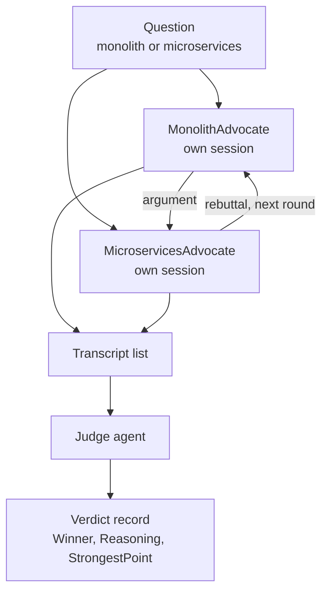

---
{
  "title": "Debate",
  "summary": "Two agents argue opposing sides for several rounds, then a judge agent rules on the transcript.",
  "category": "Reasoning & generation",
  "projects": [ { "flavor": "AgentFramework", "path": "Debate.AgentFramework" } ]
}
---

## What it is

Two agents are assigned **opposing positions** on the same question and told never to concede.
Each round, a debater is shown the opponent's last argument and must rebut it point by point
before reinforcing its own case. After the final round a third agent — a judge with no stake in
either side — reads the whole transcript and rules.

The value is in the *interaction*. A single agent asked to "consider both sides" tends to produce
a balanced-sounding paragraph that never stress-tests anything. Forcing a rebuttal makes weak
arguments visible, because the other side is actively trying to break them.

## When to use it

- Genuinely contested trade-offs where the right answer depends on assumptions worth surfacing.
- Architecture and design reviews, buy-vs-build, risk assessments.
- When you want the *reasons* on record, not just a recommendation.

Skip it when the question has a factual answer — debate will manufacture a plausible case for the
wrong side. It is also the most expensive multi-agent pattern here: rounds × 2 agents + a judge,
each carrying a growing transcript. For questions where independent opinions matter more than
argument quality, use **Voting** instead — its voters never see each other, which is the point.

## How the demo works

The sample asks *"Should a 5-person startup build its product as a monolith or as
microservices?"*. `MakeDebater` builds two `ChatClientAgent` instances — `MonolithAdvocate` and
`MicroservicesAdvocate` — from the same instruction template with a different `position`. Each
gets its **own session** via `CreateSessionAsync()`, so it remembers its own line of argument and
stays consistent across rebuttals; neither session contains the opponent's history, only whatever
argument text is pasted into the next prompt. Three rounds run, then a `Judge` agent receives the
joined transcript and returns a strongly typed `Verdict`.

The judge call uses the generic overload `judge.RunAsync<Verdict>(...)`, so the ruling comes
back as a `record Verdict(string Winner, string Reasoning, string StrongestPoint)` rather than
prose you would have to parse.

## Key APIs

- `new ChatClientAgent(Settings.ChatClient, name:, instructions:)` — one named agent per role.
- `await agent.CreateSessionAsync()` — per-debater memory of its own arguments.
- `agent.RunAsync(prompt, session)` — a turn that appends to that debater's history.
- `judge.RunAsync<Verdict>(prompt)` — structured output; `.Result` is the typed verdict.

## What to watch in the output

The run prints `=== Debate ===`, the question, then `---- Round 1 ----` through
`---- Round 3 ----` with each turn tagged `[MonolithAdvocate]` and `[MicroservicesAdvocate]`.
Watch how round 2 and 3 turns open by attacking a specific claim from the previous message —
that is the pattern working. It closes with `---- Judgement ----` and three lines: `Winner:`,
`Reasoning:` and `Strongest point of the debate:`. Compare with **Voting**, where agents answer
in isolation and a tally decides, and **MultiAgentCollaboration**, where agents build on each
other rather than attack each other.
