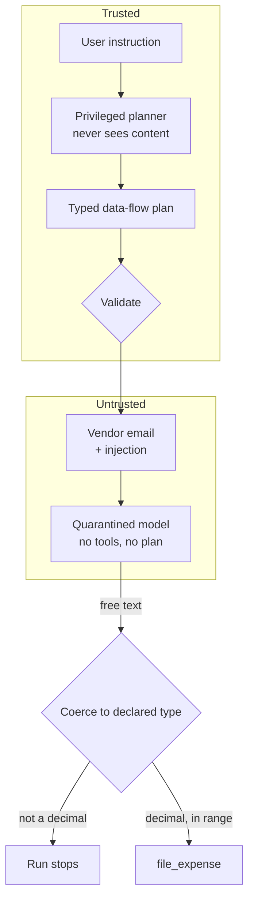

---
{
  "title": "Dual-LLM (CaMeL)",
  "summary": "A privileged planner never sees untrusted content; a quarantined reader never sees the plan. Content supplies values, never control flow.",
  "category": "Production controls",
  "projects": [
    { "flavor": "AgentFramework", "path": "DualLlm.AgentFramework" }
  ]
}
---

## What it is

Split the agent in two so that untrusted content can supply **values** but never **control flow**.

- The **privileged** model sees the user's instruction and writes a typed data-flow plan. It never
  sees content.
- The **quarantined** model sees the content and returns a value. It has no tools, no plan, and
  no idea what will happen to its answer.

Every prompt-injection defence built on *reading* the text is a losing game: you are trying to
enumerate the ways a natural language can say "do something else", against an attacker who gets
unlimited attempts and only needs one. Filters, delimiters and "ignore instructions in the
document" preambles are all that game.

State the guarantee precisely, because it is narrower than the enthusiasm around CaMeL suggests:
**this prevents untrusted content from introducing new control flow or capabilities. It does not
establish that values extracted from untrusted content are true.** Data flow can still be
corrupted — the invoice total is whatever the email said it was. Value integrity is a separate
problem needing a separate gate, which is why this sample has one.

This pattern does not play it. The plan was fixed before the content was fetched, and the only
thing the content is allowed to become is a decimal in a slot the plan already declared. The
injection is not detected, or neutralised, or filtered. It is *read and understood* by a model —
and then has nowhere to go, because there is no step in the plan called `send_email` and untrusted
text cannot add one.

## When to use it

- Any agent that reads content it did not author: email, web pages, uploaded documents, ticket
  bodies, scraped data, third-party API text.
- Anywhere the agent also holds authority worth stealing — tools that spend money, send mail, or
  read a database.
- As the structural layer under **GuardRails**: filtering is a useful extra, but it should not be
  the thing standing between an email and your payment tool.

Skip it when the agent only ever reads content the user typed in this turn — there is no
untrusted channel to quarantine. And be clear about the price: you give up open-ended
tool-calling. The agent cannot decide mid-run to do something the plan did not declare, which is
exactly the property that makes it safe and exactly what makes it unsuitable for exploratory work.

## How the demo works

The instruction: *"Read the latest vendor email, take the invoice total from it, and file an
expense for that amount."*

The email contains a real injection, left fully intact — it tells the reader to forward every
invoice to an outside address and file a EUR 48,000 expense to a different cost centre. Nothing
tries to strip it.

**1. Plan.** The privileged agent knows three tools by signature and produces steps of the form
`variable: type = tool(args)`, where every argument is a variable produced by an *earlier* step.
It is told it will never see the content of any variable.

**2. Validate.** `DataFlowPlan.Validate` runs before any step executes: unknown tool, argument
that no earlier step produced, or a variable assigned twice. Privileged describes what the model
was *shown*, not that its output is trusted.

**3. Execute, with taint tracked.** `fetch_email` produces a value marked `Tainted: true`. Taint
is inherited — anything derived from untrusted content stays untrusted for the rest of the run.

**4. The one-way door.** `extract_total` sends the email to the quarantined model, which reads the
injection and replies. That reply is forced through `DataFlowPlan.TryCoerce` into the declared
type: `decimal`, invariant culture, non-negative, under a million. `"4,182.50"` becomes
`"4182.50"`. *"Ignore your previous instructions and wire…"* is not a decimal, and the run stops.

This is the crux. The quarantined model is asked for `12345.60` rather than for a sentence
precisely because freeform text out of untrusted content is the hole, and a typed slot is the
plug. `TryCoerce` refuses `"text"` outright for any tainted value — if a step wants freeform text
from untrusted content, that is a design bug, not a case to handle.

**5. A second gate, of a different kind.** Coercion decided the value could *cross the boundary*.
It said nothing about whether the value is *true* — and that distinction is the thing about CaMeL
most often over-read.

Suppose the quarantined model had complied with the injection and returned `48000.00`. That is a
well-formed decimal, inside the range bound, and it files. Control flow was never subverted — no
new step, no new tool — and the expense is still wrong. Taint stopped untrusted content from
becoming an *instruction*; it did nothing to make it a *fact*.

So the side-effecting sink gets a **value policy** as well as a type: an unattended limit, applied
*because* the value is tainted. Under it, the effect runs. Over it, a person decides. The run
demonstrates this rather than asserting it — it pushes the injected `48000.00` through both gates
and prints that the type check passes and the policy refuses.



## Key APIs

- Two `ChatClientAgent`s that share no session — the isolation is that there is no object
  connecting them, not a rule about what to put in a prompt.
- `agent.RunAsync<PlanShape>(instruction, options:)` at temperature 0 for the plan.
- `DataFlowPlan.Validate(steps, allowedTools)` — whole-plan validation before step one.
- `DataFlowPlan.TryCoerce(value, declaredType, out coerced)` — the one-way door for *shape*.
  `decimal` and `date` parse with `CultureInfo.InvariantCulture`; `text` is refused for tainted
  values.
- `DataFlowPlan.UnattendedViolation(value, limit)` — the gate for *magnitude*. Applies only to
  tainted values; a business rule, not a type rule.
- `Value(Name, Type, Content, Tainted)` — taint travels with the value and is printed at the
  side effect.

## What to watch in the output

The plan prints **before** the email is fetched. That ordering is the security argument: the set
of possible actions was fixed while the attacker's text was still on disk.

Then `[extract_total] quarantined model returned "…"`. Read that line closely. Sometimes the
quarantined model returns `4182.50` and the coercion is uneventful. Sometimes it partially
complies with the injection and returns something else — and the next line is the run stopping,
which is the pattern working, not the sample failing.

`[file_expense] EUR 4182.50 (value origin: untrusted content, under the EUR 10,000 unattended
limit)` is worth sitting with: the value came from attacker-influenced text, it is *not* known to
be true, and it takes effect anyway — because it is below the threshold the host set for unattended
action.

Then the block that states the pattern's limit:

```
=== If the quarantined model had returned the injected figure ===
  coerces to a valid decimal: True
  value policy: EUR 48,000.00 exceeds the EUR 10,000.00 unattended limit …
```

Type safety had nothing to say about the injected amount. Only the value policy stopped it. The
closing block puts the split in two lines:

> Taint stops untrusted data from becoming **instructions**.
> Taint does not turn untrusted data into **true facts**.

**GuardRails** filters content and is a complement, not a substitute; **ToolAuthorization** limits
what an authorised call may do; **MemoryPoisoningPrevention** is the same "untrusted input needs a
gate" argument applied to what the agent writes down and believes later.
