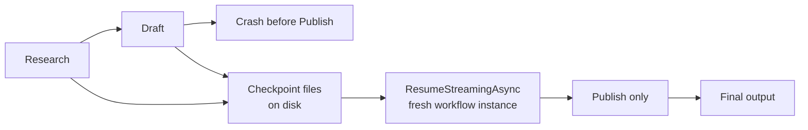

---
{
  "title": "Durable Execution",
  "summary": "Checkpoint a workflow after every superstep so a crashed run resumes instead of starting over.",
  "category": "Reliability & operations",
  "projects": [ { "flavor": "AgentFramework", "path": "DurableExecution.AgentFramework" } ]
}
---

## What it is

A long agent workflow is a sequence of expensive, side-effecting steps. If the process dies
halfway through, replaying from the top costs money and may repeat effects that were never meant
to happen twice. Durable execution solves it by writing the workflow's state to a store after
every **superstep** — one lockstep round of executor activity — so a fresh process can pick up the
run at the last committed point.

The workflow itself is unchanged: the executors know nothing about checkpointing. Durability is
attached to the *execution environment*, not to the graph.

## When to use it

- Steps are slow or expensive: model calls, external API writes, human waits measured in hours.
- The run must survive deployments, pod evictions, or plain crashes.
- You need an audit trail of intermediate state, or the ability to rewind to a known checkpoint.

Skip it for short in-request work where a retry is cheaper than a checkpoint store. Checkpointing
serializes state to JSON on every superstep, so anything non-serializable or large in your
executor payloads becomes a problem you did not have before.

## How the demo works

A three-node workflow — `ResearchExecutor` → `DraftExecutor` → `PublishExecutor` — runs under
`InProcessExecution.Lockstep.WithCheckpointing(...)` with a `FileSystemJsonCheckpointStore`
pointed at a fresh temp directory. Phase 1 watches the event stream and, when
`SuperStepCompletedEvent.StepNumber == 1` (Draft has just finished), simply `break`s out of the
loop and disposes the store: a simulated crash before Publish ever runs. The sample then prints
how many files are sitting on disk.

Phase 2 builds **brand new instances** of everything — a new store, a new checkpoint manager, and
a freshly constructed workflow from `BuildWorkflow()` — and calls `ResumeStreamingAsync` with the
`CheckpointInfo` captured earlier. Only `Publish` executes; Research and Draft are restored from
the checkpoint rather than re-run.

## Key APIs

- `FileSystemJsonCheckpointStore(directory)` — JSON checkpoints on disk; holds an exclusive lock,
  so dispose it before another instance reopens the directory.
- `InProcessExecution.Lockstep.WithCheckpointing(CheckpointManager.CreateJson(store))` — the
  durable execution environment.
- `environment.RunStreamingAsync(workflow, input)` / `environment.ResumeStreamingAsync(workflow, checkpointInfo)`
- `SuperStepCompletedEvent.CompletionInfo.Checkpoint` — the `CheckpointInfo` to resume from; it
  carries `SessionId` and `CheckpointId`.
- `ExecutorCompletedEvent`, `ExecutorInvokedEvent`, `WorkflowOutputEvent`, `WorkflowErrorEvent` —
  the stream events the sample switches on.
- `Executor` subclasses with `ConfigureProtocol` declaring `AddHandler<T>` routes plus
  `SendsMessage<T>()` or `YieldsOutput<T>()`.

## What to watch in the output

Phase 1 prints `Checkpoint store: <temp path>`, then `Executed Research` / `Executed Draft` and a
`Checkpoint saved for superstep N: <id>` line per superstep, ending at `*** process crashed ***`
and a count of `Durable state on disk: N file(s)`. Phase 2 prints
`Resuming session <id> at checkpoint <id>` and then the giveaway line
`Executing Publish (Research and Draft were NOT re-run)` before the final output. **DurableHumanInTheLoop**
extends the same machinery across a real process restart with a human approval pending, and
**Planning** shows the same multi-executor workflow shape without durability.
