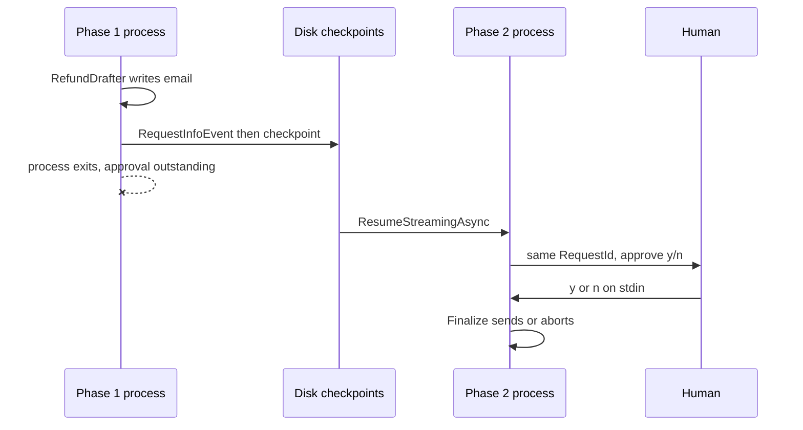

---
{
  "title": "Durable Human in the Loop",
  "summary": "Park a workflow on a human approval, checkpoint it to disk, and answer after a process restart.",
  "category": "Reliability & operations",
  "risk": "The approval gates a consequential action (sending a refund email); deny is the safe default.",
  "projects": [ { "flavor": "AgentFramework", "path": "DurableHumanInTheLoop.AgentFramework", "interactive": true } ]
}
---

## What it is

Waiting for a person is the longest step in any workflow. Minutes if you are lucky, days if the
approver is on holiday — far longer than any process is guaranteed to live. Durable human in the
loop turns the approval into workflow state instead of a blocked thread: the workflow emits a
`RequestInfoEvent` through a `RequestPort`, checkpoints, and stops. Whenever someone gets around
to answering, a fresh process resumes from the checkpoint, sees the *same* pending request with
the *same* `RequestId`, and delivers the decision.

This is the durable cousin of **HumanInTheLoop**, where approval is a
`ToolApprovalRequestContent` inside a single agent run: correct, simple, and gone the moment the
process exits.

## When to use it

- Approvals that legitimately take longer than a request, a deploy cycle, or a container's life.
- Irreversible actions — refunds, payments, emails to customers — where the record of who approved
  what must outlive the process.
- Any queue-and-resume design where the approver answers from a different process, machine, or UI.

Skip it when the human is right there in the same interactive session; the in-memory gate is far
less machinery. Skip it also when the action is cheap to redo — re-running is simpler than
serializing state.

## How the demo works

Phase 1 runs a three-node workflow: `DraftRefundExecutor` (a `ChatClientAgent` named
`RefundDrafter` that writes a short refund email for order ORD-5521, EUR 1,249, a smart speaker
dropping off WiFi) → a `RequestPort` named `HumanApproval` → `FinalizeExecutor`. The drafted email
leaves the workflow as an `ApprovalRequest`, the sample prints it, waits for the checkpoint written
*after* the request, and then breaks out and writes `pending-approval.txt` holding the directory,
session id and checkpoint id.

Phase 1 then launches a genuinely new OS process — `Process.Start(Environment.ProcessPath, ["resume", pendingFile])`
with `UseShellExecute = false` so it inherits the console. That process knows nothing but the
state file. It resumes from the checkpoint, the pending approval is re-emitted with the identical
`RequestId` (the agent does not re-draft, and no second model call happens), and it asks for `y/n`
on stdin. `SendResponseAsync` feeds an `ApprovalDecision` back in, and `FinalizeExecutor` yields
either a sent or an aborted refund. In the explorer UI the second phase surfaces a stdin box —
type `y` or `n` there. If stdin is closed, `Console.ReadLine()` returns null and the sample
auto-approves.

## Key APIs

- `RequestPort.Create<ApprovalRequest, ApprovalDecision>("HumanApproval")` — the workflow node that
  hands a question out to the world and takes an answer back.
- `RequestInfoEvent` + `requestInfo.Request.TryGetDataAs<ApprovalRequest>(out var request)` — read
  the pending question; `Request.RequestId` is stable across the restart.
- `run.SendResponseAsync(requestInfo.Request.CreateResponse(new ApprovalDecision(...)))` — deliver
  the human's answer.
- `FileSystemJsonCheckpointStore` + `InProcessExecution.Lockstep.WithCheckpointing(CheckpointManager.CreateJson(store))`
  — the durable environment; the store takes an exclusive directory lock, so phase 1 disposes it
  before phase 2 opens it.
- `environment.ResumeStreamingAsync(BuildWorkflow(), new CheckpointInfo(sessionId, checkpointId))`
- `ApprovalRequest` / `ApprovalDecision` are plain records because they are checkpointed as JSON.

## What to watch in the output

Both phases print their pid, so you can see they differ: `=== Phase 1 (pid N): draft refund,
request human approval ===` and `=== Phase 2 (pid M): fresh process resumes from checkpoint ... ===`.
Phase 1 prints `Executed DraftRefund`, `Human approval requested (request id ...)`, the drafted
email between `--- drafted email ---` rules, `Checkpoint saved: <id>`,
`Pending approval persisted to ...` and `*** Phase 1 process exits — the approval is still
outstanding, only disk state survives ***`. Phase 2's tell is
`Pending approval re-emitted (request id ...) — the agent did NOT re-draft` with the same id, then
the `Approve sending this refund email? (y/n):` prompt and a final `=== Final outcome ===` reading
`Refund email SENT` or `Refund ABORTED`. Compare with **HumanInTheLoop** for the in-memory tool-level
gate, and **DurableExecution** for the checkpoint mechanics without a human in the way.
