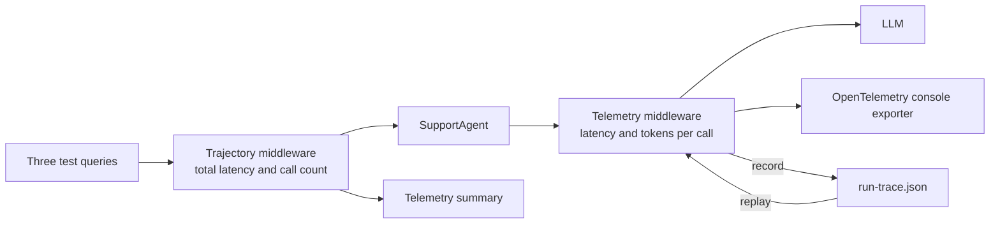

---
{
  "title": "Evaluation, Monitoring, and Trace Replay",
  "summary": "Observe agent runs, record model trajectories, and replay captured outputs without live calls.",
  "category": "Reliability & operations",
  "projects": [
    { "flavor": "AgentFramework", "path": "EvaluationAndMonitoring.AgentFramework" },
    { "flavor": "SemanticKernel", "path": "EvaluationAndMonitoring.SemanticKernel" }
  ]
}
---

## What it is

An agent that works on your machine tells you nothing about the one in production. Evaluation
and monitoring means emitting the numbers that matter — latency, token counts, model id, how
many LLM calls one user request actually cost — as **OpenTelemetry** traces and metrics, plus a
record of the *trajectory*: what the user asked and what the agent answered.

Both frameworks ship built-in `gen_ai.*` instrumentation. The samples turn it on, and add a
small custom collector on top for the numbers the built-ins do not aggregate for you. Agent
Framework also records model calls and can deterministically re-simulate the orchestration without
calling the live deployment.

## When to use it

- Anything running unattended: you need to see cost and latency regression before the invoice.
- You are tuning prompts and want before/after evidence rather than an impression.
- Debugging multi-step agents where "it was slow" needs to become "the third call was slow".
- Reproducing an orchestration regression without repeating model cost or external side effects.

Skip the OTel plumbing for a scratch script — a `Stopwatch` and a `Console.WriteLine` are the
honest amount of instrumentation for code you will delete tomorrow.

## How the demo works

Both samples run a TechCorp `SupportAgent` over three queries — a warranty question, a returns
question, and the off-topic *"What's the meaning of life?"* — on a single shared session, with
a console exporter wired to both a tracer provider and a meter provider under the service name
`AgentEvaluation`.



- **Agent Framework** layers two delegates: `TelemetryMiddleware` on the `IChatClient` records
  per-call latency and `response.Usage` token counts into `AgentTelemetry`, and
  `TrajectoryMiddleware` on the agent records end-to-end latency plus how many LLM calls that
  one request triggered. `.UseOpenTelemetry("AgentEvaluation")` on both builders emits the
  built-in `gen_ai` and `invoke_agent` spans. In `record` mode, `RecordingChatClient` saves the
  prompt version, model requests and hashes, responses, model ID, token counts, and final stop
  reason. In `replay` mode, `ReplayChatClient` returns those captured outputs and fails if a request
  hash or prompt version changed. This sample has no tools; a side-effecting application should use
  the same recorded-adapter boundary for tool arguments and results.
- **Semantic Kernel** relies on the built-in instrumentation alone: the providers subscribe to
  the `Microsoft.SemanticKernel*` source and meter, an OTel `LoggerFactory` is registered on
  the kernel, and the app context switch
  `Microsoft.SemanticKernel.Experimental.GenAI.EnableOTelDiagnosticsSensitive` adds prompts and
  completions to the traces. A `Stopwatch` around `agent.InvokeAsync` supplies the per-query ms.

## Key APIs

| Agent Framework | Semantic Kernel |
|---|---|
| `.UseOpenTelemetry(sourceName: "AgentEvaluation")` | `.AddSource("Microsoft.SemanticKernel*")` |
| `.Use(TelemetryMiddleware, null)` on `IChatClient` | `AppContext.SetSwitch(...EnableOTelDiagnosticsSensitive, true)` |
| `response.Usage.InputTokenCount` / `OutputTokenCount` | `builder.Services.AddSingleton(loggerFactory)` |
| `Sdk.CreateTracerProviderBuilder().AddConsoleExporter()` | `Sdk.CreateMeterProviderBuilder().AddMeter(...)` |

```bash
dotnet run --project EvaluationAndMonitoring.AgentFramework -- record
dotnet run --project EvaluationAndMonitoring.AgentFramework -- replay EvaluationAndMonitoring.AgentFramework/bin/Debug/net10.0/run-trace.json
```

Recording full prompt and response content is intentionally enabled only by the explicit `record`
command. Trace files may contain sensitive data and must receive the same access and retention
controls as production logs. Replay is deterministic re-simulation from captured outputs, not a
promise that a fresh stochastic model call or changing external API would return the same result.

## What to watch in the output

The run opens with `---- Running agent with telemetry ----`. Agent Framework prints a
`[Telemetry]` line per LLM call showing model, milliseconds and `input+output` tokens, a
`[Trajectory]` line per request, and finally a `═══ Telemetry Summary ═══` block with total
calls, total tokens, average latency and a rough cost estimate. Semantic Kernel instead floods
the console with raw OTel activity records — the exporter is deliberately verbose. **Middleware**
explains the interception seam these hooks use, and **ConfidenceReporting** measures answer
quality where this pattern measures cost and speed.
