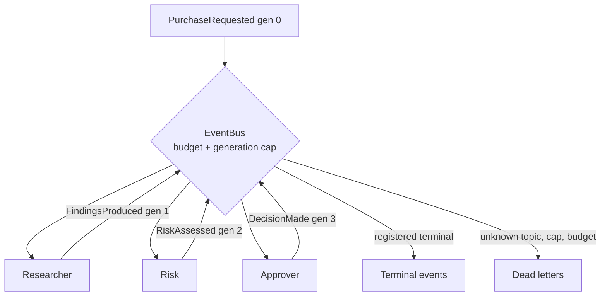

---
{
  "title": "Event-Driven Agents",
  "summary": "No orchestrator: agents subscribe to topics and publish what they learn, with a budget that bounds the reaction chain.",
  "category": "Orchestration",
  "projects": [
    { "flavor": "AgentFramework", "path": "EventDrivenAgents.AgentFramework" }
  ]
}
---

## What it is

Agents do not call each other. They subscribe to topics and publish events; the subscription
table is the architecture.

The pull is real, and familiar to anyone who has built message-driven systems: a new agent is
added by subscribing it, not by editing a coordinator. Nobody owns the flow, so nobody is the
bottleneck for changing it, and the in-process bus swaps for a real broker without touching a
handler.

The cost is equally real, and this sample is built around it. In **OrchestratorWorkers** or
**Magentic** you can read the flow off one page. Here you cannot: the graph is emergent, and it
has a failure mode a supervisor structurally cannot have — two handlers whose outputs feed each
other. That is not a bug visible in either handler. It is a property of the wiring, and it turns
into an unbounded billed loop the first time a model phrases an output slightly differently.

Hence the budget in the bus rather than in a handler. Every event carries its generation, the bus
refuses events past a maximum depth, and the run as a whole is capped.

## When to use it

- Pipelines that grow by addition: a new compliance agent should subscribe to `RiskAssessed`, not
  require a change to whoever produced it.
- Systems where the same event legitimately has several independent consumers.
- Anywhere you expect to move to Service Bus, Kafka, or Dapr later — the handler shape survives
  the move.

Skip it when there is one linear path (**PromptChaining**), when a manager genuinely needs to see
the whole picture to decide what happens next (**Magentic**), or when the "flow" is three calls
long and the indirection costs more clarity than it buys.

## How the demo works

A purchase request — a three-year EUR 84,000/year logistics SaaS contract needing access to the
customer address database — enters as a single `PurchaseRequested` event. Three agents are
subscribed:

- `PurchaseRequested` → **Researcher** → publishes `FindingsProduced`
- `FindingsProduced` → **Risk** → publishes `RiskAssessed`
- `RiskAssessed` → **Approver** → publishes `DecisionMade`

Nothing subscribes to `DecisionMade`, and the host *declares* that: `bus.RegisterTerminal(
"DecisionMade")`. It lands in `TerminalEvents` and the run reports it. An unroutable event that is
*dropped* looks exactly like a handler that never fired, which is the debugging experience
event-driven systems are notorious for; keeping it makes the outcome visible instead of missing.

`EventBus` is a `Channel<AgentEvent>` plus a subscription dictionary, with every limit checked in
`Publish`. `RunToCompletionAsync` drains the channel and republishes each handler's output at
`generation + 1` — so depth is tracked by the bus, not by the handlers, and no handler can opt out
of the bound.

**The bound is in the host counters, not in the channel.** The queue itself is unbounded, and
deliberately: a bounded channel bounds how many events may be *in flight*, which is backpressure,
and its overflow modes either block a producer or silently drop. The quantity needing a bound here
is different — how many events the run may *accept*, and how deep a chain may go — and both are
counted before anything is queued.

**Terminal events are not dead letters.** An event that finished the workflow is an output; an
event refused by the generation cap or the run budget has failed. Filing both in one list makes the
dead-letter queue useless as an alarm, which matters the moment this bus is composed with
**AgentCommunicationFaultTolerance**, where a dead letter means *requeue or escalate*. So the bus
keeps `TerminalEvents` and `DeadLetters` separately, and every dead letter carries a `Refusal`
reason: `NoSubscriber`, `GenerationLimit`, or `RunBudgetExceeded`.

**And terminal is declared, not inferred.** "Nobody subscribes" is ambiguous: it is either the
workflow finishing or a topic name nothing will ever match. In a system whose wiring *is* the
subscription table there is no compiler for a topic string, so a typo is the likeliest bug there
is — and inferring terminal from an empty handler list turns `DecisionMdae` into a successful
outcome. Terminal topics are registered; anything else with no subscriber is a `NoSubscriber` dead
letter. The run publishes one misspelled event at the end to show it.

## Key APIs

- `Channel.CreateUnbounded<AgentEvent>()` — the queue. `TryWrite`/`TryRead` keep the drain loop
  synchronous and single-threaded, which is what makes the budget accounting trivially correct.
- `EventBus.Subscribe(topic, handler)` where the handler returns the events it produces, rather
  than publishing them itself. Returning them lets the bus stamp the generation and apply the
  budget; publishing directly would let a handler bypass both.
- `EventBus.Publish` returning `bool` — not queued is a normal outcome with a visible record, not
  an exception.
- `EventBus.RegisterTerminal(topic)` — declares a topic as an outcome of the run. Without it, an
  unsubscribed topic is a delivery failure, which is what a misspelled one actually is.
- `bus.TerminalEvents` — declared workflow outputs.
- `bus.DeadLetters` — `DeadLetter(Event, Refusal)`, so the report says *why*, not just *that*.

## What to watch in the output

Each dispatch prints `── Topic (gen N, from Source) ──` followed by the payload. Watch the
generation counter climb: it is the depth of the reaction chain, and it is what the cap acts on.

At the end, `=== Done: N events dispatched ===` followed by two separate lists. `DecisionMade`
appears as `terminal: … registered as an outcome, the workflow ends here`, with the approver's
decision underneath it — an output, not a failure —
and up to that point the dead-letter list is explicitly empty. That separation is the point: if a
dead letter appears, something was genuinely refused, and the `Refusal` says which limit.

Then the last block publishes `DecisionMdae` — one transposition away from the real topic — and it
comes back as `dead-letter: DecisionMdae — NoSubscriber`. That is the whole argument for declaring
terminal topics: the same event, under the inferred rule, would have been filed as a success.

To see the mechanism that matters, add a subscription from `DecisionMade` back to
`PurchaseRequested` and re-run. Without the generation cap that is an infinite billed loop; with it
the run stops at the cap and the surplus events appear as dead letters reading `GenerationLimit`.
That experiment is the reason the budget is in the bus.

**StigmergicCoordination** coordinates through a shared workspace instead of messages;
**AgentCommunicationFaultTolerance** is what this bus needs once it spans a network;
**OrchestratorWorkers** is the same work with a coordinator you can read.
