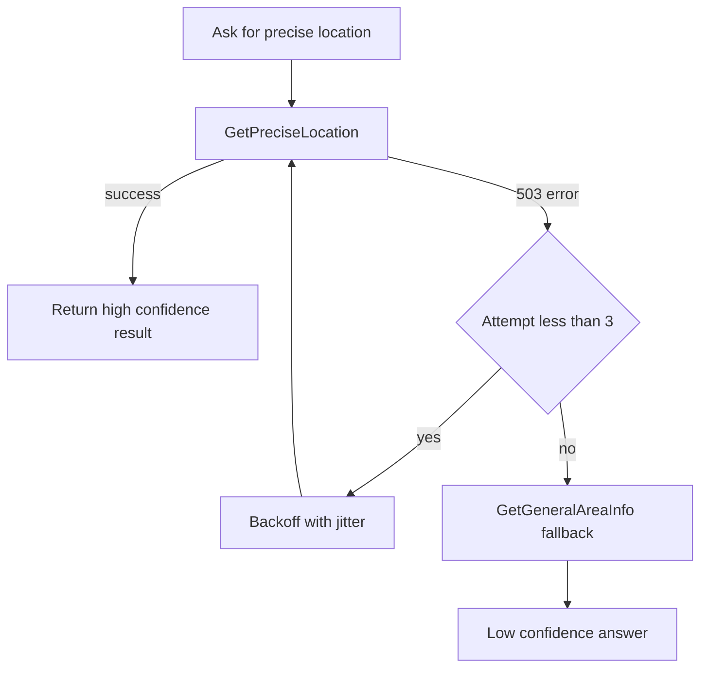

---
{
  "title": "Exception Handling and Recovery",
  "summary": "Retry a flaky tool with backoff, then degrade to a weaker one instead of failing the run.",
  "category": "Reliability & operations",
  "projects": [
    { "flavor": "AgentFramework", "path": "ExceptionHandlingAndRecovery.AgentFramework" },
    { "flavor": "SemanticKernel", "path": "ExceptionHandlingAndRecovery.SemanticKernel" }
  ]
}
---

## What it is

Agents call real services, and real services return 503s. This pattern wraps the fragile step
in a policy: **retry with exponential backoff and jitter**, and when the retries run out,
**fall back** to a cheaper or less precise source rather than throwing at the user. The
recovery lives in interception code, not in the prompt, so it fires the same way every time.

Three ideas travel together here — detect the error, retry it, and degrade gracefully when
retrying stops helping.

## When to use it

- A tool depends on a network service, a rate-limited API, or anything with transient faults.
- A degraded answer is genuinely useful: approximate coordinates beat no coordinates.
- You need an escalation path — a human, a queue — for the case where everything fails.

Skip the retry for deterministic failures. A 400, a validation error, or a missing record will
fail identically three times; you have only tripled the latency.

## How the demo works

Both samples ask *"Find the precise location of '15 Rue de Rivoli, Paris, France'."*
`GetPreciseLocation` throws `HttpRequestException("503 — Geocoding service temporarily
unavailable")` on roughly 60% of calls, while `GetGeneralAreaInfo` always succeeds with
`confidence: low`. Backoff is `2^attempt * 500ms` plus up to 200ms of jitter, capped at three
attempts.

- **Agent Framework** wraps the whole agent run in `RetryAndFallbackMiddleware`. Each attempt
  gets a fresh session so a failed turn is not replayed, and failure is detected by inspecting
  `FunctionResultContent.Exception` rather than sniffing the response text. After three
  attempts the middleware returns a hand-written apology `AgentResponse`.
- **Semantic Kernel** puts the policy at the function level: `RetryAndFallbackFilter`
  (`IFunctionInvocationFilter`) only engages for `GetPreciseLocation`, retries `next(context)`,
  then invokes `Plugins["LocationPlugin"]["GetGeneralAreaInfo"]` itself and overwrites
  `context.Result`. `Program.cs` keeps a final `try/catch` as the escalation hatch.

## Key APIs

| Agent Framework | Semantic Kernel |
|---|---|
| `.Use(RetryAndFallbackMiddleware, null)` on the agent | `IFunctionInvocationFilter` per function |
| `FunctionResultContent.Exception` for error detection | `try { await next(context); }` around the call |
| `return new AgentResponse([...])` as fallback | `context.Result = new FunctionResult(...)` |

## What to watch in the output

Agent Framework prints `[RunMiddleware] Attempt 1/3`, then either `[RunMiddleware] Success on
attempt 1.` or `[Retry] Backing off 1000ms...`. Semantic Kernel logs `[ErrorDetection]`,
`[ErrorHandling]`, `[Retry]`, `[Fallback]`, and `[Recovery]` through `ILogger`; a lucky run
shows none of the interesting ones, so run it a few times. **Guardrails** uses the same
interception seams for safety instead of resilience, and **Routing** is the deliberate version
of choosing between the precise and the general tool.
