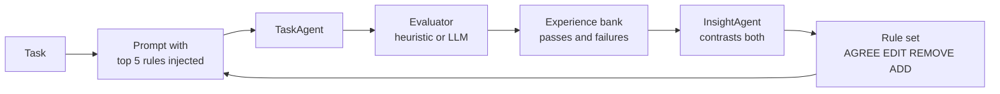

---
{
  "title": "ExpeL",
  "summary": "Keep both wins and failures, distil general rules from the contrast, and inject them into the next task.",
  "category": "Knowledge & state",
  "risk": "Persists model-derived insights that steer future runs — bad or poisoned lessons survive across tasks.",
  "projects": [
    { "flavor": "AgentFramework", "path": "ExpeL.AgentFramework" },
    { "flavor": "SemanticKernel", "path": "ExpeL.SemanticKernel" }
  ]
}
---

## What it is

ExpeL — *Experiential Learning* — gives an agent a memory of what actually happened. Every
attempt at a task is stored as a `Trial`, **successes as well as failures**, in an experience
bank. A second agent then contrasts the two groups and writes short, general rules ("insights")
that would have prevented the failures. Those rules are injected into the prompt of the *next*
task, so learning from task 1 pays off on task 3.

The rule set is not append-only. The insight extractor emits **AGREE / EDIT / REMOVE / ADD**
operations against the existing rules, each rule carries a score, and rules that fall to -3 are
pruned. That is the difference from a plain reflection loop: the rules themselves compete.

## When to use it

- You run the same *kind* of task repeatedly and want later runs to be better than earlier ones.
- Failures are informative and cheap to detect — a compiler, a test suite, a validator.
- You want the learned knowledge to be readable and editable text, not fine-tuned weights.

Skip it for one-shot tasks — there is nothing to generalize across. Skip it too when the fix is
always the same: a well-written system prompt is cheaper than a learning loop that rediscovers
it every run.

## How the demo works

Both samples run three Python coding tasks — `find_duplicates`, `is_palindrome`, `flatten` —
with up to 3 attempts each. Attempts are scored by keyword-based heuristic evaluators
(`EvaluateFindDuplicates`, `EvaluateIsPalindrome`, `EvaluateFlatten`); the Agent Framework
version scores `task-3` with a strict `EvaluatorAgent` returning a structured `EvalResult`
instead. Both successes and failures go into `ExpeLMemory.ExperienceBank`, which is persisted to
`expel_memory.json` / `expel_memory_maf.json` so a second run starts where the first left off.

Insight extraction is skipped until the bank holds at least one success *and* one failure —
there is nothing to contrast otherwise, and the demo prints exactly that.

## Key APIs

| Agent Framework | Semantic Kernel |
|---|---|
| Three `ChatClientAgent`s: TaskAgent, InsightAgent, EvaluatorAgent | One `IChatCompletionService` with per-step `ChatHistory` |
| `agent.RunAsync<InsightOperations>(prompt, options)` | `ResponseFormat = typeof(InsightOperations)` + `JsonSerializer.Deserialize` |
| `ChatClientAgentRunOptions(new ChatOptions { Temperature = 0.2f })` per run | `AzureOpenAIPromptExecutionSettings { Temperature = 0.2 }` per call |
| Rules injected into the **user** message via `BuildInjectedPrompt` | Rules injected into the **system** message via `BuildSystemPromptWithInsights` |

The prompt-injection difference matters: MAF keeps the agent's `instructions` fixed and varies
context per run, while SK rebuilds the system message each attempt.

## What to watch in the output

Per attempt you get `── Attempt n/3 ──` followed by `V PASSED` / `X FAILED` (MAF) or
`✅ PASSED` / `❌ FAILED` (SK). Then the extraction banner — `── InsightAgent extracting
cross-task insights ──` in MAF, `Extracting cross-task insights` in SK — followed by the
operation log: `ADD 1: …`, `AGREE Rule 1 → score now 2`, `EDIT Rule 2: …`, `Pruned n low-scoring insight(s)`,
and `Memory saved → expel_memory.json`. The payoff is the `=== Final Insight Set ===` block, and
the fact that later tasks show a `LEARNED RULES` header in their prompt. Compare with
**Reflexion**, which reflects on one task only, and **MemoryManagement** for storing episodes
without distilling them.
