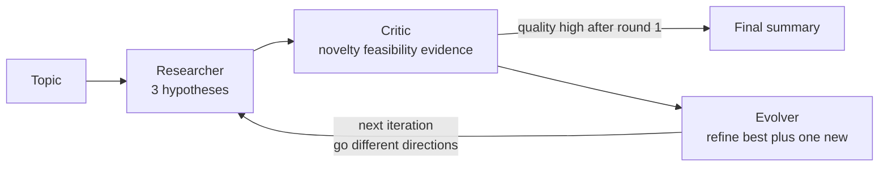

---
{
  "title": "Exploration and Discovery",
  "summary": "Generate bold hypotheses, have a critic tear them apart, evolve the survivor, repeat.",
  "category": "Reasoning & generation",
  "projects": [
    { "flavor": "AgentFramework", "path": "ExplorationAndDiscovery.AgentFramework" },
    { "flavor": "SemanticKernel", "path": "ExplorationAndDiscovery.SemanticKernel" }
  ]
}
---

## What it is

Most patterns converge on one answer. This one deliberately diverges first. Three agents with
opposing jobs run in a cycle: a **Researcher** invents hypotheses, a **Critic** scores them on
novelty, feasibility, evidence and weaknesses, and an **Evolver** takes the best one, repairs
the flaws the critic named, and adds a cross-disciplinary twist plus one brand-new hypothesis.
The next round starts from the evolved output and is told to go in *different* directions.

It is a small evolutionary search over an idea space: generate variation, apply selection
pressure, mutate the winner, loop.

## When to use it

- Open-ended questions with no single correct answer — research directions, product ideas,
  attack surfaces, experiment design.
- You want breadth on purpose and have a human downstream to validate.
- A single generation call gives you three obvious ideas and you want the non-obvious fourth.

Don't use it where a right answer exists — the critic scores *promise*, not truth, so you get
persuasive hypotheses rather than verified facts. It is also the most expensive shape here:
three LLM calls per iteration, and the output is long prose nobody may read.

## How the demo works

Both samples explore the same topic: *novel approaches to reducing antibiotic resistance in
hospital settings that don't involve developing new antibiotics*. Two iterations, each running
Researcher then Critic then Evolver. The Critic returns a structured `Critique` record with
`Feedback`, `MostPromising` and `Quality`, and the loop breaks early if `Quality` is `"high"`
**and** it is past the first iteration — the guard forces at least one round of evolution before
the run is allowed to stop.

The Researcher's prompt changes between iterations: round 1 asks for 3 novel hypotheses from
scratch, later rounds paste in the evolved hypotheses and ask for 3 **new** ones exploring
different directions — that is what keeps the search from collapsing onto one idea.

## Key APIs

| Agent Framework | Semantic Kernel |
|---|---|
| `new ChatClientAgent(chatClient, name: "Researcher", instructions: ...)` | `new ChatCompletionAgent { Name = "Researcher", Instructions = ..., Kernel = kernel }` |
| `await agent.RunAsync(prompt)` then `.Text` | `await agent.InvokeAsync(prompt).FirstAsync()` then `.Message.Content` |
| `await critic.RunAsync<Critique>(prompt)` then `.Result` | `AgentInvokeOptions` + `ResponseFormat = typeof(Critique)` + `JsonSerializer.Deserialize` |

Structured output is what makes the loop controllable: `critique.Quality` is a real string the
`for` loop can branch on, instead of the program grepping prose for the word "high".

## What to watch in the output

Watch the round banners `--- Iteration n/2 ---` and the stage markers `[Researcher] Generating
hypotheses...`, `[Critic] Evaluating hypotheses...`, `[Evolver] Refining hypotheses...`. After
each critique come the two decision lines `MOST PROMISING:` and `OVERALL QUALITY:` — those drive
the possible `High quality reached — stopping exploration.` The run closes with
`--- Final Discovery Summary ---` and a reminder that these are AI-generated hypotheses needing
human validation. **Debate** applies the same adversarial pressure to a single claim, and
**TreeOfThoughts** searches a branching space with explicit scoring instead of critique prose.
