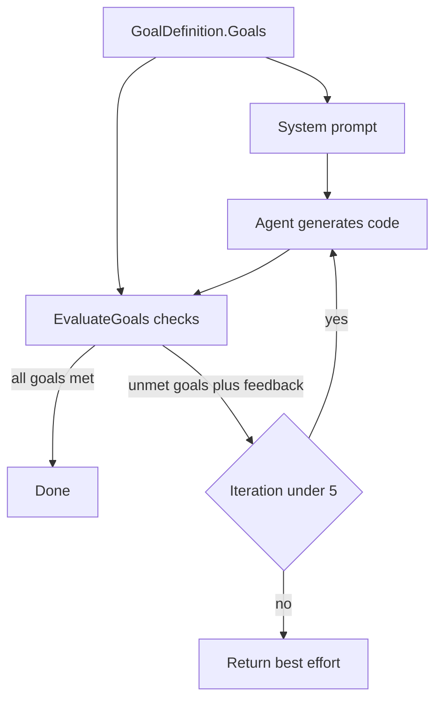

---
{
  "title": "Goal Setting and Monitoring",
  "summary": "State the goals up front, check the output against them in code, and loop until they are met.",
  "category": "Orchestration",
  "projects": [
    { "flavor": "AgentFramework", "path": "GoalSettingsAndMonitoring.AgentFramework" },
    { "flavor": "SemanticKernel", "path": "GoalSettingsAndMonitoring.SemanticKernel" }
  ]
}
---

## What it is

Give the agent an explicit, machine-checkable definition of done, then let deterministic code —
not the model's own opinion — decide when it is finished. The goals live in one place
(`GoalDefinition.Goals`), they are pasted into the system prompt so the agent knows the target,
and the *same* list backs an `EvaluateGoals` function that inspects the produced artefact and
returns `AllGoalsMet` plus feedback naming each unmet goal.

The monitor then owns the control flow: goals met, stop; goals unmet, feed the feedback back and
refine; iteration budget exhausted, stop anyway with the best effort so far.

## When to use it

- "Done" has objective criteria you can test — compiles, has docs, has tests, passes a schema.
- You want a hard iteration cap so an agent can't spin forever.
- The agent tends to declare victory early and you want an external referee.

Skip it when quality is subjective — a keyword check on prose measures nothing. Skip it too when
one pass is reliably good enough: the loop multiplies cost by the iteration count for tasks that
never needed a second attempt.

## How the demo works

The prompt is *"Write a C# method that parses a string to an integer safely."* The four goals
are valid C#, XML doc comments, edge cases (null, empty string, negatives), and at least two
test assertions. `EvaluateGoals` checks them with deliberately simple string tests — `///`,
`null`, `Assert`, `throw` or `if (` — and returns a `GoalEvaluationResult`. The comment in both
files is explicit that production would compile the code or run real tests here.

The monitor sits in a different place in each flavor. Agent Framework wraps the agent in
**middleware** — `GoalDirectedMiddleware` runs the inner agent, then loops up to 5 times reading
`plugin.LastResult`, injecting a refinement `ChatMessage` each round; the caller makes a single
`RunAsync` call and never sees the iterations. Semantic Kernel uses an
`IAutoFunctionInvocationFilter` that fires after every `EvaluateGoals` call and sets
`context.Terminate = true` once goals are met or the cap is hit — the loop is SK's own automatic
function-calling loop, and the filter just decides when to break it.

## Key APIs

| Agent Framework | Semantic Kernel |
|---|---|
| `agent.AsBuilder().Use(GoalDirectedMiddleware, null).Build()` | `builder.Services.AddSingleton<IAutoFunctionInvocationFilter, GoalMonitoringFilter>()` |
| `AIFunctionFactory.Create(plugin.EvaluateGoals)` | `builder.Plugins.AddFromType<CodeGenerationPlugin>()` with `[KernelFunction]` |
| Loop state in the middleware + `plugin.LastResult` | `context.Terminate = true` inside the filter |
| `await agent.CreateSessionAsync()` carries history across refinements | `ChatHistory` + `FunctionChoiceBehavior.Auto()` |

Note the MAF sample keeps the evaluation plugin as a live object so the middleware can read
`LastResult` between turns; the SK filter reads it straight off `context.Result`.

## What to watch in the output

Every evaluation prints `[GoalCheck] ALL GOALS MET` or `[GoalCheck] n goal(s) unmet`. Around it
you see the monitor: MAF prints `[GoalMonitor] Iteration n/5`, then either
`[GoalMonitor] Goals achieved — returning result.`, `[GoalMonitor] Goals not met — requesting
refinement...`, or `[GoalMonitor] Max iterations — returning best effort.` SK prints the same
decisions as `[Monitor] Iteration n/5`, `[Monitor] Goals achieved — terminating loop.` and
`[Monitor] Max iterations reached — terminating with best effort.` Both close with
`Final output:`. **SelfCorrectionLoop** is the same loop with an LLM judge instead of code
checks, and **EvaluationAndMonitoring** scores runs after the fact rather than steering them.
