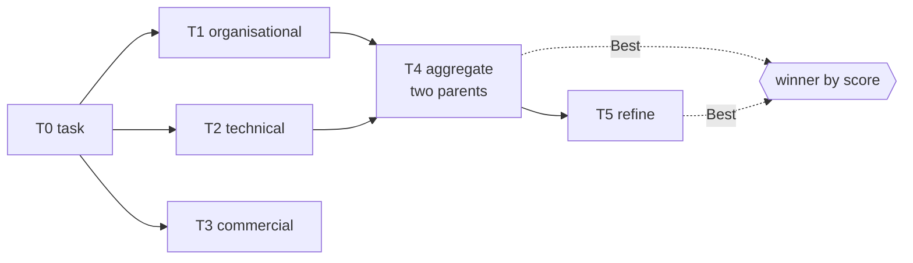

---
{
  "title": "Graph of Thoughts",
  "summary": "Thoughts as a DAG the host owns, so two promising lines can be merged instead of one being pruned.",
  "category": "Reasoning & generation",
  "projects": [
    { "flavor": "AgentFramework", "path": "GraphOfThoughts.AgentFramework" }
  ]
}
---

## What it is

**TreeOfThoughts** can only branch. Every thought has exactly one parent, so when two lines of
reasoning are both partly right, the search has one move available: keep one, prune the other,
and lose whatever the loser knew. That is the correct move when the branches are alternatives.
It is the wrong move when they are complements.

Graph of Thoughts gives a thought several parents. That single change makes **aggregation**
expressible as a structural operation rather than a prompt trick: an edge that says *these two
partial answers are both partly right, merge them*. Alongside it sits refinement — a node with
one parent that improves it in place — and the ordinary generation of the tree version.

The important consequence is not the extra operation, it is who owns the structure. The graph
lives in C#. The model generates a node's contents and scores a node's quality; it never decides
what the graph does next. So the reasoning has provenance you can print — `Ancestors(id)` gives
the exact set of thoughts an answer descends from — and a shape you can reason about
independently of any prompt.

## When to use it

- Composition tasks where partial answers are additive: merging findings from several angles,
  combining constraints, assembling a document from independently drafted sections.
- Anywhere you can score a candidate and want the score to drive structure rather than just
  ranking.
- When you want the derivation auditable. The graph *is* the audit trail.

Skip it when the branches really are alternatives — pick one, and **TreeOfThoughts** is simpler
and cheaper. Skip it when you cannot score a thought: without a scorer, aggregation has nothing
to select inputs by and the graph degenerates into an expensive chain. And note the ceiling: this
is one model exploring its own output. **Debate** and **MixtureOfAgents** buy diversity from
different agents, which is a different axis than buying it from structure.

## How the demo works

The task is the *Risks* paragraph of a decision memo about a monolith-to-microservices migration
— chosen because the good answer is genuinely a merge. Organisational risk, technical risk and
commercial risk are all real, none subsumes another, and a tree would have to throw two of them
away.

Four operations run against `ThoughtGraph`:

- **Generate.** Three drafts from three angles, in parallel, each scored 0–1 by a scorer agent on
  concreteness, relevance and actionability. The scorer judges **content only**: the brief's
  six-sentence limit is applied afterwards by `LengthPolicy`, in host code, which caps an overlong
  candidate's score deterministically and says so. Asking the model to weigh length works most of
  the time — and "most of the time" is a suggestion with good odds, not a limit. A constraint the
  host can evaluate belongs in code; the model judges what only a model can. Three nodes, all
  children of the task node.
- **Aggregate.** The two highest-scoring drafts are merged by an aggregator told to keep every
  distinct risk from both and drop the repetition. One node, **two parents** — the operation
  that does not exist in a tree.
- **Refine.** The aggregate is tightened. One node, one parent.
- **Select.** `graph.Best()` picks the highest score across *every* node, not the last one.
  Refinement is not assumed to be an improvement; if tightening lost something, the aggregate
  wins and the run says so.

`ThoughtGraph.Add` requires that every parent already exists, so the graph is acyclic by
construction — there is no cycle check anywhere because there is no way to create one. The class
also renders itself as Mermaid, which the run prints at the end.

## Key APIs

- `ThoughtGraph.Add(kind, text, parents, score)` — the one mutation. Rejects a parent that does
  not exist yet, which is the acyclicity guarantee.
- `ThoughtGraph.Ancestors(id)` — transitive provenance of a thought, printed for the winner.
- `ThoughtGraph.Best()` — highest score, ties broken towards the more derived node.
- `agent.RunAsync<Score>(text, options:)` — structured scoring, run at temperature 0.2 while
  generation runs at 0.9. Diverse candidates, stable judgement.
- `LengthPolicy.Apply(modelScore, text, maxSentences)` — the host's deterministic cap. Returns the
  adjusted score and a penalty string, so the run explains the number rather than just showing it.
- `ThoughtGraph.ToMermaid()` — the graph as a diagram, which is most of why owning the structure
  in C# is worth it.

## What to watch in the output

Read the three `[T1] score …` blocks first and note that the scores are usually close — that is
the situation where pruning is a coin flip and merging is not. Then `=== Aggregated T1 + T2 → T4
===`: check whether the merged paragraph actually carries risks from both parents, because a
lazy aggregator that quietly picks one is the failure mode here, and the score will not always
catch it.

The most informative line is the winner. When `T5 (refine)` wins, refinement helped. When `T4
(aggregate)` wins, the refiner tightened away something real — a normal outcome, and the reason
`Best()` looks at every node instead of taking the last. The `Derived from thoughts:` line and
the Mermaid block at the end show the full derivation.

**TreeOfThoughts** for branch-and-prune, **SelfConsistency** for sampling the same path many
times, **MixtureOfAgents** when the diversity should come from different agents rather than
different angles.
