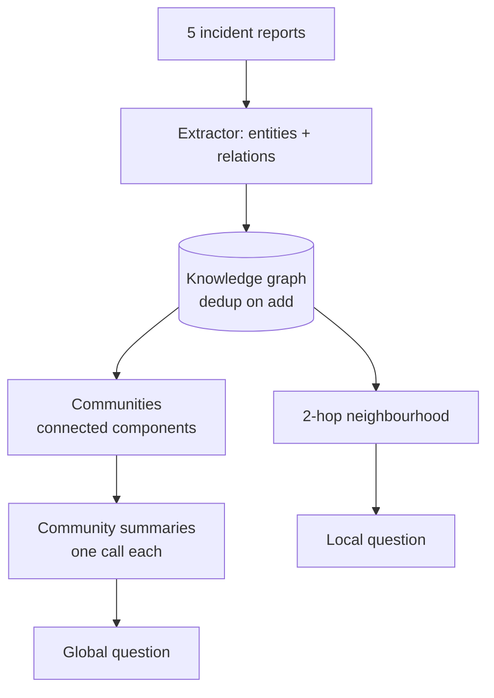

---
{
  "title": "Graph RAG",
  "summary": "Extract entities and relations into a graph, summarise its communities, then answer global questions no chunk contains.",
  "category": "Knowledge & state",
  "projects": [
    { "flavor": "AgentFramework", "path": "GraphRAG.AgentFramework" }
  ]
}
---

## What it is

Plain **RAG** retrieves the *k* chunks most similar to the question. That works whenever the
answer lives in a passage — and it structurally cannot answer a question whose answer is not
written down anywhere.

*"What is the recurring systemic problem across these incident reports?"* is such a question. No
report says it. It is a property of the corpus: three separate documents each mention one
component, and the pattern only exists once you can see all three at once. Top-*k* similarity over
chunks has nothing to retrieve, because there is no chunk to retrieve.

GraphRAG builds the structure that does contain it. Extract entities and relations from every
document, assemble a graph, group it into communities, summarise each community once — then answer
**global** questions from the summaries and **local** questions by walking a neighbourhood.

The cost is honest and paid up front: every document goes through an extraction call before anyone
asks anything. This pays off on a stable corpus queried many times, and is pure overhead on a
corpus you read once.

## When to use it

- Corpora where entities recur across documents: incident reports, case files, research
  literature, org and dependency knowledge.
- Questions of the form "what themes", "how do these relate", "what connects X and Y" — where the
  answer is a synthesis over the whole corpus.
- When the corpus is stable enough to amortise extraction over many queries.

Skip it when the answer is always in one passage — that is **RAG**, at a fraction of the cost.
Skip it when the corpus changes constantly, because every change means re-extraction and possibly
re-summarising a community. And **AgenticRAG** is the better answer when the problem is bad
retrieval (queries needing rewriting, results needing grading) rather than missing structure.

## How the demo works

Five short incident reports, engineered so the interesting facts span documents: no single report
mentions both the manual rollback and the third outage, and the shared Postgres cluster appears in
two reports about unrelated services.

**1. Extract, once per document.** An extractor agent returns typed entities and relations —
services, teams, infrastructure and notable recurring conditions, with short verb types (`owns`,
`depends-on`, `caused-by`). Two instructions carry the weight. *Only relationships the text
states, no inference* — inference at extraction time compounds into a graph of things nobody
wrote. And *use the shortest consistent name*: entity names are what join documents together, so
"checkout" in one report and "the checkout service" in another silently split the graph into
disconnected fragments and the cross-document theme never forms. Name drift is the single most
common way a GraphRAG pipeline quietly stops working, and it fails silently — you get a graph, it
is just the wrong shape.

**2. Build.** `KnowledgeGraph.Add` deduplicates case-insensitively, so the same edge appearing in
two reports is one edge — corroboration, not a second fact.

**3. Communities.** Connected components over the entity graph, largest first. The `ponytail:` note
is explicit that this is components, not Leiden: deterministic, parameter-free, and correct for
this corpus. On any corpus large enough to matter, one giant component forms and a real community
algorithm is required — that is the upgrade path, not a bigger prompt.

**4. Summarise** each community once — and carry provenance through it. This is the step where a
GraphRAG pipeline most easily stops being GraphRAG: documents carry ids, relations carry ids, and
then a free-text summary carries whatever the model happened to retain. The final answerer is asked
to "cite the incident ids", and can only repeat what reached it, or invent.

So the summariser returns a structured `CommunitySummary(Summary, SourceDocumentIds)`, **and the
host checks those ids against the graph rather than believing them.** Ids the model names that are
not in the community are reported and dropped; what gets attached to the summary is the set the
host already knows. Verifying is cheap here precisely because the truth is a set the host holds —
which is the difference between GraphRAG and summarising some graph-shaped text.

**5. Answer, two ways.**
- *Global:* "what is the recurring systemic problem" — answered from community summaries alone.
- *Local:* "what is Team Atlas involved in, directly and indirectly" — answered from
  `Neighbourhood("Team Atlas", hops: 2)`, which reaches facts no report states directly, because
  they are two edges away.

## Key APIs

- `agent.RunAsync<Extraction>(document, options:)` at temperature 0 — structured extraction is the
  only place the model touches the graph's *shape*.
- `KnowledgeGraph.Add(relation)` — case-insensitive dedup of `(From, Type, To)`.
- `KnowledgeGraph.Communities()` — union-find over the relations, groups ordered largest first.
- `KnowledgeGraph.Neighbourhood(entity, hops)` — breadth-limited traversal for local questions.
- `Relation.SourceDoc` — every edge remembers its document, so answers can cite incident ids.
- `agent.RunAsync<CommunitySummary>(...)` — summary plus claimed source ids, checked against the
  community's actual ids before either is used.

## What to watch in the output

The extraction lines, then the full relation list. Check for the entities that appear in more than
one document — `shared Postgres cluster`, `manual rollback`, `Team Atlas` — because those are the
edges that stitch reports together, and they are what plain retrieval would never surface side by
side. `manual rollback` linking INC-101 and INC-104 is the clearest example: two incidents weeks
apart, connected by a condition neither report calls out as a pattern.

The community block shows the split. Expect the marketing-site incident to sit alone — it shares
no entity with the others, which is exactly what a community algorithm should say about it — and
everything else to join into one component through the shared Postgres cluster and the rollback
chain. If you see four or five tiny communities instead, extraction drifted on entity names; that
is the failure this pipeline has, and the relation list above is where you diagnose it.

Each community also prints `sources (from the graph): INC-…` — the provenance the answerer will
cite, taken from the host's set rather than the summariser's memory. A
`[provenance] summariser also claimed …` line means the model named an id the community does not
contain; it is dropped, and seeing it occasionally is the check earning its place.

Then the two answers. The global one should name weak change management around shared
infrastructure, citing manual rollbacks and the shared Postgres cluster — a claim no single report
makes, assembled from community summaries rather than retrieved from any passage. The local one
should reach `payments gateway` from `Team Atlas` via `checkout`, an indirect connection that exists
only in the traversal. Both should cite incident ids, and every id they cite should be traceable
back through a community's source list to a real relation.

**RAG** for passage-level retrieval, **AgenticRAG** when retrieval itself needs an agent,
**MemoryConsolidation** for the same "many episodes become one durable fact" move applied to
memory instead of a corpus.
