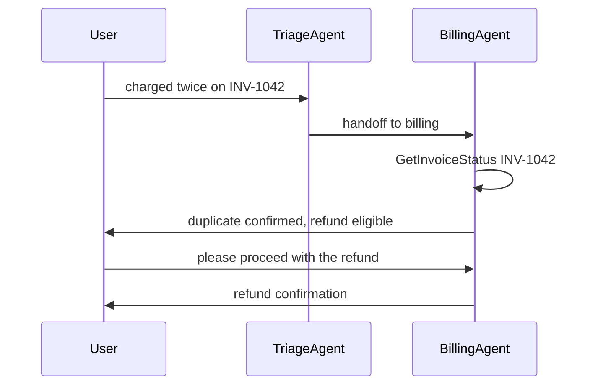

---
{
  "title": "Handoff",
  "summary": "A triage agent transfers the live conversation to a specialist, which can hand it back.",
  "category": "Orchestration",
  "projects": [ { "flavor": "AgentFramework", "path": "Handoff.AgentFramework" } ]
}
---

## What it is

Handoff is delegation that transfers *ownership of the conversation*. A front-desk agent reads
the request, decides which specialist should own it, and steps aside; the specialist then talks
to the user directly, with the full history and its own tools. When it is done — or realises the
request is not its department — it can hand control back.

The difference from routing is that the conversation keeps going. Routing picks a destination
once and forwards a single request; handoff moves a multi-turn dialogue between agents, and the
edges are bidirectional.

## Information-theoretic view

What actually crosses a handoff is a compression: the specialist inherits the transcript, but
everything the triage agent concluded and did not write down is lost at the boundary — the data
processing inequality in miniature (see `docs/coordination-physics.md`). This sample fares
better than most because the *full history* transfers verbatim rather than a summary of it;
the boundary rule is to keep hard information — identifiers like INV-1042, decisions, tool
results — intact across the transfer and let only narrative be re-derived. Every extra hop
(specialist back to triage, triage to another specialist) is another chance to shed context,
which is one more reason the write-up warns against gratuitous triage layers.

## When to use it

- Customer support and similar desks: one entry point, several specialist teams.
- Specialists need different tools or permissions that you do not want to give everyone.
- The dialogue continues after the transfer, possibly across several more user turns.

Skip it for one-shot classification with no follow-up — plain **Routing** is cheaper and easier
to reason about. Skip it too when there is really only one specialist: the extra triage hop just
adds a model call and a chance to misroute.

## How the demo works

Four agents: `TriageAgent` (routes to Billing, Tech or Account, or asks a short clarifying
question), `BillingAgent` (owns a `GetInvoiceStatus` tool that reports two identical $49.99
charges), `TechAgent` and `AccountAgent`. Handoff edges go from triage out to all three, and
from each specialist back to triage. Two customer turns are scripted in a `Queue<string>` — a
double-charge complaint about invoice INV-1042, then approval of the refund — and the workflow
pauses for the next one after each completed turn.

Because `EmitAgentResponseEvents(true)` is set, every agent reply arrives as an
`AgentResponseEvent` and is printed live; each `WorkflowOutputEvent` marks the end of a turn and
is where the sample injects the next scripted user message.

## Key APIs

- `AgentWorkflowBuilder.CreateHandoffBuilderWith(triageAgent)` — the entry agent owns the start.
- `.WithHandoffs(triageAgent, [billingAgent, techAgent, accountAgent])` — fan-out edges.
- `.WithHandoff(billingAgent, triageAgent, "Transfer here if it's not billing related")` — the
  return edge, whose description is what the model reads when deciding to hand back.
- `.EmitAgentResponseEvents(true)` — surfaces each agent reply as an `AgentResponseEvent`.
- `run.TrySendMessageAsync(new ChatMessage(...))` then `new TurnToken(emitEvents: true)` — how a
  further user turn is fed into a paused workflow.

## What to watch in the output

The first line is `User:` with the complaint; after that, watch the speaker label change from
`TriageAgent:` to `BillingAgent:` — that switch *is* the handoff, and nothing in the code names
Billing explicitly, the model chose it. The `$49.99` figure can only have come from the
`GetInvoiceStatus` tool. The run closes with `=== Final Conversation ===` and the full replayed
transcript. Compare with **Routing** for the one-shot version and **ToolUse** for the tool the
specialist calls.
