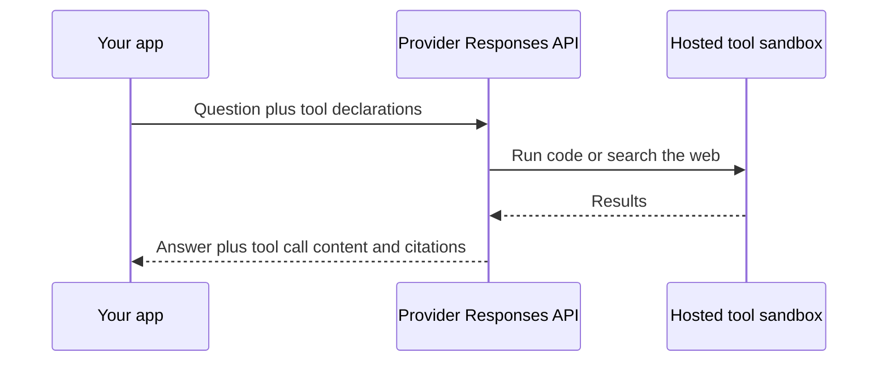

---
{
  "title": "Hosted Tools",
  "summary": "Let the provider run the tool for you, so no C# method ever executes on your machine.",
  "category": "Knowledge & context",
  "projects": [ { "flavor": "AgentFramework", "path": "HostedTools.AgentFramework", "note": "Needs an Azure OpenAI deployment that supports the Responses API with hosted tools." } ]
}
---

## What it is

In the **ToolUse** pattern the model asks for a function call, and *your process* executes the
C# method and sends the result back. Hosted tools invert that: you declare the tool, and the
provider runs it server-side. The code interpreter sandbox, the web search index and the
crawler all live on their side of the wire; you receive the transcript of what happened
alongside the answer.

You give up control and gain capability — sandboxed Python execution and a live web index are
not things you want to build and secure yourself.

## When to use it

- The capability is genuinely the provider's: running arbitrary code safely, searching the
  live web, browsing files you uploaded to them.
- You want the answer grounded in current information with citations attached.

Skip it when the tool touches *your* systems — a database, an internal API, a file on disk.
The provider cannot reach those, so those stay client-side functions. Also note the portability
cost: hosted tools require the OpenAI Responses API, so this sample is the least portable
pattern in the repo.

## How the demo works

Two agents share one chat client. `DataAnalyst` gets a `HostedCodeInterpreterTool` and is asked
to *simulate 10,000 rolls of two six-sided dice and report the distribution of sums as
percentages* — the provider actually runs the Python. `WebResearcher` gets a
`HostedWebSearchTool` and is asked *what Microsoft announced at the most recent .NET Conf*.

The client is built as a plain `OpenAIClient` pointed at Azure's `openai/v1` endpoint rather
than the usual `AzureOpenAIClient`, and that is deliberate: `openai/v1` is the GA surface for
the Responses API, and `Azure.AI.OpenAI` 2.9.0-beta.1's `GetResponsesClient()` is
binary-incompatible with the OpenAI 2.12 that MEAI 10.9 requires — calling it throws
`MissingMethodException`. Going through the plain client sidesteps the mismatch while still
talking to your Azure deployment.

Because the provider ran the tool, its activity does not arrive as `FunctionCallContent`. The
demo walks `response.Messages.SelectMany(m => m.Contents)` and switches on
`CodeInterpreterToolCallContent`, `WebSearchToolCallContent`, and `TextContent` annotations.

## Key APIs

- `new OpenAIClient(credential, options).GetResponsesClient().AsIChatClient(deployment)` — the
  Responses API client the hosted tools require.
- `new HostedCodeInterpreterTool()` — provider-side sandboxed code execution.
- `new HostedWebSearchTool()` — provider-side web search.
- `CodeInterpreterToolCallContent.Inputs` — the code the provider actually ran.
- `WebSearchToolCallContent.Queries` — the searches it issued.
- `TextContent.Annotations.OfType<CitationAnnotation>()` — title and URL per source.
- `#pragma warning disable OPENAI001` — the Responses API is still evaluation-only in the SDK.

## What to watch in the output

Each run prints `User: <question>`, then the hosted activity: `[code interpreter ran]` followed
by the generated Python for the first agent, and `[web search: <queries>]` plus one
`[citation] <title> - <url>` line per source for the second. The final line is prefixed with
the agent name, `DataAnalyst:` or `WebResearcher:`. Contrast the client-side execution in
**ToolUse**, and see **MCP** for the third option — tools hosted by a server you control.
