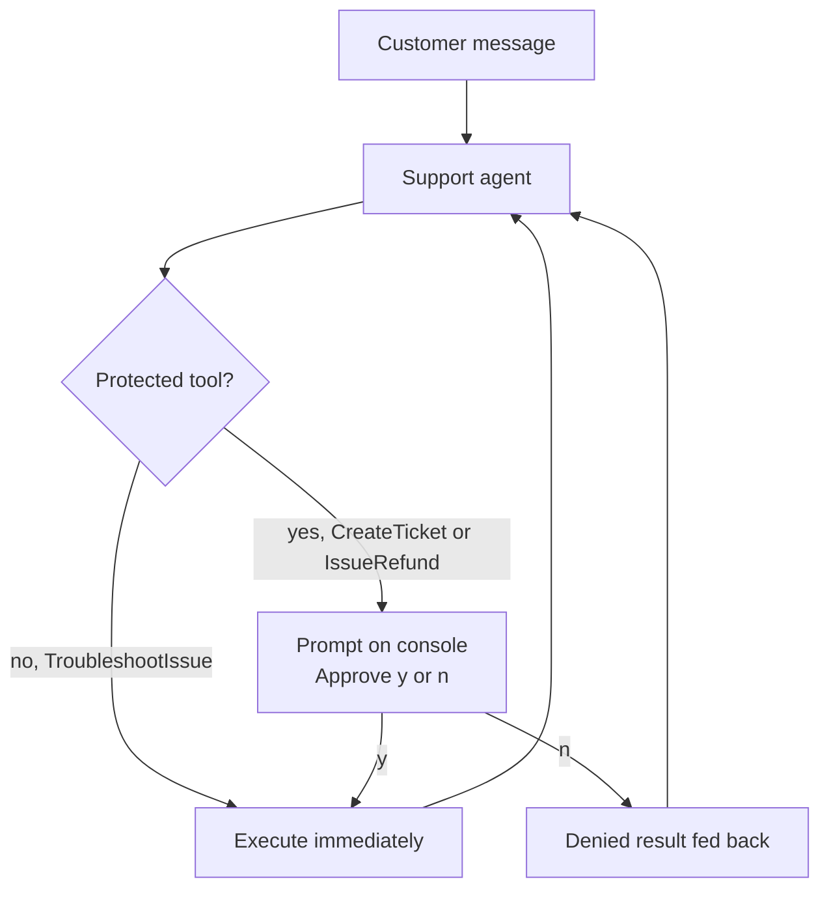

---
{
  "title": "Human in the Loop",
  "summary": "Pause before a risky tool call and let a person approve or deny it before it runs.",
  "category": "Production controls",
  "projects": [
    { "flavor": "AgentFramework", "path": "HumanInTheLoop.AgentFramework", "interactive": true },
    { "flavor": "SemanticKernel", "path": "HumanInTheLoop.SemanticKernel", "interactive": true }
  ]
}
---

## What it is

Some tool calls are cheap to get wrong and some issue refunds. Human in the loop puts a
checkpoint between the model's decision and its execution: when the agent wants to call a
protected function, the run pauses, a person sees the function name and its arguments, and
nothing happens until they say yes.

A denial is not an error — it is a result. The agent is told the action was refused and continues
the conversation gracefully, which is what keeps the pattern usable rather than merely safe.

Human oversight has three operating modes; they are deployment choices, not separate workflow
patterns:

| Mode | Behavior |
|---|---|
| Human in the loop | Execution pauses for a decision before the protected action runs. |
| Human on the loop | Execution continues within host-enforced limits while a person monitors and can intervene. |
| Human out of the loop | No per-action approval; deterministic policy, bounded execution, and audit controls govern the run. |

This sample demonstrates **human in the loop**. Moving to on- or out-of-the-loop operation must
not grant the model more authority; Tool Authorization and execution budgets still apply.

## Information-theoretic view

An approval gate is only worth what the approver actually reads, and undesigned HITL decays
into a compliance checkbox — every gratuitous prompt trains the click that waves the bad one
through (see `docs/coordination-physics.md`). The empirical picture of *designed* review comes
from 25 months of WhatsCode at WhatsApp: 3,000+ accepted changes settled into a stable
equilibrium of roughly 60% one-click accepts and 40% commandeer-and-revise, with acceptance
spanning 9–100% across domains (arXiv:2512.05314) — engagement persisted because the workflow
made both outcomes cheap and legitimate. The design levers here match: gate only the
consequential pair of functions, show the exact arguments, and treat a denial as a first-class
result the agent continues from rather than an error.

## When to use it

- The action moves money, sends external communication, or deletes something.
- Compliance requires a named human to authorize a class of operation.
- You are new to a tool and want to watch what the model actually asks for before trusting it.

Skip it for read-only tools — approving every lookup trains people to click yes without reading,
which is worse than no gate at all. Gate the smallest possible set of functions.

## How the demo works

**Both samples block on `Console.ReadLine`, so the run waits for you** — the explorer shows a
stdin box; type `y` or `n` and press enter to let it continue. Each sample plays a support
conversation of three customer messages (a smart speaker dropping WiFi, then escalation, then a
refund request) against a `SupportPlugin` with four functions: `TroubleshootIssue`,
`CreateTicket`, `IssueRefund` and `EscalateToHuman`. `CreateTicket` and `IssueRefund` are the
protected pair.

The mechanism differs sharply. Agent Framework makes approval a first-class protocol: the
sensitive tools are wrapped in `ApprovalRequiredAIFunction`, so `RunAsync` returns without
executing them and instead emits `ToolApprovalRequestContent` in the response. `Program.cs`
scans for those, prompts, and sends `request.CreateResponse(approved)` back as a new user
message — looping up to five rounds in case the follow-up asks for more approvals. Semantic
Kernel intercepts instead: `HumanApprovalFilter` implements `IAutoFunctionInvocationFilter`,
checks the function name against a `HashSet`, and either calls `next(context)` or replaces
`context.Result` with an `APPROVAL_DENIED` string telling the agent to explain the delay.

## Key APIs

| Agent Framework | Semantic Kernel |
|---|---|
| `new ApprovalRequiredAIFunction(fn)` | `IAutoFunctionInvocationFilter` implementation |
| `ToolApprovalRequestContent` in `response.Messages` | `AutoFunctionInvocationContext.Function.Name` |
| `request.CreateResponse(approved)` | `await next(context)` to allow |
| `agent.RunAsync([new ChatMessage(ChatRole.User, approvals)], session)` | `context.Result = new FunctionResult(...)` to deny |

The practical difference: Agent Framework *suspends* the run and hands control back to you, which
is what makes it durable across a process boundary. The Semantic Kernel filter blocks inline
inside the call stack.

## What to watch in the output

Both print `[APPROVAL REQUIRED]` with the function name and its arguments, then
`Approve? (y/n):`. Agent Framework echoes `V Approved.` or `X Denied.`; Semantic Kernel prints
`Approved — executing.` or `Denied — skipping function.`. `EscalateToHuman` writes its own
`[ESCALATION]` block from inside the plugin — that one is not gated, so it runs unprompted.
Try denying the refund and watch the agent explain that manual review is needed instead of
failing. See **GuardRails** for automatic refusal without a human, and
**DurableHumanInTheLoop** for approval that survives the process being killed.
