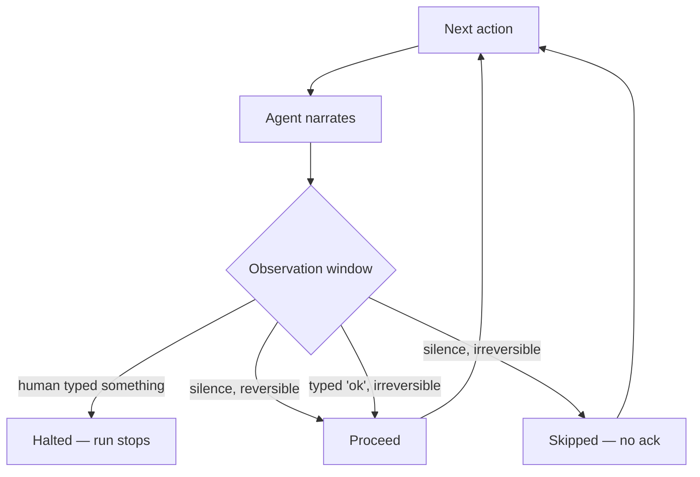

---
{
  "title": "Human on the Loop",
  "summary": "The agent runs and narrates, the human watches and can cut in — with silence meaning yes only for reversible actions.",
  "category": "Production controls",
  "projects": [
    { "flavor": "AgentFramework", "path": "HumanOnTheLoop.AgentFramework", "interactive": true }
  ]
}
---

## What it is

**HumanInTheLoop** stops at every gated action and waits. Human-on-the-loop inverts the default:
the agent proceeds, narrating as it goes, and the human's ability to interrupt is what provides
oversight.

The entire pattern is one design decision — *what happens when the human says nothing* — and
getting it right requires that the answer not be uniform. In-the-loop is safe and does not scale;
past a handful of steps the human becomes the throughput limit and, worse, starts approving
blind, which is oversight in form only. On-the-loop scales, and it has an obvious failure: nobody
was reading the terminal.

So the answer is per action, not per agent. **Reversible actions proceed on silence.
Irreversible actions do not** — silence is not consent when there is nothing to undo. That single
field, `Reversible`, is what keeps this from collapsing into either of the two failure modes.

## When to use it

- Long autonomous runs a person supervises rather than drives: maintenance windows, migrations,
  batch remediation.
- Operational work where most steps are routine and a few are not.
- Anywhere approval fatigue has already set in — an operator clicking "approve" forty times is
  providing no oversight, and this is the honest version of what is happening.

Skip it when every action is consequential; that is **HumanInTheLoop**, and the friction is the
feature. Skip it too when nobody is actually watching — an agent with an interrupt window and no
observer is an unsupervised agent with extra latency. If oversight has to survive a restart, see
**DurableHumanInTheLoop**.

## How the demo works

A four-action maintenance plan runs, with the agent narrating each step. Three actions are
reversible; `drop_index` is not.

`InterruptWatcher` reads stdin on a background thread into a queue. This matters: a blocking read
per step would turn the pattern back into human-in-the-loop, with the agent waiting on the human
at every action. Instead the main loop asks "has anyone said anything?" after each observation
window. At EOF — piped input, or Pattern Explorer — the reader loop simply ends and every window
comes back empty, which is the correct reading of "nobody objected".

`OversightPolicy.Decide` is the whole rule, and it fits in a `switch`:

- interrupted → `Halted`, regardless of anything else;
- irreversible and not acknowledged → `AwaitingAck`;
- irreversible and acknowledged → `Proceed`;
- otherwise → `Proceed`.

Reversible actions get a 3-second window and proceed on silence. The irreversible one gets 15
seconds and requires the literal `ok`; anything else — including silence — skips it. Note that
skipping is not stopping: the run continues without that action, so an unattended run completes
the safe work and leaves the dangerous work undone.

`Reversible` is the **host's** classification of the action, never the model's claim about it.
Asking a model whether what it is about to do is reversible is asking the wrong party.

## Key APIs

- `InterruptWatcher` over a background `Task.Run` reading `Console.ReadLine()` into a locked
  queue — non-blocking polling from the main loop, which is what makes "on the loop" different
  from "in the loop" mechanically and not just rhetorically.
- `OversightPolicy.Decide(action, interrupted, acknowledged)` → `Proceed | Halted | AwaitingAck`.
  A pure function, which is why the reversibility rule is a five-line test rather than an
  integration exercise.
- `agent.RunAsync(...)` per step for the narration — the human is supervising *something they can
  read*, and unnarrated autonomy is not supervisable.

## What to watch in the output

Let it run untouched first. The three reversible actions complete after their windows;
`drop_index` prints `[IRREVERSIBLE]`, waits, and then `skipped — no acknowledgement`. That is the
default that makes unattended operation safe: the routine work is done, the dangerous work is not,
and nothing needed a human to be present.

Now run it again and type anything during a window. `HALTED by operator: "…"` and the run stops
with a list of what completed — an interrupt beats everything, including an acknowledgement.

Third run: type `ok` at the irreversible prompt and watch it proceed. Three runs, three different
outcomes from the same code, which is the shape of the policy table.

**HumanInTheLoop** for approve-before-every-action, **DurableHumanInTheLoop** when the wait must
survive a restart, **BoundedExecution** for the limits that apply when nobody is watching at all.
