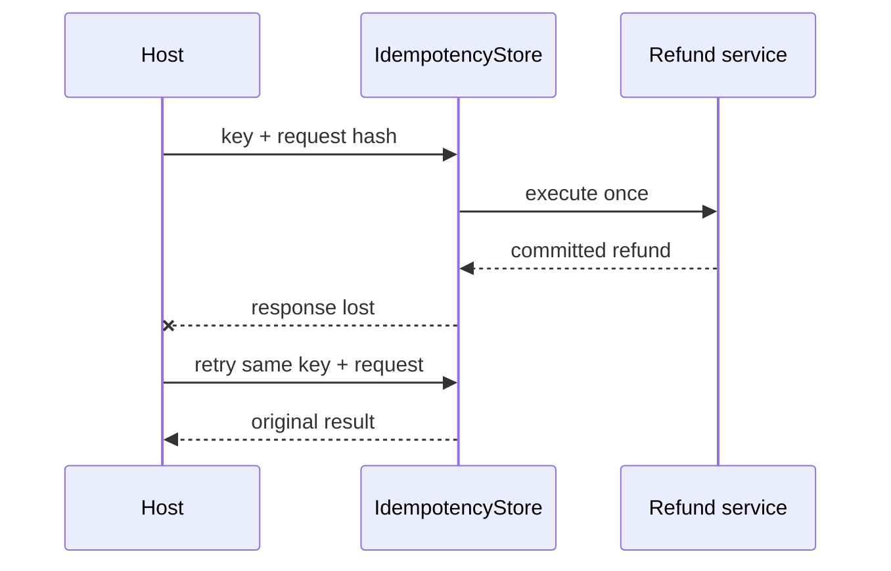

---
{
  "title": "Idempotent Tool Calls",
  "summary": "Make retries of side-effecting tools return the first committed result instead of repeating the effect.",
  "category": "Production controls",
  "projects": [ { "flavor": "AgentFramework", "path": "IdempotentToolCalls.AgentFramework" } ]
}
---

## What it is

The dangerous retry is not a clean failure before work starts. It is a successful side effect
whose response is lost: the caller sees an error, retries, and charges, books, emails, or refunds
twice. An idempotency key binds all attempts for one logical operation to one normalized request
and one stored result.

The trusted host creates the key and reuses it for retries. Asking the model to invent a fresh key
on every attempt defeats the guarantee.

## When to use it

- Payments, refunds, bookings, messages, ticket creation, and other side effects.
- Any transient retry policy where commit status can be ambiguous.
- At-least-once delivery from queues or workflow recovery.

Pure reads usually do not need this machinery. They may still benefit from caching, but caching
and idempotency solve different problems.

## How the demo works

An Agent Framework `AIFunction` closes over a host-generated key. The first `IssueRefund` call
commits a refund to `SimulatedRefundService`, records the result in `IdempotencyStore`, and then
throws a simulated network exception before returning. The retry uses the same key and normalized
request, so it receives the stored refund and creates no second side effect.

The store serializes concurrent attempts per key. The same key with a different request hash is an
idempotency conflict. Permanent validation failures are remembered; caller cancellation remains
cancellation rather than being mislabeled transient.

## Key APIs

- `AIFunctionFactory.Create(...)` — exposes the retry-safe operation without exposing the key.
- `SHA256.HashData(...)` — binds the key to a normalized request.
- `ConcurrentDictionary` + per-entry `SemaphoreSlim` — one execution for concurrent retries.
- Stored state: request hash, creation time, completion/failure state, result, and response-loss marker.

## What to watch in the output

The first attempt reports simulated response loss. The retry returns the original `Refund`, then
`Refund side effects: 1`. Reusing the key with €30 instead of €25 produces an explicit conflict.
