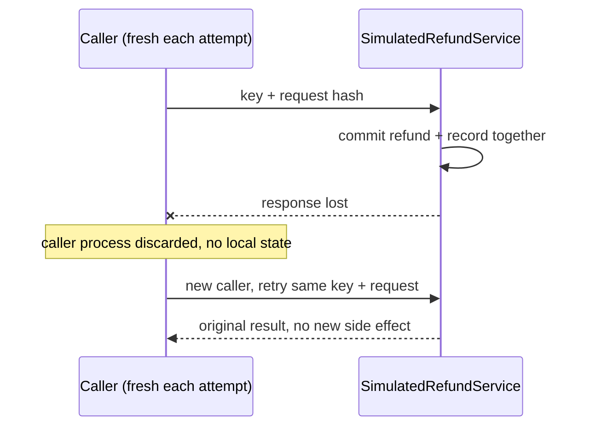

---
{
  "title": "Idempotent Tool Calls",
  "summary": "Make retries of side-effecting tools return the first committed result instead of repeating the effect.",
  "category": "Production controls",
  "projects": [ { "flavor": "AgentFramework", "path": "IdempotentToolCalls.AgentFramework" } ]
}
---

## What it is

The dangerous retry is not a clean failure before work starts. It is a successful side effect
whose response is lost: the caller sees an error, retries, and charges, books, emails, or refunds
twice. An idempotency key binds all attempts for one logical operation to one normalized request
and one stored result.

The trusted host creates the key and reuses it for retries. Asking the model to invent a fresh key
on every attempt defeats the guarantee.

The idempotency record lives with the side effect, not with the caller. It is committed in the
same transaction as the refund, so the window this pattern actually closes is the hard one:
*the operation succeeded remotely and the caller never found out*. A client-side registry only
closes the easy window, where the result already reached the caller's process.

## When to use it

- Payments, refunds, bookings, messages, ticket creation, and other side effects.
- Any transient retry policy where commit status can be ambiguous.
- At-least-once delivery from queues or workflow recovery.

Pure reads usually do not need this machinery. They may still benefit from caching, but caching
and idempotency solve different problems.

## How the demo works

An Agent Framework `AIFunction` closes over a host-generated key. The first `IssueRefund` call
reaches `SimulatedRefundService`, which commits the refund and its idempotency record together,
then throws a simulated network exception before the response reaches the caller. The caller's
process is discarded — a brand new `IdempotentTool` instance stands in for a fresh caller with no
local state. Its retry carries the same key and normalized request, so the service returns the
already-committed refund and creates no second side effect.

The service serializes concurrent attempts per key, scoped per tenant. The same key with a
different request hash is an idempotency conflict. Permanent validation failures are remembered;
caller cancellation remains cancellation rather than being mislabeled transient.

## Key APIs

- `AIFunctionFactory.Create(...)` — exposes the retry-safe operation without exposing the key.
- `SHA256.HashData(...)` — binds the key to a normalized request.
- `ConcurrentDictionary` + per-entry `SemaphoreSlim` — one execution for concurrent retries, keyed by `tenant|key`.
- Stored state: request hash, the committed refund, permanent-failure message, and response-loss marker — all owned by `SimulatedRefundService`, not the caller.

## What to watch in the output

The first attempt reports simulated response loss. A fresh caller retry returns the original
`Refund`, then `Refund side effects: 1`. Reusing the key with €30 instead of €25 produces an
explicit conflict.
