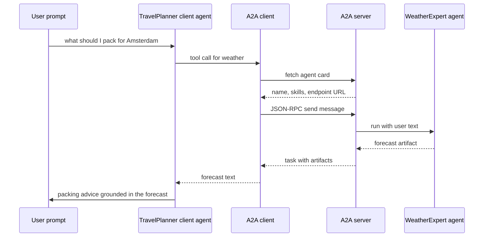

---
{
  "title": "Agent-to-Agent Communication",
  "summary": "One agent calls another over HTTP through the A2A protocol instead of an in-process function.",
  "category": "Orchestration",
  "projects": [
    { "flavor": "AgentFramework", "path": "InterAgentCommunication.A2A.AgentFramework.Client", "server": "InterAgentCommunication.A2A.AgentFramework.Server", "serverPort": 5200 },
    { "flavor": "SemanticKernel", "path": "InterAgentCommunication.A2A.SemanticKernel.Client", "server": "InterAgentCommunication.A2A.SemanticKernel.Server", "serverPort": 5100 }
  ]
}
---

## What it is

Every other multi-agent pattern here runs its agents inside one process, sharing objects. **A2A**
(Agent-to-Agent) puts a network boundary between them: a remote agent is published over HTTP as
a JSON-RPC endpoint plus an **agent card** — a machine-readable document naming the agent, its
version, its skills, and the URL to reach it. A client fetches the card, learns what the agent
can do, and calls it like any other tool.

The payoff is independence. The remote agent can be a different team's codebase, a different
model, a different language, deployed and versioned on its own schedule. The caller only knows
the card.

## When to use it

- The capability belongs to another team, service, or trust boundary.
- You want to swap or scale the remote agent without redeploying the caller.
- Discovery matters: the caller should read what the agent offers rather than hard-code it.

Skip it when both agents live in the same solution and always ship together — you are paying for
HTTP, serialization, and a second process to get what a method call already gives you. Use
**Handoff** or **MultiAgentCollaboration** for in-process delegation, and **MCP** when you want
to expose *tools* rather than a whole conversational agent.

## How the demo works

Each flavor is two processes. The **server** hosts a `WeatherExpert` agent; the **client** runs a
`TravelPlanner` agent that is asked *"I'm planning a weekend trip to Amsterdam. What should I
pack?"* and whose instructions require it to check the weather before advising. The only way to
get weather is the remote agent, so the model must make the A2A call.

The explorer runs the server first, polls the port with a TCP connect until it accepts
(`WaitForPortAsync`, 90-second cap), prints `server is listening on port 5200`, and only then
starts the client. Both processes stream into the same console, so ASP.NET Core's startup and
request logs from the server interleave with the client's output.

**Agent Framework** does nearly all of this for you. `builder.AddAIAgent("WeatherExpert", ...)`
registers the agent, `AddA2AServer` generates the agent card from the registration and the
request address, and `MapA2AJsonRpc(weatherAgent, "/a2a/weather")` exposes it on port 5200. The
client points an `A2AClient` straight at that known URL, wraps it in an `A2AAgent`, and converts
it to a tool with `AsAIFunction` — supplying the tool name and description explicitly — so the
remote agent is indistinguishable from a local function to the `TravelPlanner`.

**Semantic Kernel** is more explicit. `WeatherAgentHandler` implements `IAgentHandler`, drives an
`AgentEventQueue` by hand through `SubmitAsync`, `StartWorkAsync`, `AddArtifactAsync` and
`CompleteAsync`, and hand-writes its `AgentCard` with skills, interfaces and capabilities.
`MapA2A("/weather")` publishes both the endpoint and the well-known card on port 5100. The client
resolves that card with `A2ACardResolver`, reads the endpoint out of
`SupportedInterfaces[0].Url`, and registers a `KernelFunction` that builds the JSON-RPC `Message`
and unpacks the artifact text itself — a deliberate choice noted in the source, because the
packaged SK `A2AAgent` wrapper targets an older A2A protocol version than the one pinned here.

## Key APIs

| Agent Framework | Semantic Kernel |
|---|---|
| `builder.AddAIAgent(name, instructions)` | `new ChatCompletionAgent { Name, Instructions, Kernel }` |
| `weatherAgent.AddA2AServer(_ => { })` — card generated | `WeatherAgentHandler.GetAgentCard()` — card hand-written |
| `app.MapA2AJsonRpc(agent, "/a2a/weather")` | `AddA2AAgent<WeatherAgentHandler>(card)` + `app.MapA2A("/weather")` |
| `new A2AClient(uri)` + `new A2AAgent(client)` | `new A2ACardResolver(uri)` + `GetAgentCardAsync()` |
| `a2aAgent.AsAIFunction(new AIFunctionFactoryOptions { Name, Description })` | `KernelFunctionFactory.CreateFromMethod(...)` calling `SendMessageAsync` |

## What to watch in the output

The explorer's own `sys` lines come first — `dotnet run --project ...` for the server, then
`server is listening on port 5200` (5100 for Semantic Kernel) before the client starts. The
Semantic Kernel client then prints `Discovered remote agent: WeatherExpert` — proof the card was
fetched, not hard-coded — followed by `  [A2A] Calling WeatherExpert: "..."` with the exact query
the model composed. Both flavors end with `TravelPlanner:` and a packing answer that references a
forecast the client process never produced. Interleaved `info:` lines are the server handling the
request. Compare with **ToolUse**, which is the same tool-calling loop against a local C# method,
and **MCP**, which crosses a process boundary to expose tools rather than an agent.
