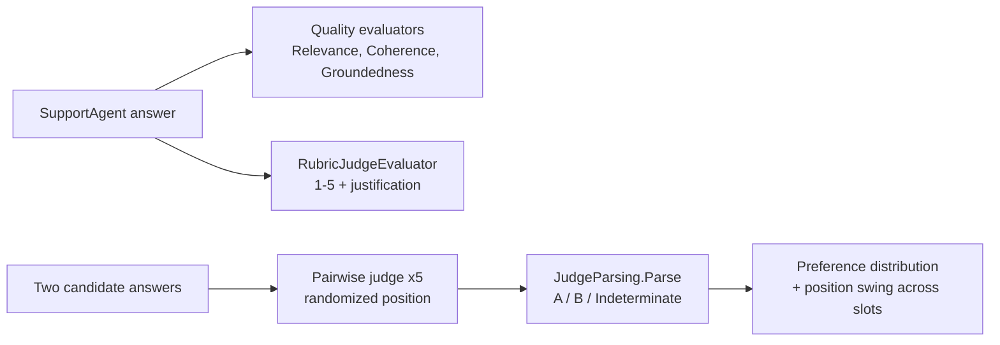

---
{
  "title": "LLM as Judge",
  "summary": "Score answers with a judge model against a rubric, and measure the judge's own position bias by comparing its verdicts across balanced candidate orderings, discarding verdicts it cannot parse.",
  "category": "Evaluation",
  "projects": [
    { "flavor": "AgentFramework", "path": "LLMAsJudge.AgentFramework" }
  ]
}
---

## What it is

You cannot grade a thousand free-text answers by hand, and string equality does not know that
*"a two-year warranty"* and *"24 months of coverage"* are the same answer. LLM-as-judge uses a
second model call to score an output against criteria — the workhorse of modern evaluation. This
sample scores answers three ways: built-in **quality evaluators** (`Relevance`, `Coherence`,
`Groundedness`) from `Microsoft.Extensions.AI.Evaluation.Quality`, a **custom rubric judge**
written directly against `IEvaluator`, and a **pairwise comparison** that picks the better of two
answers.

The judge is not a neutral instrument, and the pairwise step exists to measure it: the same two
candidates are judged five times, with the better answer placed in slot A three times and slot B
twice, shuffled. The statistic is the **position swing** — how far the better answer's win rate
moves when it changes slots. A judge whose verdict does not depend on position swings 0; a judge
that just picks whatever sits in slot A swings 1. That is **position bias** — one of its documented
failure modes alongside verbosity bias (longer looks better) and self-preference (its own style
looks better).

Crucially, a judge that is simply *wrong* — it prefers the vague answer in both slots — also swings
0. Wrongness and position-dependence are different defects, and a statistic that cannot tell them
apart is not measuring position.

A judge is also not a reliable narrator of its own output format: `JudgeParsing.Parse` treats any
verdict it cannot parse as its own contract — `{"winner": "A"}` or `{"winner": "B"}`, matched
exactly — as `Indeterminate` rather than silently counting it as a win for either side.

**Builds on:** **SelfCorrectionLoop** and **Debate** use a judge *inline* to drive generation;
this pattern is the same judge as a standalone measurement, plus its failure modes.
**ConfidenceReporting** is the self-assessment counterpart — what the model says about itself,
where this is what a second model says about the answer.

## Information-theoretic view

A judge score is a proxy, and Goodhart's law applies the moment you optimize against it (see
`docs/coordination-physics.md`): tune a prompt to please the judge and you may buy judge points
without buying quality. The randomized-ordering probe is the honest correction — it measures the
*instrument's* noise floor before you trust its readings. A judge that flips on position is not
measuring answer quality; it is measuring slot order, and any score it emits is that much less
information about the thing you actually care about.

## When to use it

- Grading open-ended output where exact match is meaningless but quality is judgeable.
- Ranking two prompt or model variants against each other (pairwise is more reliable than
  scoring each in isolation).
- Any eval suite whose "correct" is semantic rather than literal — the judge tier of
  **RegressionEvals** is exactly this pattern embedded in a gate.

Skip it when a cheaper signal exists: an exact string, a regex, or an NLP overlap metric costs
no model call and cannot be gamed by fluent wrongness.

## How the demo works

A TechCorp `SupportAgent` answers two warranty/returns questions against a fixed policy string.
Each answer is scored by the three quality evaluators plus `RubricJudgeEvaluator`, a custom
`IEvaluator` that asks the judge for a 1–5 score with a one-sentence justification and returns it
as a `NumericMetric`. `GroundednessEvaluator` receives the policy text as its context so it can
check the answer against the source rather than against the model's own memory.

The rubric judge never throws and never invents a number. A reply that is empty, truncated, not
JSON, missing a score, or scored outside 1–5 yields a `NumericMetric` with **no value** and an
`Indeterminate` reason, printed as `INDETERMINATE`. A numeric `0` would be worse than that: it sits
below the rubric's own floor of 1, so an unreadable verdict would be recorded as *worse than the
worst possible answer* and would drag any average computed over the metric.



The pairwise section pits a precise answer against a vague one across five orderings, parses each
verdict with `JudgeParsing.Parse` (which returns `Indeterminate` — never a default winner — for
anything that doesn't match the `{"winner": "A"}` / `{"winner": "B"}` contract), and records each
result as a `Trial` that keeps **which slot the precise answer occupied**. The slot has to survive
into the statistic: fold it away first and five trials drawn in one slot yield the same number as
five alternating ones, and the randomisation measures nothing.

`JudgeParsing.Summarize` partitions the trials by slot, computes the precise answer's win rate
within each, and reports the absolute difference as `PositionSwing`. `Indeterminate` verdicts are
excluded from both rates and counted separately. If either slot produced no determinate verdict the
swing is `null` — *not measurable* rather than zero, because one slot cannot say anything about
position. The five orderings are a balanced 3/2 split, shuffled, rather than five coin flips: five
flips land every trial in one slot 6.25% of the time, and a balanced split costs nothing and rules
that out.

## Key APIs

| API | Role |
|---|---|
| `new ChatConfiguration(chatClient)` | Wraps the model for the evaluators to call |
| `RelevanceEvaluator` / `CoherenceEvaluator` / `GroundednessEvaluator` | Built-in quality evaluators |
| `GroundednessEvaluatorContext(policy)` | Supplies grounding source to the evaluator |
| `IEvaluator.EvaluateAsync(messages, response, chatConfig, contexts)` | The evaluator contract |
| `result.Get<NumericMetric>(name)` | Reads a score back out of the `EvaluationResult` |
| `RubricJudgeEvaluator` | Custom 1–5 rubric judge; an unreadable verdict becomes a value-less metric, never a 0 |
| `JudgeParsing.Parse(json)` | Strict verdict parse: `A` / `B` / `Indeterminate`, never throws |
| `Trial(referenceInPositionA, verdict)` | One pairwise result with its slot kept, not folded away |
| `JudgeParsing.Summarize(trials)` | Win/loss/indeterminate counts plus the position swing between slots |

```bash
dotnet run --project LLMAsJudge.AgentFramework
dotnet run --project LLMAsJudge.AgentFramework -- --selfcheck   # offline bias-logic check
```

## What to watch in the output

The first block prints each answer with four scored lines (`Relevance`, `Coherence`,
`Groundedness`, `RubricScore`) and the judge's reason per metric; a line reading `INDETERMINATE`
means that judge's reply could not be read, not that the answer scored badly. The second block runs five balanced
orderings and prints the win/loss/indeterminate counts, the position swing between the two slots
(computed from determinate verdicts only), and a `► Position bias` verdict. A well-behaved judge on
a clear-cut pair picks the precise answer regardless of slot and swings 0 — if the swing is above
0, you have just measured your instrument, not your agent. A judge that picks the vague answer in
both slots also swings 0: that shows up in the win counts, which is where wrongness belongs. **RegressionEvals** builds a gate on top of these evaluators, and
**EvaluationAndMonitoring** tracks the token cost of running a judge on every answer.
