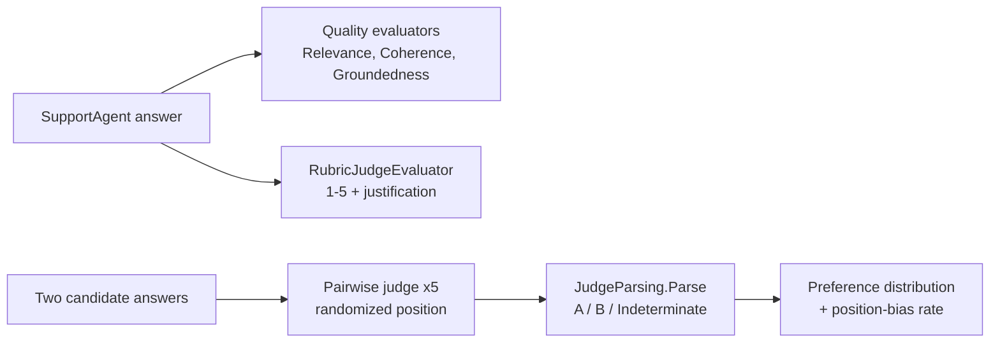

---
{
  "title": "LLM as Judge",
  "summary": "Score answers with a judge model against a rubric, and probe the judge's own position bias across randomized orderings, discarding verdicts it cannot parse.",
  "category": "Evaluation",
  "projects": [
    { "flavor": "AgentFramework", "path": "LLMAsJudge.AgentFramework" }
  ]
}
---

## What it is

You cannot grade a thousand free-text answers by hand, and string equality does not know that
*"a two-year warranty"* and *"24 months of coverage"* are the same answer. LLM-as-judge uses a
second model call to score an output against criteria — the workhorse of modern evaluation. This
sample scores answers three ways: built-in **quality evaluators** (`Relevance`, `Coherence`,
`Groundedness`) from `Microsoft.Extensions.AI.Evaluation.Quality`, a **custom rubric judge**
written directly against `IEvaluator`, and a **pairwise comparison** that picks the better of two
answers.

The judge is not a neutral instrument, and the pairwise step exists to prove it: the same two
candidates are judged across five randomized position orderings. If the same candidate does not
win regardless of slot, the judge has **position bias** — one of its documented failure modes
alongside verbosity bias (longer looks better) and self-preference (its own style looks better).
A judge is also not a reliable narrator of its own output format: `JudgeParsing.Parse` treats any
verdict it cannot parse as its own contract — `{"winner": "A"}` or `{"winner": "B"}`, matched
exactly — as `Indeterminate` rather than silently counting it as a win for either side.

**Builds on:** **SelfCorrectionLoop** and **Debate** use a judge *inline* to drive generation;
this pattern is the same judge as a standalone measurement, plus its failure modes.
**ConfidenceReporting** is the self-assessment counterpart — what the model says about itself,
where this is what a second model says about the answer.

## Information-theoretic view

A judge score is a proxy, and Goodhart's law applies the moment you optimize against it (see
`docs/coordination-physics.md`): tune a prompt to please the judge and you may buy judge points
without buying quality. The randomized-ordering probe is the honest correction — it measures the
*instrument's* noise floor before you trust its readings. A judge that flips on position is not
measuring answer quality; it is measuring slot order, and any score it emits is that much less
information about the thing you actually care about.

## When to use it

- Grading open-ended output where exact match is meaningless but quality is judgeable.
- Ranking two prompt or model variants against each other (pairwise is more reliable than
  scoring each in isolation).
- Any eval suite whose "correct" is semantic rather than literal — the judge tier of
  **RegressionEvals** is exactly this pattern embedded in a gate.

Skip it when a cheaper signal exists: an exact string, a regex, or an NLP overlap metric costs
no model call and cannot be gamed by fluent wrongness.

## How the demo works

A TechCorp `SupportAgent` answers two warranty/returns questions against a fixed policy string.
Each answer is scored by the three quality evaluators plus `RubricJudgeEvaluator`, a custom
`IEvaluator` that asks the judge for a 1–5 score with a one-sentence justification and returns it
as a `NumericMetric`. `GroundednessEvaluator` receives the policy text as its context so it can
check the answer against the source rather than against the model's own memory.



The pairwise section pits a precise answer against a vague one across five randomized orderings,
parses each verdict with `JudgeParsing.Parse` (which returns `Indeterminate` — never a default
winner — for anything that doesn't match the `{"winner": "A"}` / `{"winner": "B"}` contract), and
reports the win distribution. `JudgeParsing.Summarize` excludes `Indeterminate` verdicts from the
position-bias rate and reports their count separately; a well-behaved judge should pick the
precise answer regardless of slot, so any determinate flip is the bias signal.

## Key APIs

| API | Role |
|---|---|
| `new ChatConfiguration(chatClient)` | Wraps the model for the evaluators to call |
| `RelevanceEvaluator` / `CoherenceEvaluator` / `GroundednessEvaluator` | Built-in quality evaluators |
| `GroundednessEvaluatorContext(policy)` | Supplies grounding source to the evaluator |
| `IEvaluator.EvaluateAsync(messages, response, chatConfig, contexts)` | The evaluator contract |
| `result.Get<NumericMetric>(name)` | Reads a score back out of the `EvaluationResult` |
| `JudgeParsing.Parse(json)` | Strict verdict parse: `A` / `B` / `Indeterminate`, never throws |
| `JudgeParsing.Summarize(picks)` | Win/loss/indeterminate counts plus a bias rate that excludes indeterminates |

```bash
dotnet run --project LLMAsJudge.AgentFramework
dotnet run --project LLMAsJudge.AgentFramework -- --selfcheck   # offline bias-logic check
```

## What to watch in the output

The first block prints each answer with four scored lines (`Relevance`, `Coherence`,
`Groundedness`, `RubricScore`) and the judge's reason per metric. The second block runs five
randomized orderings and prints the win/loss/indeterminate counts, the position-bias rate (of
determinate verdicts only), and a `► Position bias` verdict. A well-behaved judge on a clear-cut
pair should pick the precise answer regardless of slot — if it flips, you have just measured your
instrument, not your agent. **RegressionEvals** builds a gate on top of these evaluators, and
**EvaluationAndMonitoring** tracks the token cost of running a judge on every answer.
