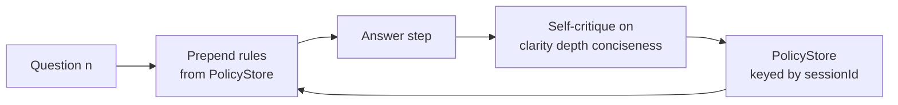

---
{
  "title": "Learning and Adaptation",
  "summary": "After every answer the agent critiques itself, saves behavioural rules, and follows them next turn.",
  "category": "Knowledge & state",
  "projects": [
    { "flavor": "AgentFramework", "path": "LearningAndAdaptation.AgentFramework" },
    { "flavor": "SemanticKernel", "path": "LearningAndAdaptation.SemanticKernel" }
  ]
}
---

## What it is

An agent that changes how it behaves without anyone editing its prompt. After each response it
runs a self-critique step, and any concrete improvement it finds is written to a `PolicyStore`
as a short imperative rule — "Lead with a one-sentence summary before diving into detail". Every
later prompt gets those rules prepended, so the style of turn 3 is shaped by what the agent
learned in turns 1 and 2.

The rules are plain text in a store you own, which means the adaptation is inspectable, editable
and revertible. Nothing is fine-tuned; the "policy" is just a growing list of sentences.

## When to use it

- Conversational or long-running agents where quality drifts and you want it to self-correct.
- You can articulate the improvement as an instruction — tone, structure, length, thoroughness.
- You want the learned behaviour visible in a store rather than buried in weights.

Skip it when the desired behaviour is already known: write the rule into the system prompt and
save a critique call per turn. Skip it too for factual correctness — a self-critique with no
ground truth will happily invent rules, which is why both samples explicitly tell the critiquer
to return nothing when the answer was already good.

## How the demo works

Both samples ask three progressively harder transformer questions: what a transformer is, how
attention works, why positional encoding is needed. Each turn answers, then critiques the answer
on **clarity, depth, conciseness**, and stores whatever rules come out of the critique.

The wiring differs sharply. Agent Framework builds a two-node **workflow** — `AnswerExecutor`
prepends the rules and answers, `CritiqueExecutor` returns a structured `CritiqueResult` and
calls `PolicyStore.AddRules` — and the program streams `ExecutorCompletedEvent` and
`WorkflowOutputEvent` to print each stage. Semantic Kernel instead lets the agent **call a
tool**: `AdaptationTools.LearnRule` is a `[KernelFunction]` the critique step invokes, and an
`IPromptRenderFilter` (`PolicyInjectionFilter`) silently prepends the rules to every rendered
prompt. So in SK the injection is invisible middleware; in MAF it is an explicit workflow step.

## Key APIs

| Agent Framework | Semantic Kernel |
|---|---|
| `WorkflowBuilder(answerExec).AddEdge(...).WithOutputFrom(critiqueExec)` | `kernel.ImportPluginFromObject(new AdaptationTools(sessionId))` |
| `Executor("answer")` + `ProtocolBuilder.ConfigureRoutes` handlers | `IPromptRenderFilter` rewriting `context.RenderedPrompt` |
| `agent.RunAsync<CritiqueResult>(prompt)` for structured rules | `LearnRule` tool call + `FunctionChoiceBehavior.Auto()` |
| `InProcessExecution.RunStreamingAsync` + `WatchStreamAsync` | `IFunctionInvocationFilter` logging every tool call |

Both keep rules in a static `PolicyStore` keyed by a `sessionId`, so nothing leaks between
sessions. In SK the id is passed through `kernel.Data["sessionId"]` on a cloned kernel.

## What to watch in the output

Each turn prints a `Turn n —` banner. From turn 2 on, MAF prints `[injected policy]` with the
numbered rules learned so far, then `[answer]`, then `[rules learned this turn]` or
`[critique: no new rules — answer was already good]`. SK prints `[answer]`, `[self-critique]`,
and — thanks to `ToolCallLoggingFilter` — a live `[agent tool call] AdaptationTools.LearnRule(rule=…)`
with its `[tool result]`. Both end with the accumulated policy list. **ExpeL** is the same idea
scored and pruned across tasks; **SelfCorrectionLoop** critiques the current answer instead of
future ones.
