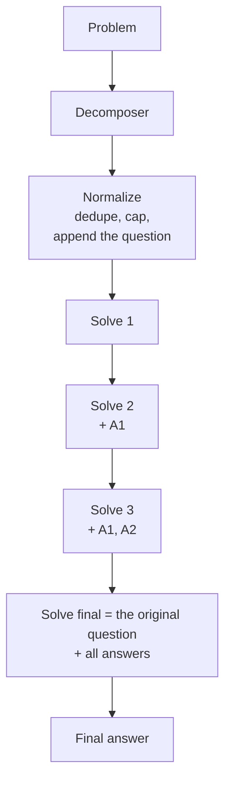

---
{
  "title": "Least-to-Most Prompting",
  "summary": "Decompose into an ordered chain of easier subproblems, then solve them in order with earlier answers as facts.",
  "category": "Reasoning & generation",
  "projects": [
    { "flavor": "AgentFramework", "path": "LeastToMost.AgentFramework" }
  ]
}
---

## What it is

Break the problem into subproblems, easiest first, then solve them in sequence — each call
receiving the *answers* to the previous ones as established facts.

The distinction from **ChainofThoughts** is where the intermediate results live. Chain of thought
keeps them inside a single generation, as text the model conditions on but nobody inspected. A
wrong step three sentences in silently poisons everything after it, and the only signal is that
the final answer is wrong. Least-to-most puts each step in its own call with its own input and
its own output. The steps become artifacts: printable, checkable, replaceable.

There is a second, quieter benefit. Because the host controls what carries forward, the later
calls see *conclusions* rather than reasoning. That is a deliberate compression — the fifth
subproblem does not re-read how the second was derived, only what it concluded — which keeps
context flat as the chain grows.

## When to use it

- Multi-hop problems where the steps are genuinely ordered: each one needs the previous one's
  answer, not just the original question.
- Arithmetic-over-policy problems — billing, entitlements, prorations — where a single pass drops
  a rule and the result is off by one period.
- Anywhere you want the intermediate values in the log for audit or debugging.

Skip it for anything a single call solves reliably: this costs one call per subproblem plus one
to decompose. And skip it when the subproblems are *independent* rather than sequential — that is
**Parallelization** (fan out, join) or **OrchestratorWorkers** (decompose to a validated worker
plan), both of which get concurrency that a chain cannot.

## How the demo works

The problem is a subscription billing question with four interacting rules — monthly billing on
the 3rd, no proration, upgrades effective at the next billing date, cancellation ending the paid
period. Asked in one call, models reliably drop one rule and produce a confident total that is
one period out.

A decomposer proposes up to five subproblems and is told **not** to restate the original
question. Then `Decomposition.Normalize` does the host's part:

- trims blanks and case-insensitive duplicates;
- drops any step that is just the original question echoed back (compared after squashing to
  letters and digits, so punctuation differences do not fool it);
- caps the list, counting the appended question;
- and **appends the original question as the final subproblem**, always.

That last rule exists because of a specific, repeatable failure: models produce good sub-steps
and then stop one short. They compute the pieces and never assemble them, leaving the chain
ending on "how many months at the higher price?" — correct, and not what was asked. Rather than
prompt harder, the host guarantees the chain ends where it must.

Solving is a plain loop. Each iteration builds a prompt containing the original problem, every
`Qn`/`An` pair so far, and the current subproblem, then runs a **sessionless** call. Nothing carries
forward except the answers the host chose to carry.

**And that carry is a risk, not a safety property.** "Treat these as established facts" is a rigid
error-propagation channel: a wrong figure in step 2 is not questioned by step 5, it is *cited* by
it, and the chain arrives at a confidently wrong total with a clean-looking audit trail. Making the
intermediate state inspectable does not make it correct.

The actual benefit is one step further along: externalised state can be **checked**, if something
checks it. So the host attaches a deterministic verifier where one exists — here `StepChecks`
recomputes the billing schedule from the problem's own rules and compares it against the final
answer's stated total. A failure gets one retry with the discrepancy named; a second failure is
reported as contested rather than quietly accepted.

Most steps have no verifier, and the run says so with `[no verifier for this step]` rather than
implying coverage it does not have. That is the honest situation in most chains, and it is why the
lesson is *"externalising state makes validation possible"* rather than *"externalised state is
safer"*.

## Key APIs

- `agent.RunAsync<ProposedSteps>(question, options:)` — structured decomposition.
- `Decomposition.Normalize(proposed, question, max)` — the guarantee that the chain ends at the
  question, plus dedup and the cap.
- `solver.RunAsync(prompt, options:)` with no session — each subproblem is an independent call;
  the only state is the `Q`/`A` list the host assembles into the prompt.
- `StepChecks.BillingTotal(start, upgradeEffective, cancelled, before, after)` — the billing rules
  in code, evaluated deterministically. Not a hardcoded expected answer: the same rules the prompt
  states, which is the only kind of check worth having.
- `StepChecks.AgainstTotal(answer, expected)` — extracts the answer's concluding figure and
  compares. Returns a reason, so a failure can be handed back to the model.

## What to watch in the output

The decomposition prints first. Read it before the answers: a good chain moves from "how many
months at EUR 14?" toward the total, and the last line is always the original question because
the host put it there. Compare that to what the model proposed — if the model's own last step was
already the question, `Normalize` dropped its duplicate rather than asking it twice.

Then each `[n]` block with its `→` answer. Because every step is its own call, a wrong total is
traceable to the exact subproblem that went wrong, which is the practical payoff over chain of
thought. Watch particularly for a step re-deriving something an earlier step already established —
that means the "treat these as established facts" instruction did not take, and the chain is paying
for work twice.

Most steps end `[no verifier for this step]`. The final one ends `[check] EUR 144.00 matches the
schedule computed by the host` — the only claim in the whole run that anything actually tested. If
it ever prints a mismatch, watch the retry: the model is handed the discrepancy and recomputes, and
if it still disagrees the run says **CONTESTED** rather than shipping the number.

**ChainofThoughts** is the single-call version; **Planning** turns the decomposition into a
validated tool plan rather than a question chain; **SelfNote** is the same "prepare, then answer"
shape applied to source material.
