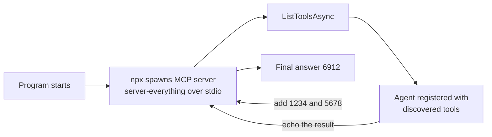

---
{
  "title": "Model Context Protocol",
  "summary": "Discover tools from an external MCP server at runtime instead of compiling them in.",
  "category": "Fundamentals",
  "projects": [
    { "flavor": "AgentFramework", "path": "MCP.AgentFramework", "note": "Needs npx on PATH - the MCP server is fetched with npx on first run." },
    { "flavor": "SemanticKernel", "path": "MCP.SemanticKernel", "note": "Needs npx on PATH - the MCP server is fetched with npx on first run." }
  ]
}
---

## What it is

In **ToolUse** every tool is a C# method you wrote and shipped. The Model Context Protocol turns
that around: a tool provider runs as a separate process (or a remote service), exposes a
standard `list_tools` / `call_tool` interface, and your agent discovers what is available at
startup. Adding a capability becomes a deployment decision rather than a recompile.

Because the protocol is open, the same server works for any MCP-capable host. You get the tool
catalogue someone else maintains without writing a binding for it.

## When to use it

- A capability already exists as an MCP server — filesystem, GitHub, a database, a vendor's API.
- Tools should be added, removed, or upgraded without rebuilding the agent.
- You want the tool implementation isolated in its own process with its own credentials.

Skip it when the tool is three lines of C# against a library you already reference — a local
`AIFunction` is faster and has no process to supervise. Skip it too when you cannot vouch for the
server: its tool descriptions land straight in your prompt, so an untrusted server is an
untrusted instruction source.

## How the demo works

Both samples spawn the official reference server, `@modelcontextprotocol/server-everything`, over
stdio via `npx -y` — no credentials needed, but **npx must be on PATH** and the first run
downloads the package. They call `ListToolsAsync()`, register everything it returns with the
agent, and send one prompt: *"Use the 'add' tool to compute 1234 + 5678, then use the 'echo' tool
to repeat the result."* Two chained calls against tools that were unknown at compile time.

The registration step is where the flavors differ. Agent Framework needs no adapter at all —
`McpClientTool` already derives from `AIFunction`, so `tools.Cast<AITool>()` is passed straight
into the `ChatClientAgent` constructor. Semantic Kernel converts each one with
`AsKernelFunction()` and adds them as a plugin named `McpTools`, then enables
`FunctionChoiceBehavior.Auto` with `RetainArgumentTypes = true` — without that, the numeric
arguments reach the `add` tool as strings and the call fails schema validation.

## Key APIs

| Agent Framework | Semantic Kernel |
|---|---|
| `McpClient.CreateAsync(new StdioClientTransport(...))` | `McpClient.CreateAsync(new StdioClientTransport(...))` |
| `mcpClient.ListToolsAsync()` | `mcpClient.ListToolsAsync()` |
| `tools.Cast<AITool>()` into `ChatClientAgent` | `kernel.Plugins.AddFromFunctions("McpTools", tools.Select(f => f.AsKernelFunction()))` |
| — no conversion, `McpClientTool` is an `AIFunction` | `FunctionChoiceBehaviorOptions { RetainArgumentTypes = true }` |

`StdioClientTransportOptions` is what launches the process: `Command = "npx"` with
`Arguments = ["-y", "@modelcontextprotocol/server-everything"]`. Point it at any other executable
and the rest of the code is unchanged.

## What to watch in the output

The Agent Framework sample prints `MCP tools: ` followed by the full discovered list — `echo`,
`add`, `longRunningOperation`, `printEnv` and the rest — which is the whole point of the pattern
made visible; nothing in the source names them. Then comes the agent's answer containing
**6912**, a number only the remote `add` tool produced. The Semantic Kernel sample skips the
listing and prints just the streamed answer. If the run hangs or dies at startup, npx is missing
or still downloading. Compare with **ToolUse** for locally compiled tools, and **HostedTools**
for tools the model provider runs on your behalf.
