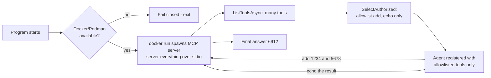

---
{
  "title": "Model Context Protocol",
  "summary": "Discover tools from a pinned, sandboxed MCP server at runtime, but bind only an explicit allowlist.",
  "category": "Orchestration",
  "risk": "Runs a third-party MCP server; discovery and authorization are kept separate so only an explicit allowlist is ever bound.",
  "projects": [
    { "flavor": "AgentFramework", "path": "MCP.AgentFramework", "note": "Needs Docker or Podman - the pinned server runs in a locked-down container, not on the host." },
    { "flavor": "SemanticKernel", "path": "MCP.SemanticKernel", "note": "Needs Docker or Podman - the pinned server runs in a locked-down container, not on the host." }
  ]
}
---

## What it is

In **ToolUse** every tool is a C# method you wrote and shipped. The Model Context Protocol turns
that around: a tool provider runs as a separate process (or a remote service), exposes a
standard `list_tools` / `call_tool` interface, and your agent discovers what is available at
startup. Adding a capability becomes a deployment decision rather than a recompile.

Because the protocol is open, the same server works for any MCP-capable host. You get the tool
catalogue someone else maintains without writing a binding for it.

## When to use it

- A capability already exists as an MCP server — filesystem, GitHub, a database, a vendor's API.
- Tools should be added, removed, or upgraded without rebuilding the agent.
- You want the tool implementation isolated in its own process with its own credentials.

Skip it when the tool is three lines of C# against a library you already reference — a local
`AIFunction` is faster and has no process to supervise. Skip it too when you cannot vouch for the
server: its tool descriptions land straight in your prompt, so an untrusted server is an
untrusted instruction source.

## How the demo works

Both samples run the official reference server, `@modelcontextprotocol/server-everything`, over
stdio — but inside the same locked-down local container the **CodeAct** sample uses, not on the
host. They call `ListToolsAsync()`, but unlike the pre-fix version they do **not** register
everything the server returns: discovery and authorization are two separate steps, and only an
explicit allowlist (`add`, `echo`) is bound to the agent. Then they send one prompt: *"Use the
'add' tool to compute 1234 + 5678, then use the 'echo' tool to repeat the result."* Two chained
calls against tools that were unknown at compile time — and unreachable if they weren't
allowlisted.

The registration step is where the flavors differ. Agent Framework needs no adapter at all —
`McpClientTool` already derives from `AIFunction`, so `tools.Cast<AITool>()` is passed straight
into the `ChatClientAgent` constructor. Semantic Kernel converts each one with
`AsKernelFunction()` and adds them as a plugin named `McpTools`, then enables
`FunctionChoiceBehavior.Auto` with `RetainArgumentTypes = true` — without that, the numeric
arguments reach the `add` tool as strings and the call fails schema validation.

## Security: pin, sandbox, and allowlist the server

An MCP server is a third-party tool provider: its binary runs on your machine (or one you
control) and its tool descriptions land straight in your prompt. The pre-fix shape of this
sample — `npx -y @modelcontextprotocol/server-everything` (an **unpinned**, latest-at-run-time
package), executed directly **on the host with the application's own environment**, with
**every discovered tool bound to the agent** — is exactly what this sample now exists to *not*
do. The same rule this repo applies to every pattern that executes untrusted work:

> **The model proposes. A constrained host validates and executes. Untrusted execution
> never inherits the application's authority.**

Concretely:

- **Pin the server.** `MCP.AgentFramework/Sandbox/Dockerfile` bakes in an exact version
  (`@modelcontextprotocol/server-everything@2025.8.18`) at build time — no "whatever is
  latest today" resolved at run time.
- **Run it in the same constrained container as CodeAct.** The pinned server is launched with
  `Shared.Sandbox.SandboxRunner.BuildRunArguments`, the identical locked-down-container boundary
  the **CodeAct** sample uses for model-generated code — see that pattern's security section for
  the full flag-by-flag walkthrough.
- **Pass no host environment or credentials.** The container gets nothing from the host process;
  the server never sees an API key, a token, or a host env var it wasn't explicitly handed.
- **Deny network unless the chosen server needs it.** This demo server only needs stdio, so
  `Network: false` — `--network none`. A server that legitimately calls out (a real GitHub or
  database MCP server) would need that grant made explicit and justified, not defaulted on.
- **Keep discovery and authorization separate.** `ListToolsAsync()` still returns everything the
  server advertises — discovering a tool never grants it.
- **Bind an explicit allowlist.** `McpToolBinding.SelectAuthorized` filters the discovered list
  down to exactly `add` and `echo` before anything reaches the agent, and **fails closed** —
  throwing `InvalidOperationException` — if an allowlisted tool goes missing, on the theory that
  a missing expected tool means the server isn't the one that was pinned.
- **Fail closed when the boundary is unavailable.** No Docker or Podman means no sandbox, which
  means no MCP server — the sample exits with an explanatory message rather than falling back to
  running the third-party server on the host. Same double opt-in as CodeAct
  (`AGENTIC_PATTERNS_ALLOW_UNSAFE_HOST_EXECUTION` + `AGENTIC_PATTERNS_ACKNOWLEDGE_UNSAFE_CODE_EXECUTION`)
  would be required to override that, and this sample does not wire that override up.

The bundled Dockerfile/sandbox is a teaching boundary, not a production one — see CodeAct's
"Included sandbox ≠ production-ready sandbox" for the caveats, which apply here unchanged.

## Key APIs

| Agent Framework | Semantic Kernel |
|---|---|
| `McpClient.CreateAsync(new StdioClientTransport(...))` | `McpClient.CreateAsync(new StdioClientTransport(...))` |
| `mcpClient.ListToolsAsync()` | `mcpClient.ListToolsAsync()` |
| `McpToolBinding.SelectAuthorized(discovered, allowed)` | `McpToolBinding.SelectAuthorized(discovered, allowed)` |
| `tools.Where(authorized).Cast<AITool>()` into `ChatClientAgent` | `kernel.Plugins.AddFromFunctions("McpTools", tools.Where(authorized).Select(f => f.AsKernelFunction()))` |
| — no conversion, `McpClientTool` is an `AIFunction` | `FunctionChoiceBehaviorOptions { RetainArgumentTypes = true }` |

`StdioClientTransportOptions` is what launches the process: `Command = "docker"` with
`Arguments = SandboxRunner.BuildRunArguments(sandbox, [])` — an empty command list, because the
image's own `ENTRYPOINT` is the pinned server binary. Point `SandboxOptions.Image` at any other
sandboxed server and the rest of the code is unchanged.

## What to watch in the output

Both samples print `Discovered: ` followed by the full list the container hands back — `echo`,
`add`, `longRunningOperation`, `printEnv` and the rest — then `Bound to the agent: ` showing
exactly `echo, add`, the visible proof that discovery and authorization are different steps. Then
comes the agent's answer containing **6912**, a number only the remote `add` tool produced. If the
run exits immediately with "No container runtime available", Docker/Podman isn't installed or the
daemon isn't running. Compare with **ToolUse** for locally compiled tools, **HostedTools** for
tools the model provider runs on your behalf, and **CodeAct** for the container sandbox this
sample reuses.
