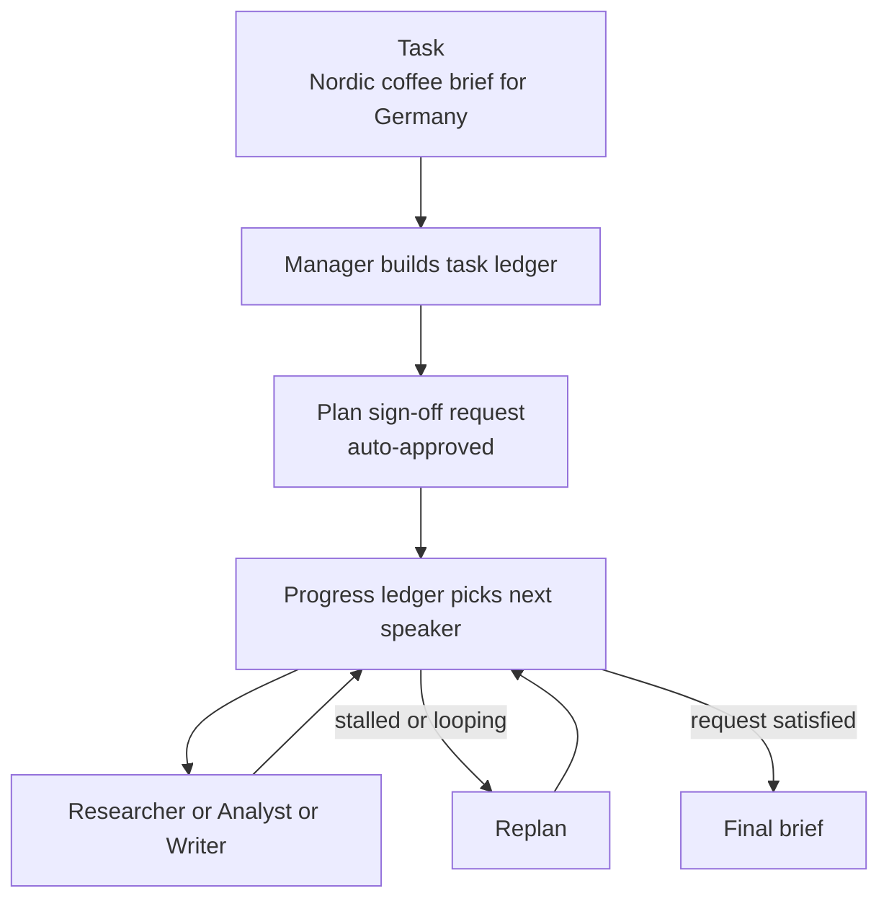

---
{
  "title": "Magentic Orchestration",
  "summary": "A manager agent plans the task, picks the next speaker each round, and replans when stuck.",
  "category": "Orchestration",
  "risk": "Multiple agents act autonomously after a single plan sign-off.",
  "projects": [ { "flavor": "AgentFramework", "path": "Magentic.AgentFramework", "interactive": true } ]
}
---

## What it is

Magentic is the open-ended end of multi-agent orchestration. Instead of a fixed order, a
**manager** agent writes a task ledger — the facts it knows, the guesses it is making, and a
plan — then before every round writes a **progress ledger**: is the request satisfied, are we
looping, is progress being made, who speaks next, and what exactly should they do. The team
runs until the manager says done or the round budget runs out.

Two safety valves keep it bounded: a maximum round count, and a stall count that triggers a
**replan** — the manager rewrites the task ledger rather than grinding the same loop again.

## When to use it

- The task is genuinely open-ended and you cannot write the step order up front.
- The right specialist for step three depends on what came out of step two.
- You want the plan and the per-round reasoning as inspectable artifacts, not hidden state.

Skip it when the steps are known — a fixed **PromptChaining** or **Parallelization** graph is
cheaper, faster and deterministic. The manager costs a model call *per round* on top of the
specialists, so an over-engineered orchestration is easy to feel in the bill.

## How the demo works

Three specialists — `Researcher` (market facts, competitors, risks), `Analyst` (pricing,
positioning, go/no-go) and `Writer` (the final brief) — plus a `Manager` agent that plans and
delegates. The task is a market-entry brief for a Nordic specialty-coffee subscription
expanding into Germany, capped at 10 rounds and 2 stalls. `RequirePlanSignoff()` makes the plan
surface as a review request before any work happens; the sample auto-approves it.

Every stage of that loop is an event the sample handles explicitly, which is what makes the
manager's reasoning visible instead of implied.

## Key APIs

- `AgentWorkflowBuilder.CreateMagenticBuilderWith(manager)` — the manager owns planning.
- `.AddParticipants([researcher, analyst, writer])` — the specialists it can call on.
- `.WithMaxRounds(10)` and `.WithMaxStalls(2)` — the two termination guards.
- `.RequirePlanSignoff()` — turns the plan into a `RequestInfoEvent` carrying a
  `MagenticPlanReviewRequest`, answered with `review.Approve()` and `run.SendResponseAsync`.
- `MagenticPlanCreatedEvent`, `MagenticReplannedEvent`, `MagenticProgressLedgerUpdatedEvent` —
  the observability surface, exposing `FullTaskLedger` and the ledger's flags.

## What to watch in the output

`=== Plan created ===` prints the full task ledger first. Then `[review] plan sign-off requested
-> auto-approving`. After that every round prints two `[ledger]` lines — the flags
`satisfied= loop= progress= next=` and the `instruction:` handed to the chosen speaker. Watch
`next=` change between Researcher, Analyst and Writer, and watch for `=== Replanned ===` if the
team stalls. The run ends with `=== Final output ===` and `##`-prefixed messages. Compare with
**MultiAgentCollaboration**, whose round-robin manager makes none of these decisions, and
**Planning**, which produces a plan without the per-round re-evaluation.
