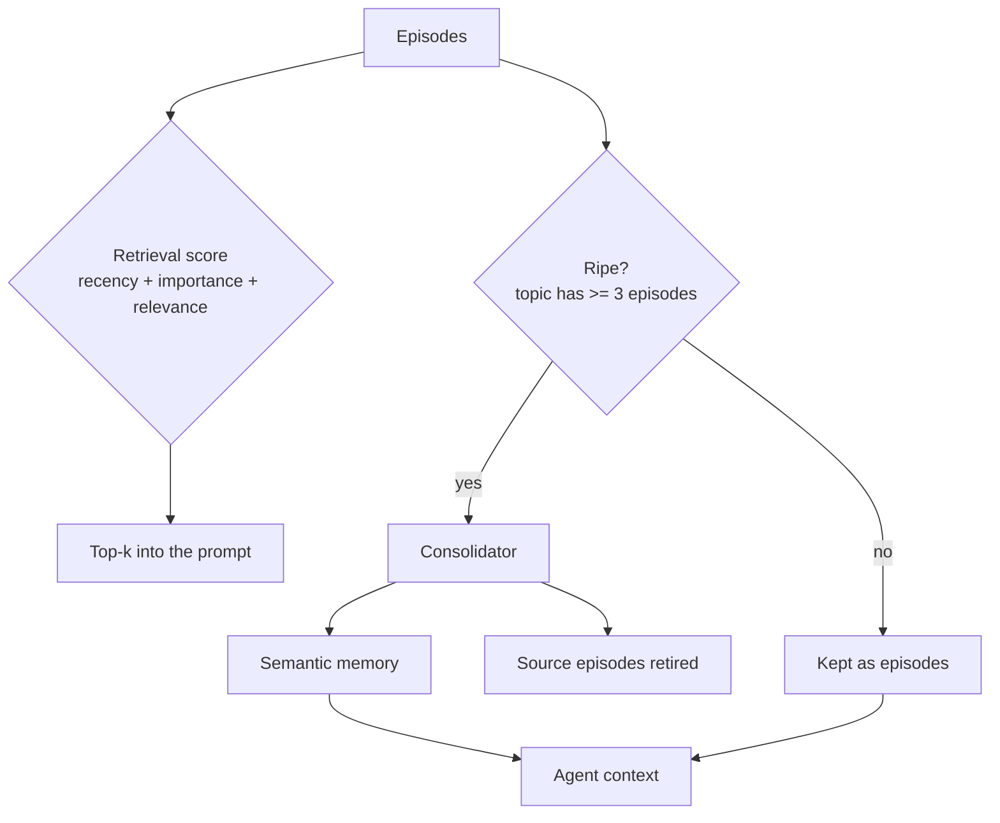

---
{
  "title": "Memory Consolidation",
  "summary": "Episodes retrieved by recency, importance and relevance; ripe topics collapse into durable semantic facts.",
  "category": "Knowledge & state",
  "projects": [
    { "flavor": "AgentFramework", "path": "MemoryConsolidation.AgentFramework" }
  ]
}
---

## What it is

**MemoryManagement** covers where memory lives. This covers what happens to it over time — which
is the difference between an agent with a long history and an agent that has learned anything.

Two mechanisms, and they are separable:

**Retrieval that is not just similarity.** Vector search alone retrieves the most *similar*
memory, which for a long-lived agent is regularly the wrong one: a highly relevant thing from
eight months ago beats a slightly less relevant thing from this morning, and the agent answers
with stale information very confidently. Adding recency and importance — the generative-agents
formula — fixes both ends. Recency favours what just happened; importance keeps the rare
significant event retrievable long after it stops being recent.

**Consolidation.** A thousand episodes is a store you cannot afford to search or to read.
Periodically, a topic's episodes collapse into one semantic memory: *"the customer's exports are
slow every month-end"* is worth more than twelve timestamps saying so. This is a real information
loss, taken deliberately.

## When to use it

- Long-lived assistants that accumulate episodes over weeks: support, personal assistants,
  ongoing project agents.
- Anywhere the memory store has grown past what you would put in a prompt, and truncating by
  recency alone loses things that matter.
- When the useful fact is a *pattern* over episodes rather than any one of them.

Skip it for session-scoped memory — there is nothing to consolidate. Skip consolidation
specifically when individual episodes must remain individually retrievable for audit or legal
reasons; summarising them away is the wrong move, and the right one is archival plus an index.
**ExpeL** is the neighbouring pattern that distils *insights* for future decisions rather than
compressing the record; **SkillLearning** does it for procedures.

## How the demo works

Eight episodes across three topics span 45 days, each with an importance scored at write time (by
the host here; usually a cheap model call in production).

**Retrieval.** `EpisodicRetrieval.Score` computes `recency + importance + relevance` for a query
about export timeouts. Recency is exponential decay at 0.995 per hour — a day-old memory retains
about 89%, and the half-life is about 5.8 days. Relevance is word overlap, with a `ponytail:` note that a real
system swaps in the embedding generator from the **RAG** sample; the scoring formula around it
does not change.

The run prints the three components separately, and calls out the 45-day-old billing episode with
its high importance and near-zero score. That episode was important *once*. Under
importance-only retrieval it would still be crowding the prompt; under similarity-only retrieval a
month-old export complaint could outrank today's.

**Consolidation.** `Consolidation.Ripe(episodes, minimum: 3)` selects topics with enough
accumulated history. The threshold is the load-bearing parameter: two episodes summarised into
"the customer sometimes reports slow exports" have lost both dates and gained nothing; twelve of
them have become a fact about the customer. So `exports` (5 episodes) consolidates and `billing`
(2) does not.

A consolidator writes one durable fact per ripe topic, and the source episodes are **archived —
not deleted**, with their ids recorded on the semantic memory as `SourceEpisodeIds`.

That distinction is the difference between a memory architecture and a lossy compressor. The
semantic memory is model-written prose about a dozen episodes. If it is subtly wrong and the
episodes are gone, the error is now canonical, unfalsifiable, and retrieved into every future
prompt — twelve mostly-correct episodes become one confidently-wrong fact with nothing left to
check it against. Consolidation removes episodes from the **hot retrieval set**; durable history
keeps them, so a suspect fact can be re-derived or audited.

`EpisodicRetrieval.Score` and `Consolidation.Ripe` both filter to `Active`, so archived episodes
neither crowd the prompt nor re-consolidate.

The agent is then built from the consolidated store: semantic facts plus the episodes that
survived.



## Key APIs

- `EpisodicRetrieval.Score(episodes, query, now)` → `Scored(Episode, Recency, Relevance, Total)` —
  the components come back separately so the run can show *why* something ranked where it did.
- `Consolidation.Ripe(episodes, minimum)` — grouping plus a threshold, over active episodes only.
- `episode with { Status = EpisodeStatus.Archived }` — the retirement, and it is not a delete.
- `SemanticMemory.SourceEpisodeIds` — the derivation, so a consolidated fact has provenance.
- `agent.RunAsync(...)` at temperature 0.2 for consolidation, instructed not to list the episodes
  back and not to invent causes they do not support — the two ways a summary turns into fiction.
- `Episode(Text, At, Importance, Topic)` — importance recorded at write time, because deciding it
  later means re-reading everything.

## What to watch in the output

The retrieval table shows the arithmetic: `2.14 = rec 0.99 + imp 0.70 + rel 0.45`. Watch a recent
low-importance episode outrank an old high-importance one, and note the parenthetical line about
the billing episode — important, and correctly not retrieved.

The consolidation block shows `[exports] 5 episodes -> 1 semantic memory` with the fact printed
in full. Read it against the five episodes: a good consolidation captures the month-end pattern
and the workaround already suggested. A bad one says "the customer has had export issues", which
is true, useless, and the sign that the topic was consolidated too early.

The consolidation block also prints `derived from: ep-01, ep-02, …` — the provenance that makes
the fact checkable later.

Then the two store lines:

```
Active retrieval set: 3 episodes + 1 semantic memories.
Archived, still on disk and still auditable: 5 episodes.
```

The compression is real and should feel slightly uncomfortable — five episodes left the retrieval
set and one paragraph of model prose now speaks for them. What makes that acceptable is the second
line: if the paragraph is wrong, the episodes are still there to prove it.

Finally the answer, which should reference the month-end pattern and the already-suggested
workaround without having any of the individual episodes in context. That is consolidation
paying off.

**MemoryManagement** for the tiers, **ExpeL** for insights distilled across episodes,
**ContextAssembly** for fitting the result into a budget, **MemoryPoisoningPrevention** for who is
allowed to write into any of this.
