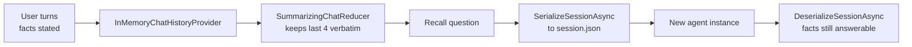

---
{
  "title": "Memory Management",
  "summary": "Keep what the user told you across turns, compact it as it grows, and survive a restart.",
  "category": "Fundamentals",
  "projects": [
    { "flavor": "AgentFramework", "path": "MemoryManagement.AgentFramework" },
    { "flavor": "SemanticKernel", "path": "MemoryManagement.SemanticKernel" }
  ]
}
---

## What it is

A chat model is stateless — it only knows what you resend. Memory management is the machinery
that decides what to resend: which turns to keep verbatim, which to compress into a summary,
which durable facts to store outside the conversation, and how any of it survives the process
exiting.

Two flavors of memory are worth separating. **Short-term** memory is the conversation itself,
bounded by the context window. **Long-term** memory is facts extracted and stored elsewhere,
retrieved on relevance rather than recency. The two samples here take one each.

## When to use it

- The conversation spans more turns than the context window comfortably holds.
- The user states preferences early that must still apply much later.
- A session must resume after a restart, a redeploy, or on another machine.

Skip it for single-shot tools with no follow-up — a fresh session per request is simpler and
cheaper. Skip long-term memory in particular until a fact genuinely needs to outlive the
conversation; storing everything makes retrieval worse, not better.

## How the demo works

The Agent Framework sample is the fuller of the two and covers short-term memory in three
stages. `CreateAgent()` builds a `ChatClientAgent` with an `InMemoryChatHistoryProvider` wired to
a `SummarizingChatReducer(targetCount: 4, threshold: 2)`, triggered `AfterMessageAdded`. It then
feeds three facts across three turns — Anna's name, weekly PDF reports rather than slides, the
Thursday 10:00 demo, the executive-board audience — asks a recall question, serializes the
session to `session.json`, builds a *brand-new* agent to simulate a restart, deserializes, and
asks again.

The Semantic Kernel sample takes the long-term route instead: a `Mem0Provider` pointed at
`https://api.mem0.ai` with `UserId = "U1"` is added to a `ChatHistoryAgentThread` via
`AIContextProviders`, then a single question — *"Which format for reports do I prefer?"* — is
answered from stored memory rather than from this conversation. It needs a Mem0 API key in
configuration, and the line that *writes* the memory is commented out on purpose: the point is
that the fact was stored on an earlier run.

## Key APIs

| Agent Framework | Semantic Kernel |
|---|---|
| `InMemoryChatHistoryProvider` | `Mem0Provider` over `HttpClient` |
| `SummarizingChatReducer(client, targetCount, threshold)` | `Mem0ProviderOptions { UserId = "U1" }` |
| `ReducerTriggerEvent.AfterMessageAdded` | `thread.AIContextProviders.Add(provider)` |
| `agent.SerializeSessionAsync` / `DeserializeSessionAsync` | `ChatHistoryAgentThread` |
| `session.TryGetInMemoryChatHistory(out var messages)` | `provider.ClearStoredMemoriesAsync()` |

## What to watch in the output

The Agent Framework run prints three step banners — `---- Step 1: Multi-turn conversation ...`,
`---- Step 2: Recall within the session ----`, `---- Step 3: Persist session, simulate app
restart, restore ----` — plus bracketed counters like
`[after 3 turns, reducer applied: N messages in agent-managed history]` and
`[restored from disk: N messages ...]`. The count is the evidence the reducer ran; the answer
after `Session saved to ...` is the evidence the facts survived a new agent instance. The
Semantic Kernel run prints a single line, and its worth is that the answer mentions PDF reports
that were never said in this conversation. See **ContextCompaction** for compaction taken
further and **SelfNote** for an agent writing its own notes.
