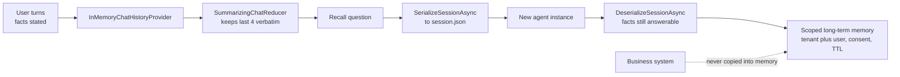

---
{
  "title": "Memory Management and State Isolation",
  "summary": "Separate invocation, session, long-term, and authoritative business state across users and tenants.",
  "category": "Knowledge & state",
  "risk": "Sends conversation content to the external Mem0 service (SK flavor) and persists session and long-term memory data to local plaintext files (AF flavor).",
  "projects": [
    { "flavor": "AgentFramework", "path": "MemoryManagement.AgentFramework" },
    { "flavor": "SemanticKernel", "path": "MemoryManagement.SemanticKernel" }
  ]
}
---

## What it is

A chat model is stateless — it only knows what you resend. Memory management is the machinery
that decides what to resend: which turns to keep verbatim, which to compress into a summary,
which durable facts to store outside the conversation, and how any of it survives the process
exiting.

Two flavors of memory are worth separating. **Short-term** memory is the conversation itself,
bounded by the context window. **Long-term** memory is facts extracted and stored elsewhere,
retrieved on relevance rather than recency. The two samples here take one each.

Do not collapse every kind of state into agent memory:

| State | Lifetime | Example |
|---|---|---|
| Invocation | One run | Current counters and stop reason |
| Session | One conversation | Recent messages and summary |
| Long-term memory | Across sessions | Consented user preference with TTL |
| Business state | Source-of-truth system | Orders, payments, tickets, permissions |

Agent memory is never authoritative for identity, permissions, approvals, or business side effects.

## Information-theoretic view

A summarizing reducer is deliberate lossy compression, and what the summary drops is
unrecoverable from the summary alone — so compress at information boundaries: keep hard facts
(names, ids, dates, stated preferences) verbatim or in structured long-term storage, and let
only conversational narrative be folded into prose summaries (see
`docs/coordination-physics.md`). The demo's recall checks are exactly that boundary being
tested — Anna's name and the Thursday demo must survive the reducer. The business-state rule is
the re-grounding escape hatch in disguise: instead of trusting memory's compressed copy of an
order, the agent goes back to the authoritative system, which resets any accumulated loss.

## When to use it

- The conversation spans more turns than the context window comfortably holds.
- The user states preferences early that must still apply much later.
- A session must resume after a restart, a redeploy, or on another machine.

Skip it for single-shot tools with no follow-up — a fresh session per request is simpler and
cheaper. Skip long-term memory in particular until a fact genuinely needs to outlive the
conversation; storing everything makes retrieval worse, not better.

## How the demo works

The Agent Framework sample is the fuller of the two and covers isolated state in four
stages. `CreateAgent()` builds a `ChatClientAgent` with an `InMemoryChatHistoryProvider` wired to
a `SummarizingChatReducer(targetCount: 4, threshold: 2)`, triggered `AfterMessageAdded`. It then
feeds three facts across three turns — Anna's name, weekly PDF reports rather than slides, the
Thursday 10:00 demo, the executive-board audience — asks a recall question, serializes the
session to `session.json`, builds a *brand-new* agent to simulate a restart, deserializes, and
asks again. A fourth stage writes a consented preference to `ScopedLongTermMemory`, proves that the
same user ID in another tenant cannot read it, reloads it after a restart, and deletes it on request.
The memory has a TTL. A separate order dictionary stands in for the authoritative business system;
it is queried directly rather than inferred from conversation history.

The Semantic Kernel sample takes the long-term route instead: a `Mem0Provider` pointed at
`https://api.mem0.ai` uses a tenant-and-user namespaced `UserId` and is added to a
`ChatHistoryAgentThread` via
`AIContextProviders`, then a single question — *"Which format for reports do I prefer?"* — is
answered from stored memory rather than from this conversation. It needs a Mem0 API key in
configuration. `MEM0_TENANT_ID` and `MEM0_USER_ID` select the scope, defaulting to explicit demo
values. Production hosts must derive both from authenticated runtime context rather than model
output. The line that *writes* the memory is commented out on purpose: the point is that the fact
was stored on an earlier run.

## Key APIs

| Agent Framework | Semantic Kernel |
|---|---|
| `InMemoryChatHistoryProvider` | `Mem0Provider` over `HttpClient` |
| `SummarizingChatReducer(client, targetCount, threshold)` | `Mem0ProviderOptions { UserId = tenant + ":" + user }` |
| `ReducerTriggerEvent.AfterMessageAdded` | `thread.AIContextProviders.Add(provider)` |
| `agent.SerializeSessionAsync` / `DeserializeSessionAsync` | `ChatHistoryAgentThread` |
| `session.TryGetInMemoryChatHistory(out var messages)` | `provider.ClearStoredMemoriesAsync()` |
| `ScopedLongTermMemory.Remember/Recall/Delete` | External provider lifecycle APIs |

## What to watch in the output

The Agent Framework run prints four step banners — `---- Step 1: Multi-turn conversation ...`,
`---- Step 2: Recall within the session ----`, `---- Step 3: Persist session, simulate app
restart, restore ----` and a fourth scoped-memory stage — plus bracketed counters like
`[after 3 turns, reducer applied: N messages in agent-managed history]` and
`[restored from disk: N messages ...]`. The count is the evidence the reducer ran; the answer
after `Session saved to ...` is the evidence the facts survived a new agent instance. The
fourth stage prints consent denial, cross-tenant isolation, restart visibility, and deletion. The
Semantic Kernel run first confirms that its tenant/user scope is configured, then an answer whose
worth is that it mentions PDF reports that were never said in this conversation. See **ContextCompaction** for
compaction taken further and **SelfNote** for an agent writing its own notes.
