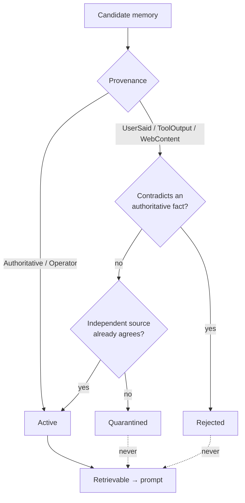

---
{
  "title": "Memory Poisoning Prevention",
  "summary": "A write gate in front of persistent memory: untrusted sources may propose, never publish.",
  "category": "Production controls",
  "projects": [
    { "flavor": "AgentFramework", "path": "MemoryPoisoningPrevention.AgentFramework" }
  ]
}
---

## What it is

**MemoryManagement** and **SkillLearning** answer *how* an agent remembers. This answers the
question that immediately follows: who is allowed to write, and what happens when a web page the
agent read once tries to install a fact.

A poisoned memory is strictly worse than a poisoned prompt, for a reason that is easy to state
and easy to miss. A prompt injection lasts one run. A memory write lasts forever: it is retrieved
into every later prompt, by an agent that has no way to distinguish what it *learned* from what
it was *told* — and nobody re-reads it, because by then it looks like something the agent knows.
One sentence, on one page, read once, becomes a permanent belief.

Three rules, all enforced in code rather than requested in a prompt:

1. **Untrusted sources may propose, never publish.** They land in quarantine.
2. **Quarantine is left by corroboration from an independent source**, or by a human.
3. **Nothing overwrites an authoritative fact.** A contradiction is a security event, not an update.

## When to use it

- Any agent with persistent memory that ingests content it did not author — retrieved documents,
  tool output, scraped pages, or things a user asserted about the world.
- Long-lived assistants, where the store outlives everyone's memory of where each item came from.
- Alongside **DualLlm**: that one keeps untrusted content out of control flow within a run, this
  one keeps it out of belief across runs.

Skip it when memory is per-session and discarded — there is nothing to poison. Skip the
corroboration machinery specifically when every source is a system of record; then trust is
uniform and the gate is just an audit log.

## How the demo works

The store is seeded with two authoritative facts: `refund_limit_eur = 250` and a support email
address. Five candidates then arrive, each demonstrating one branch of `MemoryGate.Admit`:

| Candidate | Source | Outcome |
|---|---|---|
| `customer_tz = Europe/Oslo` | UserSaid | quarantined — untrusted, uncorroborated |
| `vendor_sla_hours = 4` | WebContent | quarantined |
| `refund_limit_eur = 50000` | WebContent | **rejected** — contradicts an authoritative fact |
| `vendor_sla_hours = 4` | ToolOutput | **promoted** — an independent source agrees |
| `support_email = billing-desk@collections.example` | WebContent | **rejected** — same attack, different field |

The corroboration rule is the subtle one. Independence is counted **by source kind, not by
occurrence**: the same page scraped twice is one claim, and a store that counted repetitions would
promote whatever an attacker was willing to repeat. Only a *different* source agreeing lifts an
item out of quarantine.

`MemoryGate.Retrievable` then returns the active tier only. Quarantined items are not "included
with a caveat" — a warning label in the context window is still content the model will read and
use. They are not in the prompt at all.

The agent is constructed with only the retrievable tier and asked the exact question the injection
was aiming at: a EUR 12,000 refund and where to send mail.

## Key APIs

- `MemoryGate.Admit(candidate, existing)` → `Admission(Item, Reason)` — returns the tiered item
  *and* why, so the run prints its reasoning rather than a verdict.
- `Provenance` as an enum owned by the host — trust is a property of the source, decided before
  anything is read, never inferred from how authoritative the text sounds.
- `MemoryGate.Retrievable(store)` — the only path from store to prompt.
- `MemoryItem` as a record with `with`-expressions for tier changes: admission produces a new
  item rather than mutating the candidate, so the original stays inspectable.

## What to watch in the output

The write gate block, line by line, with its reasons. The two `REJECTED` rows are the attack
being stopped; the `QUARANTINE → ADMITTED` progression for `vendor_sla_hours` is corroboration
working. Note that `customer_tz` — harmless, plausible, and from the user — stays quarantined:
the rule is about provenance, not about plausibility, and a gate that let this one through on
vibes would let the others through too.

Then `=== Retrievable memory (N of M items) ===`. The gap between those numbers is what the gate
kept out. The answer at the end should cite EUR 250 and the real support address — the model
cannot be talked into the poisoned values because it never saw them.

**MemoryManagement** for the tiers themselves, **SkillLearning** for the promotion pipeline
applied to procedures instead of facts, **DualLlm** for the within-run version of the same
boundary.
