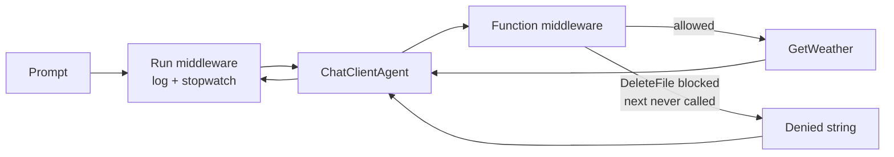

---
{
  "title": "Middleware",
  "summary": "Wrap an agent in a pipeline that logs every run and can block a tool call before it executes.",
  "category": "Production controls",
  "projects": [ { "flavor": "AgentFramework", "path": "Middleware.AgentFramework" } ]
}
---

## What it is

Middleware is the ASP.NET Core idea applied to agents: a chain of delegates wrapped around the
thing that does the work, each free to inspect, time, rewrite, or short-circuit the call before
handing it to `next`. Agent Framework exposes it through `agent.AsBuilder().Use(...)`, and the
sample uses two of the three available layers:

1. **Run middleware** wraps the whole `RunAsync` — one call per user turn, the right place for
   logging, latency, and token accounting.
2. **Function-invocation middleware** wraps each individual tool call inside the agent loop — the
   right place for an audit trail or a policy guard.

A third layer sits below both: MEAI chat-client middleware
(`ChatClient.AsBuilder().Use(...)`), which sees every raw model request before the agent loop
does. The sample mentions it in a comment but does not use it.

## When to use it

- You need observability you did not write into the agent: timings, token usage, tool audit logs.
- You need a policy that must hold no matter what the model decides — blocking destructive tools,
  redacting arguments, enforcing a quota.
- You want cross-cutting behaviour (retry, caching) added without touching agent or tool code.

Skip it when there is exactly one call site and a plain `try`/`Stopwatch` around it says the same
thing. Middleware runs on *every* invocation, so anything expensive or chatty in there becomes a
permanent tax.

## How the demo works

One `ChatClientAgent` gets two tools, `GetWeather` and `DeleteFile`, then is wrapped in both
layers. Prompt 1 asks for the weather in Amsterdam: the run middleware logs the prompt and the
elapsed time, the function middleware logs the call, and `next` lets it through. Prompt 2 asks to
delete `/tmp/report.txt`: the function middleware sees `context.Function.Name == nameof(DeleteFile)`,
never calls `next`, and returns the string *"Denied: destructive operations are blocked by policy."*
straight back into the model's context, so the agent explains the refusal instead of deleting
anything.

`DeleteFile` itself prints `[tool] DeleteFile actually ran ... guard failed!` — it is a tripwire,
not part of the happy path.

## Key APIs

- `agent.AsBuilder()` — starts the pipeline around an existing `AIAgent`.
- `.Use(runFunc, runStreamingFunc)` — run middleware; the sample passes `null` for streaming.
- `.Use(async (agent, context, next, ct) => ...)` — function-invocation middleware; `context.Function.Name`
  and `context.Arguments` identify the call, and returning without awaiting `next` blocks it.
- `.Build()` — returns the wrapped `AIAgent`; call it exactly as before.
- `AIFunctionFactory.Create(GetWeather, nameof(GetWeather))` — tool registration.

> Naming trap: `AIFunctionFactory.Create` on a **local** function picks up the compiler-mangled
> name (`<<Main>$>g__DeleteFile|0_1`). The guard compares against `nameof(DeleteFile)`, so without
> the explicit name argument the comparison silently never matches and the destructive tool runs.
> Always pass the name for local or lambda tools.

## What to watch in the output

Every turn prints `[run] -> "..."` and `[run] <- done in N ms, tokens in/out: .../...`, and every
tool call prints `[func] Name(args)`. Prompt 2 adds `[func] BLOCKED by guard middleware - the tool
never runs`; if you ever see `[tool] DeleteFile actually ran`, the naming trap above bit you.
**ToolUse** shows the same tools with no interception at all, and **GuardRails** enforces policy
at the prompt and output level rather than at the call boundary.
