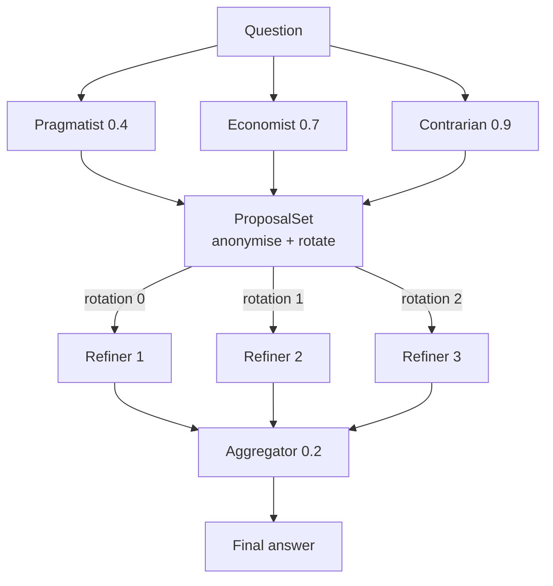

---
{
  "title": "Mixture of Agents",
  "summary": "Layered proposers: the second layer answers again having read everything the first layer wrote.",
  "category": "Orchestration",
  "projects": [
    { "flavor": "AgentFramework", "path": "MixtureOfAgents.AgentFramework" }
  ]
}
---

## What it is

Several agents answer the question independently. Then several agents answer it *again*, this
time having read all of the first round's answers. A final aggregator writes the version that
ships.

The contrast that makes this worth a folder of its own is with **Voting**. Voting picks one of N
answers and discards N−1 — including the weak answer that happened to be the only one that raised
the real risk. A mixture never discards; layer 2 *reads* the losers. A proposal that was mediocre
overall but uniquely right about one thing still reaches the final answer through the refiner
that read it.

The cost is honest and worth stating up front: two layers of three plus an aggregator is seven
model calls for one answer.

## When to use it

- Open-ended analytical output — recommendations, assessments, plans — where the good answer is a
  synthesis and not a selection.
- When you can afford latency and calls, and quality is what you are buying.
- When diversity is available cheaply: different framings, different temperatures, or genuinely
  different models behind the same `IChatClient`.

Skip it when the answer is a single value — for "which of these three options" **Voting** is
cheaper and its majority is meaningful in a way a synthesis is not. Skip it when the proposals
will all be the same: three agents at temperature 0 with the same instructions produce one
proposal three times, and you have paid 7× for a 1× answer. And if what you want is adversarial
pressure rather than breadth, **Debate** puts the disagreement in the loop instead of averaging
it out.

## How the demo works

The question — a 30-person consultancy weighing self-hosted GitLab against managed SaaS — is one
where the honest answer needs operations, economics and the contrarian case all present.

**Layer 1** runs three proposers concurrently, each with its own framing and temperature:
Pragmatist (0.4, operational reality), Economist (0.7, total cost of ownership), Contrarian (0.9,
the less obvious side taken seriously). The spread of temperatures is deliberate — a layer whose
members agree is a layer that cost 3× and explored once.

**Layer 2** runs the same refiner three times over the layer-1 output. Two distortions are
applied by `ProposalSet`, both the host's job rather than the prompt's:

- **Anonymised.** Refiners see `Proposal A`, never "the Contrarian said". Author labels invite a
  refiner to reason about who is usually right instead of about the content — and in a mixture
  the authors are the same base model in different hats anyway.
- **Rotated.** Each refiner receives the same proposals in a different order. Models weight
  earlier items more heavily; if all three read the same ordering, that bias is identical across
  the layer and survives into the aggregate rather than cancelling out.

**Aggregation** is one final call at temperature 0.2, told to pick a side where the refiners
still disagree rather than hedging into an "it depends".

## Key APIs

- `Task.WhenAll(proposers.Select(...))` — each layer is a fan-out; the layers are sequential, the
  members inside one are not.
- `new ChatClientAgentRunOptions(new ChatOptions { Temperature = t })` — per-run temperature, so
  one agent definition can be a different proposer on each call.
- `ProposalSet.For(readerIndex)` / `.Format(readerIndex)` — the rotation and anonymisation. Same
  set for every reader, different order per reader.
- `new ProposalSet(...)` throws when a layer produced nothing usable — an empty layer is a broken
  run, not a run with fewer proposals.

## What to watch in the output

Read layer 1 for *spread*. If the Pragmatist and the Economist say the same thing in different
words, the mixture has already collapsed and layer 2 will only polish it — the fix is more
distinct framings, not more agents.

In layer 2, look for content that came from a proposal the refiner did not write. That is the
whole mechanism: a refiner reading three proposals and keeping the one good point from the weakest
one is what a vote structurally cannot do. If all three refiners converge on the same answer, that
convergence is meaningful — they reached it from three different readings of the same evidence.

The final answer should end with a one-line recommendation and should not hedge. Where the
refiners still disagreed, the aggregator was told to pick; if it produces "it depends on your
priorities", the run has spent seven calls to reach the answer you could have had for free.

**Voting** for selection, **Debate** for adversarial pressure, **Parallelization** for the plain
fan-out/fan-in without the layering.
