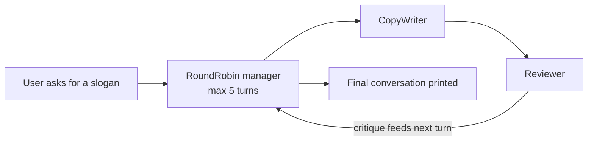

---
{
  "title": "Multi-Agent Collaboration",
  "summary": "Put two agents in one conversation and let them take turns until the work is good enough.",
  "category": "Orchestration",
  "projects": [
    { "flavor": "AgentFramework", "path": "MultiAgentCollaboration.AgentFramework" },
    { "flavor": "SemanticKernel", "path": "MultiAgentCollaboration.SemanticKernel" }
  ]
}
---

## What it is

One agent writing and self-checking tends to agree with itself. Multi-agent collaboration
splits the roles: a **maker** produces something, a **critic** with different instructions
judges it, and both see the same shared transcript. The critique becomes context for the next
draft, so quality climbs over a few turns instead of one shot.

The orchestration piece is a **group chat manager** — it decides who speaks next and when the
conversation stops. Here that is round-robin with a hard iteration cap, which is the simplest
manager that exists and the reason the demo always terminates.

## Information-theoretic view

Every message between agents is a compression of what the sender knows, and dialogue re-encodes
state at every hop — so a group chat pays an information tax that a single agent does not. The
scaling numbers are unforgiving: independent multi-agent systems amplify trace-level errors
17.2× versus 4.4× under centralized coordination, and on sequential planning every multi-agent
architecture tested degrades 39–70% below a single agent (arXiv:2512.08296). Collaboration pays
its way only when the roles genuinely differ and the task decomposes — an adversarial critic
adds information precisely because its instructions diverge from the maker's. For the full
argument, including when a shared environment beats dialogue entirely, see
`docs/coordination-physics.md`.

## When to use it

- Output quality benefits from an adversarial second opinion: copy, code, plans, designs.
- The roles genuinely differ — a reviewer with the same prompt as the writer adds nothing.
- You want the critique visible and auditable rather than hidden inside one prompt.

Skip it when a single well-instructed agent already lands it: every extra turn is another
round trip, another bill, and a chance for the pair to drift into polite agreement. If the
agents never need to see each other's output, use **Parallelization** instead.

## How the demo works

Both samples build the same pair — `CopyWriter` (write a slogan, be brief) and `Reviewer`
(critique it, say "Approved" if acceptable) — and hand them one task about a slogan for an
electric vehicle. A round-robin manager alternates them, capped at 5 turns.

The flavors differ in how you observe the exchange. Agent Framework runs the group chat as a
**workflow** and emits the whole transcript at the end as a `WorkflowOutputEvent` carrying a
`List<ChatMessage>`. Semantic Kernel wraps it as a `GroupChatOrchestration` whose only hook for
intermediate messages is `ResponseCallback`, so the sample prints each message as it arrives
and then prints the orchestration's single return value at the end.

## Key APIs

| Agent Framework | Semantic Kernel |
|---|---|
| `AgentWorkflowBuilder.CreateGroupChatBuilderWith(...)` | `new GroupChatOrchestration(manager, agents...)` |
| `new RoundRobinGroupChatManager(agents) { MaximumIterationCount = 5 }` | `new RoundRobinGroupChatManager { MaximumInvocationCount = 5 }` |
| `.AddParticipants(writer, reviewer)` | `ResponseCallback` for intermediate messages |
| `InProcessExecution.RunStreamingAsync` + `TurnToken` | `InProcessRuntime` + `orchestration.InvokeAsync` |

## What to watch in the output

Agent Framework prints nothing until the run ends, then dumps everything under
`=== Final Conversation ===`, one `AuthorName: text` line per message. Semantic Kernel streams
`CopyWriter:` / `Reviewer:` lines live and closes with `=== FINAL ===` and the winning slogan.
Watch whether the Reviewer actually pushes back on turn one — that is the whole value of the
pattern. **Debate** takes the same idea further with opposed positions, and **Magentic
Orchestration** replaces round-robin with a manager that picks the next speaker deliberately.
