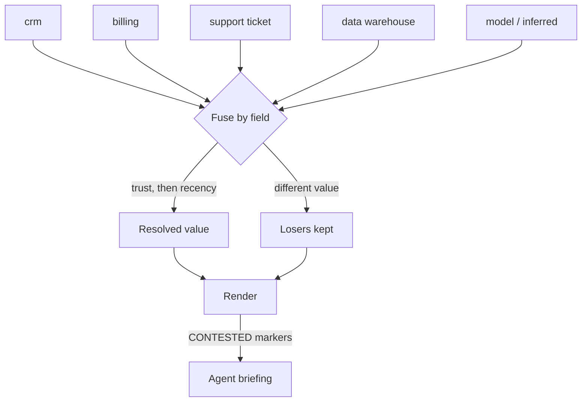

---
{
  "title": "Multi-Source Context Fusion",
  "summary": "When systems disagree about the same field, resolve by trust then recency — and tell the model the field was contested.",
  "category": "Knowledge & state",
  "projects": [
    { "flavor": "AgentFramework", "path": "MultiSourceContextFusion.AgentFramework" }
  ]
}
---

## What it is

Merging several sources into one context is easy right up to the moment two of them disagree, and
then it is the entire problem.

The common non-answer is to concatenate both values and let the model sort it out. It does not
sort it out. It picks whichever it read last, or splits the difference into an address that does
not exist, and either way the choice is invisible afterwards — there is no record that a conflict
existed, let alone how it was settled.

Fusion makes the choice in the host, by a rule you can state: **trust first, recency second**.
The losing value is kept for the audit. And the second half matters as much as the first: a
contested field is surfaced to the model **as contested**. Silently resolving a conflict tells the
agent it knows something it does not.

## When to use it

- Enterprise assistants over CRM, billing, support, warehouse and profile data, which routinely
  disagree about the same customer.
- Anywhere a stale system of record competes with a fresh but unverified user statement — the
  case that makes "just take the newest" wrong.
- Before **ContextAssembly**. Fitting the window is a different job from deciding which value is
  true, and doing them in the wrong order gets you a beautifully budgeted context built on the
  wrong address.

Skip it when there is one source, or when sources are partitioned by field so they cannot
disagree. And skip it when the conflict is real domain ambiguity that a human must resolve —
then the right output is an escalation, not a winner.

## How the demo works

Ten facts about one customer arrive from seven systems, tagged with a `Trust` tier
(`SystemOfRecord > Operator > UserStated > Retrieved > Inferred`) and an `AsOf` date. The tiers
are ordered deliberately: a system of record outranks what a customer said about themselves, which
outranks a scraped page.

`ContextFusion.Fuse` groups by field and ranks by trust, then recency, then source name for
determinism. Three cases are planted:

- **Trust beats recency.** `billing_address` from billing (14 months old, system of record) versus
  the support ticket the customer filed *yesterday*. Billing wins — and the customer's version is
  shown as contested, which is the whole point: the resolution may well be wrong, and the person
  reading the briefing is the one who can find out.
- **Recency breaks a tie within a tier.** Two `SystemOfRecord` sources disagree on seat count; the
  2-day-old value beats the 30-day-old one, and the stale value is still printed.
- **Agreement is not conflict.** Two sources give the same `preferred_language`. Reporting that as
  a conflict would train everyone to ignore the conflict list, so it is reported as uncontested.

`Render` produces the model's view: resolved values with provenance, and `— CONTESTED:` on the
fields where a source disagreed. The agent is instructed to use the resolved value, name the
disagreement, and say what should be confirmed — never to silently prefer the other value.

## Key APIs

- `ContextFusion.Fuse(facts)` → `IReadOnlyList<Resolution>` where each `Resolution` carries the
  winner, the losers, and the `Rule` that decided it in words (`"higher trust (SystemOfRecord over
  UserStated)"`).
- `Trust` as an ordered enum — `OrderByDescending(f => f.Trust)` is the whole precedence rule, and
  changing the policy means reordering the enum rather than editing comparison logic.
- `Resolution.WasContested` — only different *values* count; agreement across sources is
  corroboration.
- `ContextFusion.Render(resolutions)` — the model-facing view, with conflicts kept visible.

## What to watch in the output

Each field prints its winner, the source, and the rule. The `lost:` lines under contested fields
are the audit trail — the value, the source, its trust tier and its date.

`billing_address` is the one to sit with. The freshest information available loses to a
fourteen-month-old record, on purpose, and the losing value is not discarded. That is the trade a
trust hierarchy makes, and printing both is what keeps it honest.

Then the count of contested fields, and the briefing. The briefing should name the address
disagreement explicitly and suggest confirming it on the call. If it silently uses one address and
never mentions the other, the `CONTESTED` marker is not doing its job — which is exactly the
failure mode that concatenating both values produces every time.

**ContextAssembly** for fitting the resolved context into a budget; **MemoryPoisoningPrevention**
for the same trust hierarchy applied to *writes* rather than reads; **RAG** for the retrieval that
feeds one of these sources.
