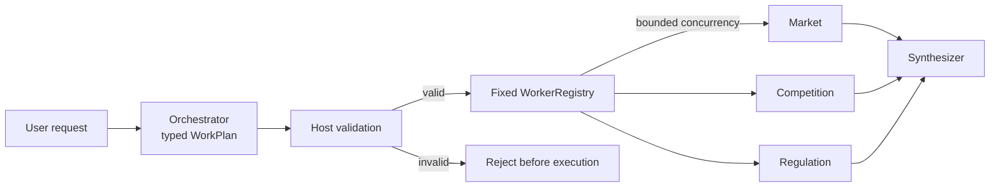

---
{
  "title": "Orchestrator-Workers",
  "summary": "Let an orchestrator choose request-specific tasks, validate them, run fixed workers with bounded concurrency, and synthesize the results.",
  "category": "Orchestration",
  "projects": [ { "flavor": "AgentFramework", "path": "OrchestratorWorkers.AgentFramework" } ]
}
---

## What it is

Orchestrator-Workers uses a central model to decide which independent subtasks a particular
request needs. The host validates that typed plan, dispatches each task to a fixed worker registry,
and asks a synthesizer to combine successful results.

This is dynamic fan-out, but not an open-ended team protocol:

- **Parallelization:** the host knows the branches in advance.
- **Orchestrator-Workers:** the orchestrator chooses branches from the request.
- **Magentic:** a manager continuously controls a multi-round team with replanning and stalls.

## When to use it

- The useful research angles vary substantially by request.
- Tasks are independent once decomposed and can run concurrently.
- Worker roles need different instructions, tools, data, or permissions.

Use static **Parallelization** when the same branches always run; it is cheaper and easier to
validate. Use **Prompt Chaining** when tasks depend on earlier outputs.

## How the demo works

The request asks whether a Nordic coffee-subscription business should launch in Germany. The
orchestrator returns a typed `WorkPlan`, choosing from market, competitor, and regulatory roles.
`PlanValidator` rejects unknown roles, excessive task count, duplicate IDs, and oversized
instructions before any worker runs.

`WorkerRegistry` uses `SemaphoreSlim` to cap concurrency and captures per-task failures without
discarding successful reports. Only successful outputs enter the synthesis evidence.

## Key APIs

- `agent.RunAsync<WorkPlan>(...)` — structured dynamic decomposition.
- `PlanValidator.Validate(...)` — trusted-host validation before dispatch.
- `WorkerRegistry` — fixed role-to-executor mapping; the model cannot create arbitrary workers.
- `Task.WhenAll(...)` + `SemaphoreSlim` — concurrent execution with a hard concurrency ceiling.

## What to watch in the output

First inspect the serialized validated plan: its tasks should reflect the request rather than a
hard-coded fan-out. Worker outputs follow, then one synthesis. A worker failure becomes a failed
`WorkerResult`; it does not erase independent successful evidence.
